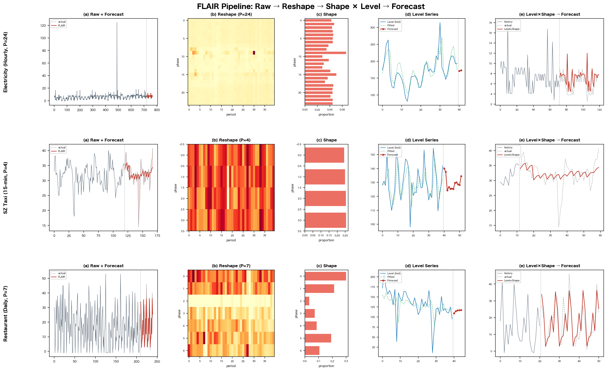
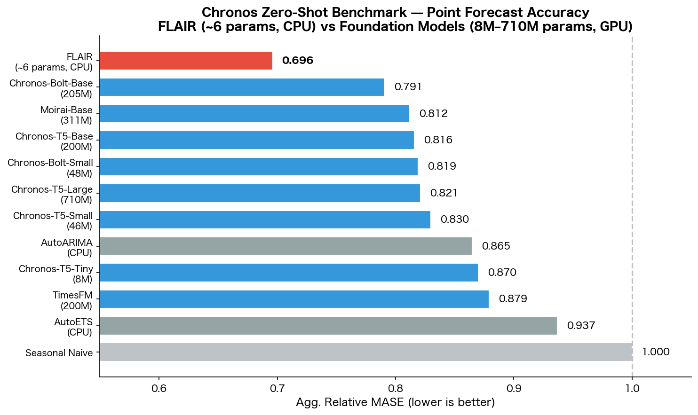
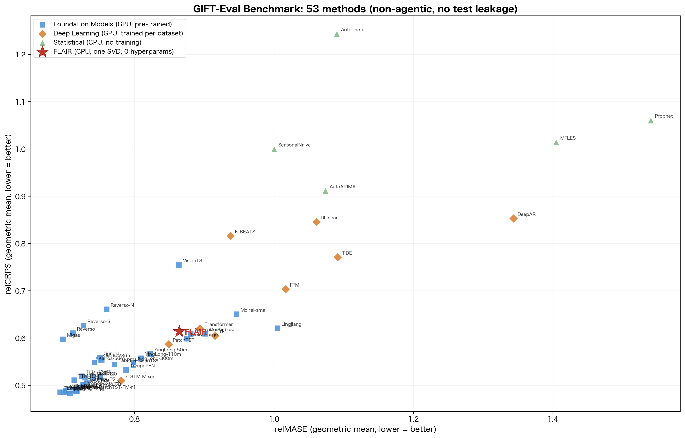

# FLAIR

[](https://pypi.org/project/flaircast/)
[](https://pypi.org/project/flaircast/)
[](https://github.com/TakatoHonda/FLAIR/actions/workflows/ci.yml)
[](LICENSE)
[](https://colab.research.google.com/github/TakatoHonda/FLAIR/blob/main/examples/quickstart.ipynb)

[English](README.md)

**Factored Level And Interleaved Ridge**: 単一方程式の時系列予測手法

ハイパーパラメータ 0。SVD 1回。CPU のみ。

- **[Chronos Benchmark II](https://github.com/amazon-science/chronos-forecasting) で第1位** (25データセット・ゼロショット). Agg. Rel. MASE **0.696** vs. Chronos-Bolt-Base 0.791 (205Mパラメータ, GPU)
- **[GIFT-Eval](https://huggingface.co/spaces/Salesforce/GIFT-Eval) で統計手法の中で最高精度** (97構成, 23データセット). relMASE **0.857**, relCRPS **0.610**
- **Python 約1000行・NumPy/SciPy のみ**。深層学習なし、基盤モデルなし、GPU 不要

## 目次

- [パイプライン](#パイプライン)
- [クイックスタート](#クイックスタート)
- [インストール](#インストール)
- [対応周波数](#対応周波数)
- [アルゴリズム詳細](#アルゴリズム詳細)
- [ベンチマーク結果](#ベンチマーク結果)
- [APIリファレンス](#apiリファレンス)
- [設計原則](#設計原則)
- [制約事項](#制約事項)
- [Citation](#citation)
- [ライセンス](#ライセンス)

## パイプライン

FLAIR は時系列をその主周期で行列に変形し、*何が起きるか*（Level）と*どう起きるか*（Shape）を分離します：

```
y(位相, 周期) = Level(周期) × Shape(位相)
```

<p align="center">
  
</p>

Shape は構造的なもの（学習されない）なので、過学習しません。Level は圧縮された滑らかな系列（P個の値の代わりに1周期あたり1つの値）を Ridge 回帰で予測します。2つの圧縮が同時に働きます: P個の位相を加算してノイズが ~√P 倍低減し、予測ステップ数が H から ⌈H/P⌉ に減少します。

## クイックスタート

```python
import numpy as np
from flaircast import forecast, FLAIR

y = np.random.rand(500) * 100  # 時系列データ

# ── 関数API ──────────────────────────────────
samples = forecast(y, horizon=24, freq='H')
point   = samples.mean(axis=0)           # (24,)
lo, hi  = np.percentile(samples, [10, 90], axis=0)

# ── クラスAPI（ループ処理に便利）─────────────
model   = FLAIR(freq='H')
samples = model.predict(y, horizon=24)

# ── 外生変数あり (天候・価格・祝日フラグなど) ─
X_hist   = np.column_stack([temperature, humidity, is_holiday])  # (n, 3)
X_future = np.column_stack([temp_fcst,   hum_fcst,   hol_fcst])  # (24, 3)
samples  = forecast(y, horizon=24, freq='H',
                    X_hist=X_hist, X_future=X_future)

# ── pandas から ──────────────────────────────
import pandas as pd
ts = pd.read_csv('data.csv')['value']
samples = forecast(ts.values, horizon=12, freq='M')
```

## インストール

```bash
pip install flaircast
```

ソースからインストール：

```bash
git clone https://github.com/TakatoHonda/FLAIR.git
cd FLAIR
pip install .
```

## 対応周波数

| 周波数文字列 | 周期 | 意味 | MDL候補 |
|:-----------:|:----:|------|:-------:|
| `S` | 60 | 秒 | 60 |
| `T` | 60 | 分 | 60 |
| `5T` | 12 | 5分 | 12, 288 |
| `10T` | 6 | 10分 | 6, 144 |
| `15T` | 4 | 15分 | 4, 96 |
| `10S` | 6 | 10秒 | 6, 360 |
| `H` | 24 | 時間 | 24, 168 |
| `D` | 7 | 日次 | 7, 365 |
| `W` | 52 | 週次 | 52 |
| `M` | 12 | 月次 | 12 |
| `Q` | 4 | 四半期 | 4 |
| `A` / `Y` | 1 | 年次 | — |

複数の候補がある場合、FLAIR は SVD スペクトルに対する BIC（MDL原理）を使って、rank-1 構造を最もよく支持する周期を選択します。

## アルゴリズム詳細

1. **MDL 周期選択**: SVD スペクトルの BIC でカレンダー候補から主周期 P を選択
2. **行列変形**: 系列を (P × n_complete) 行列にリシェイプ
3. **Shape₁** = コンテキストごとの Dirichlet 事後平均 (`context = period_index % C`)。データが少ない場合はグローバル平均に縮約
4. **Level** = 周期合計
5. **Shape₂** = Level の二次周期パターン。`w × 生の比率 + (1−w) × 事前分布` で推定（`w = nc₂/(nc₂+cp)`）。事前分布は BIC で選択: 第1高調波（2パラメータ）vs フラット（0パラメータ）。Level を Shape₂ で割って季節除去
6. **Ridge 回帰**: 季節除去済み Level に対して Box-Cox → NLinear → 切片 + トレンド + ラグ → GCV ソフト平均
7. **確率的 Level パス**: LOO残差を再帰予測に注入。誤差が Ridge のラグダイナミクスを通じて自然に伝播。平均回帰する系列は飽和、ランダムウォーク系列は √step で成長。スケーリング公式不要
8. **位相ノイズ**: SVD残差量子点 E = M − fitted から位相固有の相対ノイズを取得。シナリオ整合的にサンプリングし、同一予測ステップ内の全位相が1つの履歴周期の残差パターンを共有し、位相間相関を保存。Level パスと合成: `sample = Level_path × Shape₁ × (1 + phase_noise)`

## ベンチマーク結果

### Chronos Benchmark II (25データセット・ゼロショット)

[Chronos](https://github.com/amazon-science/chronos-forecasting) Benchmark II プロトコル (Ansari et al., 2024) で評価。Agg. Relative Score = データセットごとの (手法 / Seasonal Naive) の幾何平均。低いほど良い。

<p align="center">
  
</p>

| 順位 | モデル | パラメータ数 | Agg. Rel. MASE | GPU |
|:----:|--------|:-----------:|:--------------:|:---:|
| **1** | **FLAIR** | **~6** | **0.696** | **不要** |
| 2 | Chronos-Bolt-Base | 205M | 0.791 | 要 |
| 3 | Moirai-Base | 311M | 0.812 | 要 |
| 4 | Chronos-T5-Base | 200M | 0.816 | 要 |
| 5 | Chronos-Bolt-Small | 48M | 0.819 | 要 |
| 6 | Chronos-T5-Large | 710M | 0.821 | 要 |
| 7 | Chronos-T5-Small | 46M | 0.830 | 要 |
| 8 | AutoARIMA | — | 0.865 | 不要 |
| 9 | Chronos-T5-Tiny | 8M | 0.870 | 要 |
| 10 | TimesFM | 200M | 0.879 | 要 |
| 11 | AutoETS | — | 0.937 | 不要 |
| 12 | Seasonal Naive | — | 1.000 | 不要 |

ベースライン結果: [autogluon/fev](https://github.com/autogluon/fev)、[amazon-science/chronos-forecasting](https://github.com/amazon-science/chronos-forecasting)。FLAIR は Chronos-T5-Small (46Mパラメータ) に対して **25データセット中14個**で上回ります。

### GIFT-Eval (97構成, 23データセット)

[GIFT-Eval](https://huggingface.co/spaces/Salesforce/GIFT-Eval). 7ドメイン、short/medium/long ホライゾン、53手法（非agentic、テストデータ漏洩なし）：

<p align="center">
  
</p>

| モデル | タイプ | relMASE | relCRPS | GPU |
|--------|--------|:-------:|:-------:|:---:|
| **FLAIR** | **統計** | **0.857** | **0.610** | **不要** |
| PatchTST | 深層学習 | 0.849 | 0.587 | 要 |
| Moirai-large | 基盤モデル | 0.875 | 0.599 | 要 |
| iTransformer | 深層学習 | 0.893 | 0.620 | 要 |
| TFT | 深層学習 | 0.915 | 0.605 | 要 |
| N-BEATS | 深層学習 | 0.938 | 0.816 | 要 |
| SeasonalNaive | ベースライン | 1.000 | 1.000 | 不要 |
| AutoARIMA | 統計 | 1.074 | 0.912 | 不要 |
| Prophet | 統計 | 1.540 | 1.061 | 不要 |

### Long-term Forecasting (8データセット)

PatchTST、iTransformer、DLinear、Autoformer の標準ベンチマーク。チャネル独立（単変量）評価。StandardScaler正規化データのMSE。ホライゾン: {96, 192, 336, 720}。

4ホライゾンの平均MSE：

| データセット | FLAIR | iTransformer | PatchTST | DLinear | GPU要否 |
|-------------|:-----:|:------------:|:--------:|:-------:|:------:|
| **ETTh2** | **0.366** | 0.383 | 0.387 | 0.559 | **不要** |
| **ETTm2** | **0.257** | 0.288 | 0.281 | 0.350 | **不要** |
| **Weather** | **0.248** | 0.258 | 0.259 | 0.265 | **不要** |
| ECL | 0.215 | **0.178** | 0.205 | 0.212 | 要 |
| Traffic | 0.434 | **0.428** | 0.481 | 0.625 | 要 |
| ETTh1 | 0.591 | **0.454** | 0.469 | 0.456 | 要 |
| ETTm1 | 0.511 | 0.407 | **0.387** | 0.403 | 要 |
| Exchange | 0.815 | 0.360 | 0.366 | **0.354** | 要 |

FLAIR は **8データセット中3個**、**32個別設定中11個**で GPU Transformer を上回ります。周期性の明確なデータセットで精度が高く、非周期系列 (Exchange) では低くなります。

### なぜ FLAIR は動くのか？

3つの圧縮が同時に作用します:

1. **ノイズ低減**: P個の位相を1つの Level 値に加算することで、ノイズが ~√P 倍低減
2. **ホライゾン圧縮**: Level の予測は H ステップではなく ⌈H/P⌉ ステップのみで済み、誤差蓄積を軽減
3. **Shape は固定**: Shape は Dirichlet 事後分布であり学習パラメータではないため、過学習しない

## APIリファレンス

### `forecast(y, horizon, freq, n_samples=200, seed=None, X_hist=None, X_future=None)`

単変量時系列の確率的予測を生成します。

| パラメータ | 型 | 説明 |
|-----------|------|------|
| `y` | array-like (n,) | 過去の観測値 |
| `horizon` | int | 予測ステップ数 |
| `freq` | str | 周波数文字列（[対応周波数表](#対応周波数)参照） |
| `n_samples` | int | サンプルパス数（デフォルト: 200） |
| `seed` | int or None | 再現性のための乱数シード（デフォルト: None） |
| `X_hist` | array-like (n, k) または (n,) または None | `y` と同じ長さの履歴外生変数。`X_future` と同時に指定する必要があります |
| `X_future` | array-like (horizon, k) または (horizon,) または None | 予測区間に対応する将来の外生変数。`X_hist` と同時に指定する必要があります |

**戻り値**: `ndarray` shape `(n_samples, horizon)`。確率予測のサンプルパス

```python
from flaircast import forecast
samples = forecast(y, horizon=24, freq='H')
point   = samples.mean(axis=0)
median  = np.median(samples, axis=0)
lo, hi  = np.percentile(samples, [10, 90], axis=0)

# 外生変数あり
samples = forecast(y, horizon=24, freq='H',
                   X_hist=X_hist, X_future=X_future)
```

`X_hist=None`（デフォルト）の場合、結果は外生引数を渡さない呼び出しと bit-identical です。

### `FLAIR(freq, n_samples=200, seed=None)`

クラスラッパー。同一周波数で複数系列を予測する場合に便利です。

| メソッド | 説明 |
|---------|------|
| `predict(y, horizon, n_samples=None, seed=None, X_hist=None, X_future=None)` | `forecast()` と同等、インスタンスのデフォルト値を使用 |

```python
from flaircast import FLAIR
model = FLAIR(freq='D', n_samples=500)
for series, X_h, X_f in dataset:
    samples = model.predict(series, horizon=7, X_hist=X_h, X_future=X_f)
```

### 外生変数

FLAIR は任意の数の per-step 外生列を受け付けます。各列は訓練窓の統計量で z-score 正規化された後、期間平均で Level 時間スケールに集約され、Level Ridge の特徴行列に直接結合されます。**新しいハイパーパラメータも、モデル選択ステップもありません** ― `_ridge_sa` 内部の LOOCV ソフト平均 Ridge が正則化を担うため、ノイズ列は自然に減衰します。"One Ridge" の哲学はそのまま保たれます。

- **推奨設定**: 外生列の係数を安定推定するため、訓練窓には数十周期分のデータが望ましい (例: daily exog なら 60-90 日、hourly exog なら 60 日以上)
- **検証済みの効果**: `validation/` に rolling-origin ベンチマークを収録。UCI Bike Sharing daily で MASE −9.4% (9/12 origin で勝ち)、Jena Climate hourly で MASE −15.5% (19/24 origin で勝ち)
- **graceful degradation**: 純ノイズの外生を渡しても平均 MASE 悪化は 1% 未満、最悪ケースも bounded
- **制約**: 外生は Level (周期単位) 因子のみに結合されます。周期内の `X` の変動 (例: 1 日周期の中での時間別気温) は期間平均で潰されます

UCI Bike Sharing データセットでのエンドツーエンドの walkthrough: [](https://colab.research.google.com/github/TakatoHonda/FLAIR/blob/main/examples/exogenous_variables.ipynb)

### 定数

| 名前 | 説明 |
|------|------|
| `FREQ_TO_PERIOD` | 周波数文字列から主周期へのマッピング |
| `FREQ_TO_PERIODS` | 周波数文字列からMDL候補周期リストへのマッピング |

## 設計原則

FLAIR はあらゆるスケールで**最小記述長 (MDL)** 原理を適用します：

| スケール | メカニズム | MDL の役割 |
|---------|-----------|-----------|
| 周期 P | SVD スペクトルの BIC | 最も単純な rank-1 構造を選択 |
| Shape₁ | Dirichlet 縮約 | グローバル平均（最も単純な分布）に縮約 |
| Shape₂ | BIC ゲート付き縮約 | 事前分布を BIC で選択: 高調波 (2パラメータ) vs フラット (0パラメータ) |
| Ridge α | GCV ソフト平均 | 交差検証によるモデル複雑度の選択 |

## 制約事項

- **非周期系列**: Level × Shape 分解は周期性がない場合に圧縮効果がありません（例: 為替レート）。専用の非周期モデルを使用してください
- **間欠需要**: ゼロ率 >30% の系列は乗法構造と相性が悪いです。Croston 系の手法がより適切です
- **外生変数の解像度は粗い**: `X_hist` / `X_future` は期間平均で Level 時間スケールに集約されます。周期内の変動 (例: 1日周期内の時間別気温) は構造的に保持されません
- **短い系列**: 3完全周期未満の場合、P=1 に退化し（生の系列に対する単純な Ridge）、分解の恩恵を受けられません

## Citation

```
@misc{flair2026,
  title={FLAIR: Factored Level And Interleaved Ridge for Time Series Forecasting},
  year={2026}
}
```

## ライセンス

Apache License 2.0
