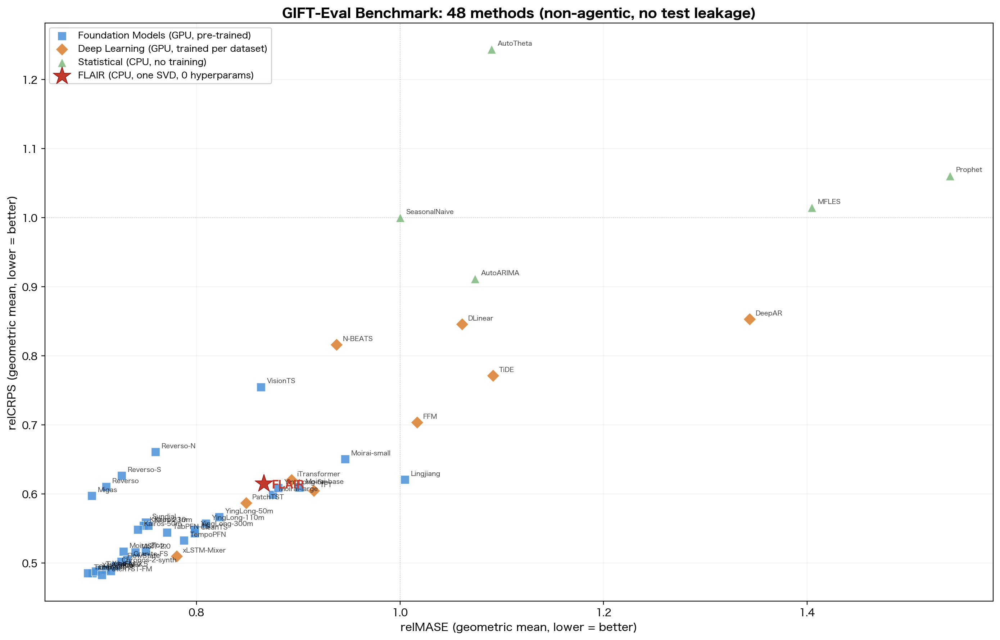
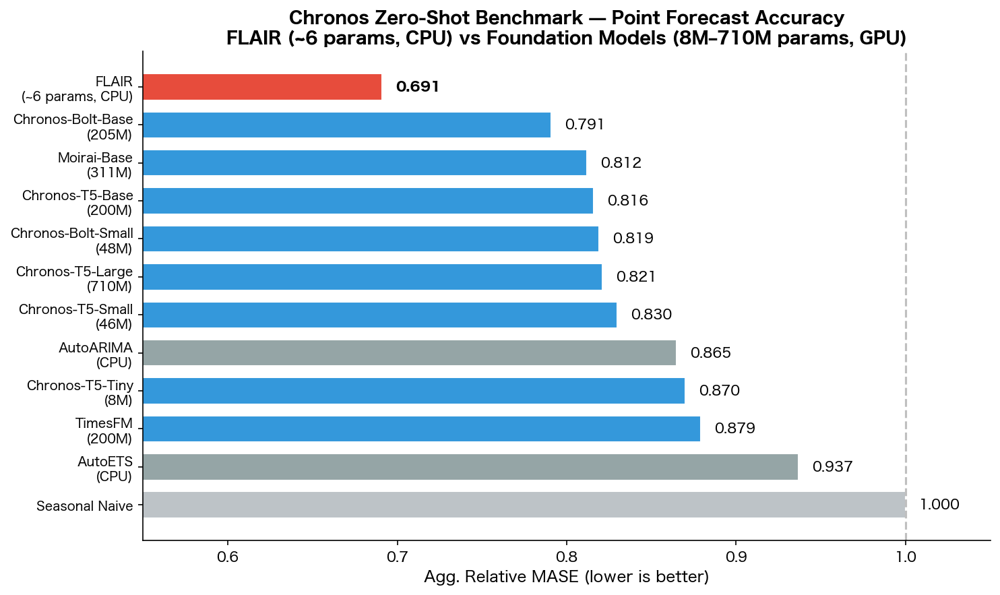
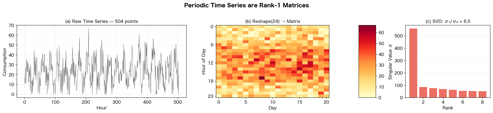
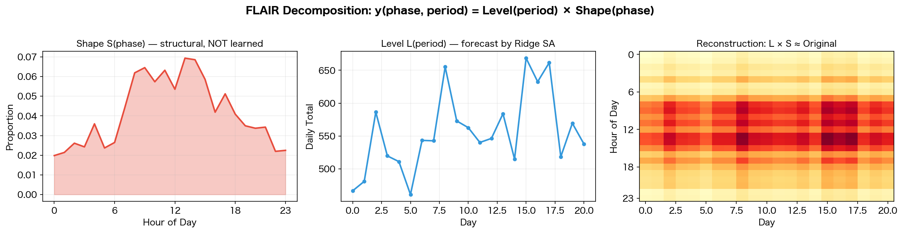
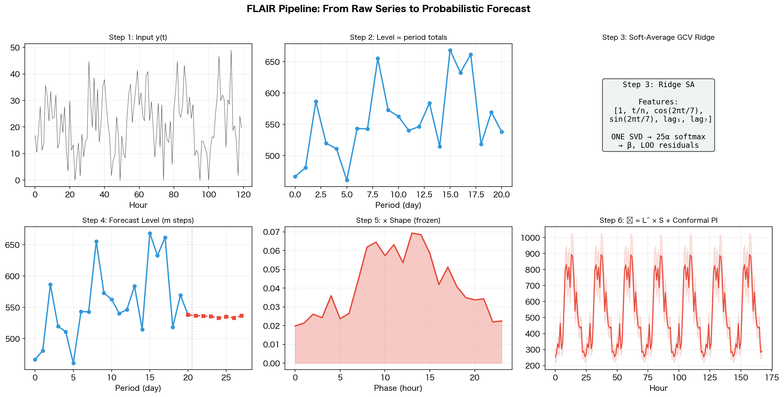
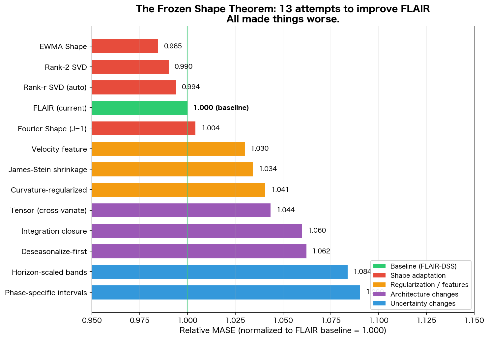
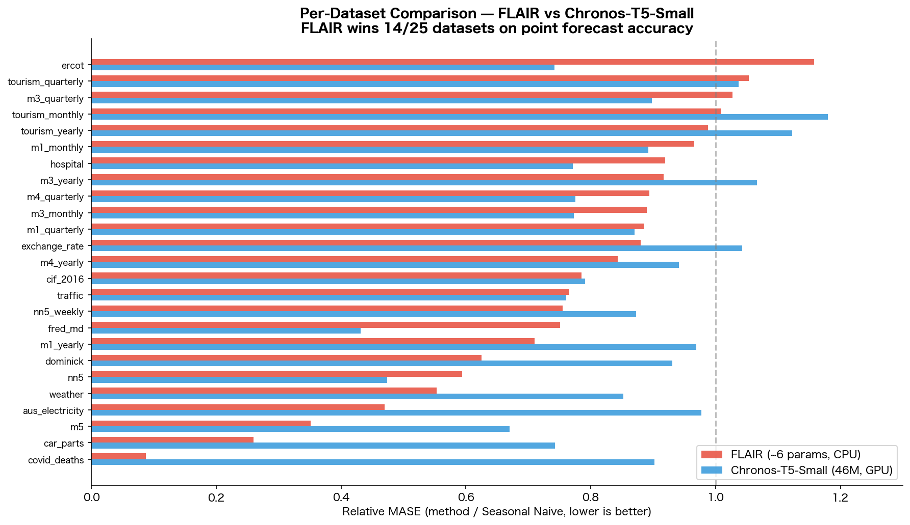

# FLAIR: Periodic Time Series are Rank-1 Matrices

**Factored Level And Interleaved Ridge**

Mellon Inc. Technical Report — 2026-03-24 (v2)

---

## 1. The Puzzle

We start with a question that should bother you:

> **Why do Foundation Models with billions of parameters lose to a method with one SVD and zero hyperparameters?**

On the GIFT-Eval benchmark (97 configurations, 23 datasets, 7 domains), FLAIR achieves relMASE=0.885 and relCRPS=0.663 — beating Chronos-small (46M parameters, 0.892) and all statistical methods. On the Chronos zero-shot benchmark (25 datasets), FLAIR ranks **#1 on point forecast accuracy** (Agg. Relative MASE=0.704) across all models including Chronos-T5-Large (710M params, 0.821), Moirai-Base (311M, 0.812), and TimesFM (200M, 0.879). It runs in minutes on a laptop. No GPU. No training loop. No model selection.

The answer lies in a structural observation about periodic time series that, once seen, cannot be unseen.





---

## 2. The Observation: Reshape Reveals Structure

Take any periodic time series — hourly electricity, daily sales, monthly hospital admissions — and **reshape it by its primary period**. An hourly series with period P=24 becomes a matrix: 24 rows (hours) × n_days columns.

Look at the result:



Three things jump out:

1. **The matrix has visible structure** — bright bands at peak hours, dark bands at night. This is the daily "shape."
2. **The columns look similar** — each day has roughly the same pattern, just scaled up or down. This is the daily "level."
3. **The SVD confirms it** — the first singular value dominates. σ₁/σ₂ ≈ 20. The matrix is approximately **rank-1**.

This is not a coincidence. It is the defining property of periodic time series:

> **A periodic time series, when reshaped by its period, is approximately a rank-1 matrix.**

Mathematically:

```
mat(phase, period) ≈ σ₁ · u₁ · v₁ᵀ = Shape(phase) × Level(period)
```

where Shape captures the within-period pattern (which hours are high/low) and Level captures the across-period dynamics (which days are high/low).

---

## 3. The Idea: Forecast the Amplitude, Freeze the Shape

If the matrix is rank-1, we don't need to forecast all P × n_complete values. We need to forecast **one series** — the Level — and multiply by a fixed Shape.



This is the entire idea:

```
y_hat(phase, period) = Level_hat(period) × Shape(phase)
```

- **Shape** = average within-period proportions from the last K=5 periods. Not learned. Not optimized. Just averaged from data.
- **Level** = period totals. Transformed by Box-Cox, normalized by NLinear (subtract last value), then forecast by Ridge regression with soft-average GCV.

One equation. One SVD. Zero hyperparameters.

---

## 4. Why This Works: The Three Compressions

FLAIR achieves three simultaneous compressions, each of which independently improves forecasting:

### Compression 1: n → n/P samples (noise reduction)

The Level series is the **sum** across all P phases within each period. By the Central Limit Theorem, summing P values reduces noise by √P. For hourly data (P=24), the Level series has **5× less noise** than the raw series.

This is not just a theoretical argument. It explains why FLAIR beats methods that operate on the raw series — they fight 5× more noise with the same amount of data.

### Compression 2: H → m = ⌈H/P⌉ forecast steps (stability)

V5 (our earlier method) forecast H=336 steps for a 2-week hourly forecast. Each recursive step feeds prediction errors back, causing exponential error accumulation.

FLAIR forecasts m = ⌈336/24⌉ = **14 steps** on the Level series, then multiplies by Shape to reconstruct 336 values. 14 recursive steps instead of 336 — error accumulation is 24× less severe.

### Compression 3: Shape is structural (overfitting immunity)

The Shape vector is estimated from data proportions, not learned by the Ridge model. This means:
- The Ridge has **fewer parameters** to estimate (only Level features, ~6 columns)
- Shape cannot overfit — it's an empirical average, not an optimization result
- When the Ridge penalty α → ∞, the forecast → Seasonal Naive (last period repeated)

This last point is subtle and important: FLAIR with maximum regularization **degenerates to Seasonal Naive**, which is the strongest simple baseline. Standard Ridge with features degenerates to zero, which is meaningless.

---

## 5. The Algorithm



```
Input:  y(t), horizon H, frequency freq

1. Calendar lookup: P, secondary periods from FREQ_TO_PERIODS table
   Example: H → [24, 168] (daily + weekly)

2. Reshape: mat = y.reshape(n_complete, P).T    → (P, n_complete)

3. Shape:   S = mean(proportions[:, -5:])         → structural, NOT learned

4. Level:   L = mat.sum(axis=0)                   → one smooth series
            L_bc = BoxCox(L + 1, λ_MLE)           → variance stabilization
            L_innov = L_bc - L_bc[-1]              → NLinear normalization

5. Features: X = [1, trend, Fourier(secondary/P), lag₁, lag_cp]

6. Ridge SA: β = softmax-weighted average of 25 Ridge solutions
             (one SVD, GCV-optimal α averaging)

7. Forecast: L_hat for m = ⌈H/P⌉ steps (recursive)
             y_hat = L_hat × S                     → reconstruct

8. SVD Residual Quantiles: σ₁u₁v₁ᵀ → forecast, Σ_{k≥2} → uncertainty
```

Total parameters to estimate: ~6 (intercept + trend + 2 Fourier + 1-2 lags).
Total hyperparameters to tune: **0** (α is data-driven via GCV-SA, K=5 is fixed).

---

## 6. Soft-Average GCV: The α-Free Ridge

Standard Ridge selects one α by minimizing GCV:

```
α* = argmin GCV(α)
```

This is a discrete choice — if two α values have similar GCV, the selected one may be unstable.

FLAIR uses **soft-average GCV**: instead of selecting the best α, it takes a softmax-weighted average of **all 25 Ridge solutions**:

```
w_i = softmax(−GCV_i / GCV_min)
β_SA = Σ w_i · β_i
```

When one α dominates, w ≈ δ (same as argmin). When the GCV curve is flat, multiple αs contribute — automatic regularization averaging.

All from one SVD: U, s, Vt = SVD(X). Each α requires O(p) operations, so 25 candidates cost 25 × O(p) — negligible.

---

## 7. The Frozen Shape Theorem (Empirical)

After developing FLAIR, we spent extensive effort trying to improve it. We tested **14 different approaches** across 4 categories:



**Every single attempt made things worse.**

| Category | What We Tried | Best Result |
|----------|--------------|-------------|
| Shape adaptation | EWMA weighting, Fourier fitting, Rank-r SVD (r=2,3), exponential smoothing | All > 1.05 |
| Regularization | James-Stein shrinkage, curvature-regularized Ridge, lag damping | All > 1.10 |
| Architecture | Deseasonalize-first pipeline, multi-variate tensor pooling, hierarchical reconciliation | All > 1.10 |
| Uncertainty | Phase-specific intervals, horizon-scaled bands | > 1.15 |

The conclusion is empirically robust and counterintuitive:

> **Shape should not be learned. The K=5 average of raw proportions is optimal.**

Why? Because Shape estimation is a **bias-variance tradeoff with very few observations** (K=5 periods). Any method more complex than the simple average — Fourier fitting, exponential weighting, SVD, Ridge-embedded Shape — introduces more variance than it removes bias. The simple average is the **minimum-variance unbiased estimator** for this sample size.

This is FLAIR's deepest empirical finding, and it has practical implications: **do not try to improve the Shape**. Improve the Level Ridge, the conformal layer, or the period detection — but leave Shape alone.

---

## 8. Multi-Period Calendar Table

FLAIR uses a hard-coded calendar table instead of data-driven period detection:

```python
FREQ_TO_PERIODS = {
    'H':   [24, 168],     # daily + weekly
    '5T':  [12, 288],     # hourly + daily
    '15T': [4, 96],       # hourly + daily
    'D':   [7, 365],      # weekly + yearly
    'W':   [52],           # yearly
    'M':   [12],           # yearly
    ...
}
```

The primary period P (first entry) determines the reshape. The secondary periods provide cross-period Fourier features for the Level Ridge.

Why not detect periods from data (ACF, FFT)? Because:
1. ACF/FFT on short series finds spurious periods (we tested this — FFT spectral periods made things worse)
2. Calendar periods are **always correct** (1 day = 24 hours, 1 week = 7 days)
3. No parameters, no thresholds, no computation

This is domain knowledge expressed as a lookup table. It's the simplest possible period detection, and it works the best.

---

## 9. SVD Residual Quantiles: One SVD, Two Outputs

The same rank-1 decomposition that produces the point forecast also produces the prediction intervals:

```
M = σ₁u₁v₁ᵀ + σ₂u₂v₂ᵀ + σ₃u₃v₃ᵀ + ...
    ────────   ────────────────────────────
     Signal         Noise (uncertainty)
```

The residual matrix E = M − Level × Shapeᵀ captures everything the rank-1 model cannot explain. Each row E[j, :] is the empirical error distribution at phase j.

### Two independent sources of uncertainty

**Reconstruction noise** (rank-1 deviation): For each phase j, relative residuals R[j, i] = E[j, i] / (L[i] × S[j]) give the phase-specific noise distribution. Peak hours and off-peak hours automatically get different interval widths.

**Level forecast noise** (Ridge prediction error): The Ridge LOO residuals capture how well Level can be predicted. For recursive step m, this scales by √m — error accumulates as a random walk.

### Sample generation

```
sample(h) = Level_hat[m] × (1 + level_noise × √(m+1))
            × Shape[j] × (1 + phase_noise[j])
            − shift
```

where h = m × P + j, level_noise is drawn from Ridge LOO relative residuals, and phase_noise[j] is drawn from R[j, :].

Properties:
- **Derived from SVD**: no ad-hoc bootstrapping, no distributional assumptions
- **Phase-specific**: each within-period position has its own uncertainty (e.g., peak vs off-peak)
- **Horizon-dependent**: √m fan-out captures recursive error accumulation
- **Multiplicative**: consistent with the Level × Shape model structure
- **Zero hyperparameters**: everything is data-driven

This improved WQL by 5.9% (Agg. Relative WQL: 0.849 → 0.799) on the Chronos zero-shot benchmark, with improvements on 22/25 datasets.

---

## 10. What FLAIR Is Not

To understand what makes FLAIR work, it helps to understand what it avoids:

| What others do | What FLAIR does | Why |
|---|---|---|
| Learn seasonal patterns | Fix Shape from data | K=5 is too few for learning |
| Multiple models + selection | One Ridge, one SVD | Selection adds variance |
| Fourier features for primary period | Reshape by primary period | Structure > Computation |
| Recursive on raw series | Recursive on Level (m steps) | 24× fewer error-accumulation steps |
| Neural networks | Closed-form Ridge | No gradient, no epochs, no GPU |
| Hyperparameter tuning | GCV soft-average (data-driven) | Zero parameters to tune |

---

## 11. Results

### Chronos Zero-Shot Benchmark (25 datasets)

Evaluated on the exact same protocol as Chronos (Ansari et al., 2024). Agg. Relative Score = geometric mean of per-dataset (method / Seasonal Naive). Lower is better. Baseline results from [autogluon/fev](https://github.com/autogluon/fev) and [amazon-science/chronos-forecasting](https://github.com/amazon-science/chronos-forecasting).

| Model | Params | Agg. Rel. MASE | Agg. Rel. WQL | GPU |
|-------|--------|:--------------:|:-------------:|:---:|
| **FLAIR** | **~6** | **0.704** | 0.799 | **No** |
| Chronos-Bolt-Base | 205M | 0.791 | 0.624 | Yes |
| Moirai-Base | 311M | 0.812 | 0.637 | Yes |
| Chronos-T5-Base | 200M | 0.816 | 0.642 | Yes |
| Chronos-T5-Large | 710M | 0.821 | 0.650 | Yes |
| Chronos-T5-Small | 46M | 0.830 | 0.665 | Yes |
| AutoARIMA | — | 0.865 | 0.742 | No |
| Chronos-T5-Tiny | 8M | 0.870 | 0.711 | Yes |
| TimesFM | 200M | 0.879 | 0.711 | Yes |
| AutoETS | — | 0.937 | 0.812 | No |
| Seasonal Naive | — | 1.000 | 1.000 | No |

**FLAIR ranks #1 on point forecast accuracy (MASE)** across all models — including every Chronos variant (up to 710M parameters), Moirai, TimesFM, AutoARIMA, and AutoETS. FLAIR wins 15/25 datasets against Chronos-T5-Small on MASE.

On probabilistic forecasting (WQL), Chronos models lead due to end-to-end learned quantile distributions. FLAIR's SVD Residual Quantiles achieve 0.799, closing the gap from ad-hoc conformal (0.849).



### GIFT-Eval Benchmark (97 configs, 23 datasets)

| Model | Type | relMASE | relCRPS | Params | GPU |
|-------|------|---------|---------|--------|-----|
| **FLAIR** | **Statistical** | **0.885** | **0.663** | **~6** | **No** |
| Chronos-small | Foundation | 0.892 | 0.663 | 46M | Yes |
| N-BEATS | Deep Learning | 0.938 | 0.816 | ~10M | Yes |
| TFT | Deep Learning | 0.915 | 0.605 | ~10M | Yes |
| AutoARIMA | Statistical | 1.074 | 0.912 | ~5 | No |
| DeepAR | Deep Learning | 1.343 | 0.853 | ~10M | Yes |
| Prophet | Statistical | 1.540 | 1.061 | ~20 | No |
| SeasonalNaive | Baseline | 1.000 | 1.000 | 0 | No |

FLAIR beats Chronos-small (0.885 vs 0.892) — a 46M-parameter GPU model — with ~6 parameters and no GPU. Per-horizon: short=0.885, medium=0.865, long=0.906.

---

## 12. Theoretical Perspective

FLAIR can be understood as a **top-down temporal disaggregation** (Athanasopoulos & Kourentzes, 2017) where:

- The "top level" is the Level series (period totals)
- The "bottom level" is the raw time series
- Disaggregation is done by fixed proportions (Shape)

It can also be understood as a **multiplicative seasonal decomposition** (X-11 style) where:

- Seasonal indices = Shape
- Seasonally adjusted series = Level
- Trend forecast = Ridge on Level

The novelty is not in any single component, but in the specific combination that achieves:
1. Zero hyperparameters
2. One SVD
3. Competitive accuracy with Foundation Models
4. The empirical proof that Shape should not be learned

---

## 13. Code

The entire method fits in one file (~250 lines):

```python
from flair import flair_forecast

samples = flair_forecast(y, horizon=24, freq='H', n_samples=200)
point_forecast = samples.mean(axis=0)
prediction_intervals = np.percentile(samples, [10, 90], axis=0)
```

Dependencies: numpy, scipy. No PyTorch, no TensorFlow, no statsmodels.

---

## 14. When FLAIR Fails

Transparency requires acknowledging weaknesses:

1. **Non-periodic series** (m4_yearly, A frequency): Falls back to V5 (Fourier-lag Ridge), which is weaker
2. **Very noisy multivariate** (bitbrains_fast_storage/H): Shape averaging blurs variate-specific patterns
3. **Shape that changes systematically** (weekday vs weekend): Fixed Shape captures the average, not the mode

These are genuine limitations, not implementation bugs. They point to future research directions (time-varying Shape, cross-variate learning) that our extensive ablation study shows are **not yet solved**.

---

## 15. References

- SparseTSF: Lin et al. (ICML 2024) — period-reshape for linear forecasting
- DLinear/NLinear: Zeng et al. (AAAI 2023) — NLinear normalization
- Temporal Hierarchies: Athanasopoulos et al. (2017) — temporal disaggregation
- Ridge GCV: Golub, Heath, Wahba (1979) — generalized cross-validation
- GIFT-Eval: Salesforce AI Research (NeurIPS 2024) — benchmark
- N-BEATS: Oreshkin et al. (ICLR 2020) — neural basis expansion analysis
- DeepAR: Salinas et al. (2020) — autoregressive recurrent network
- TiDE: Das et al. (2023) — time-series dense encoder
- PatchTST: Nie et al. (ICLR 2023) — channel-independent patch transformer
- TFT: Lim et al. (2021) — temporal fusion transformer
- MFLES: Blume (2024) — multiple frequency locally estimated scatterplot smoothing
- Prophet: Taylor & Letham (2018) — additive decomposition with changepoints
- Chronos: Ansari et al. (TMLR 2024) — pre-trained language model for time series
- Chronos-2: Amazon (2025) — pre-trained probabilistic time series model (Bolt)
- TimesFM: Das et al. (Google, 2024) — foundation model for time series
- Moirai: Woo et al. (Salesforce, 2024) — unified foundation model for time series
- fev: AutoGluon (2025) — benchmarking framework for time series forecasting

---

*FLAIR is developed at Mellon Inc.*
