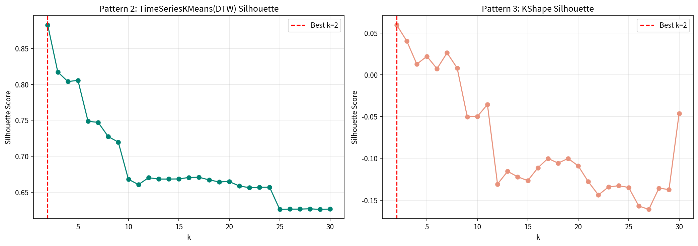
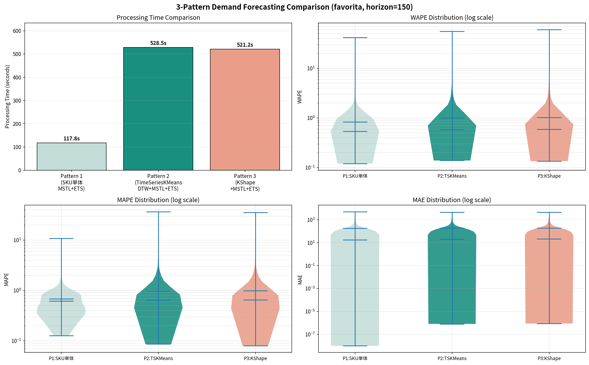

# 需要予測手法 3パターン比較レポート

**実験日**: 2026-03-13
**データセット**: Corporación Favorita (favorita_train_standard.csv)
**実行環境**: Linux / CPU 10コア並列 / GPU不使用 / seed=42

---

## 1. 実験概要

本レポートでは、時系列需要予測における**クラスタリングの有無および手法の違い**が、予測精度と計算コストに与える影響を定量的に評価する。特許出願資料「クラスタリング×時系列分解による需要予測精度・運用効率向上技術」に記載のパイプライン（DTWクラスタリング → 多段STL分解 → 予測器）を基準とし、以下の3パターンを比較した。

| パターン | クラスタリング | 時系列分解 | 予測器 |
| --- | --- | --- | --- |
| **P1**: ベースライン | なし（SKU単体） | MSTL (period=7, 365) | ETS |
| **P2**: PDF準拠 | TimeSeriesKMeans (DTW) | MSTL (period=7, 365) | ETS |
| **P3**: KShape変種 | KShape (SBD) | MSTL (period=7, 365) | ETS |

予測器を ETS に統一することで、**クラスタリング手法の効果のみ**を分離して評価する設計とした。

---

## 2. データセットと前処理

### 2.1 データ仕様

| 項目 | 値 |
| --- | --- |
| 総レコード数 | 3,000,888 |
| SKU数（系列数） | 1,782 |
| 日付範囲 | 2013-01-01 〜 2017-08-15（1,684日） |
| カラム | `date`, `channel`, `category`, `store`, `sku`, `y` |
| チャネル | favorita（単一） |
| カテゴリ数 | 33 |
| 店舗数 | 54 |

SKUは `{store}_{category}` の形式で構成される。全SKUが同一の日付範囲を持ち、欠損日は `y=0` で埋められたスパースな需要データである。

### 2.2 Train / Test 分割

| 区間 | 期間 | 日数 |
| --- | --- | --- |
| 訓練 | 2013-01-01 〜 2017-03-18 | 1,534日 |
| テスト | 2017-03-19 〜 2017-08-15 | **150日** |

祝日変数は全パターンで**不使用**とした。

### 2.3 月次需要行列（クラスタリング用）

P2・P3で使用する特徴行列 $F$ の構築手順:

1. 日次需要を月次（月初基準）で集計: $y_{sku,month} = \sum_{d \in month} y_{sku,d}$
2. SKU × 月のピボットテーブルを作成（欠損は0埋め）
3. Min-Maxスケーリング: $F \in \mathbb{R}^{1782 \times 56}$

---

## 3. 手法の詳細

### 3.1 P1: SKU単体 MSTL+ETS（ベースライン）

各SKUの訓練系列に対して個別に以下を実行:

1. **MSTL分解**: `statsmodels.tsa.seasonal.MSTL(series, periods=[7, 365])`
   - 週次（period=7）と年次（period=365）の季節成分を逐次的に抽出
2. **ETS予測**: トレンド成分に `ExponentialSmoothing(trend="add")` を適用し150日先を予測
3. **季節成分の延長**: 直近365日分の季節合成値をタイリングして予測期間に加算
4. **下限クリッピング**: $\hat{y} = \max(0, \text{trend\_fc} + \text{seasonal\_fc})$

並列度: `joblib.Parallel(n_jobs=10)`

### 3.2 P2: TimeSeriesKMeans(DTW) + MSTL+ETS

特許出願資料（PDF）に準拠したパイプライン:

#### Step 1: クラスタリング

- 距離尺度: DTW (Dynamic Time Warping)
- 手法: `tslearn.clustering.TimeSeriesKMeans(metric="dtw")`
- クラスタ数決定: $k = \arg\max_{k \in [2,30]} \text{Silhouette}(D_{DTW}, \text{labels}_k)$
  - DTW距離行列 $D_{DTW}$ を事前計算し、`metric="precomputed"` で評価
- `max_iter=50`, `random_state=42`

#### Step 2: クラスタ単位の予測

- 各クラスタの日次平均系列を算出
- MSTL(periods=[7, 365]) + ETS で150日先を予測

#### Step 3: SKU変換（PDF記載の正規化逆変換）

$$\hat{y}_{sku} = \frac{\hat{y}_{cluster} - \mu_{cluster}}{\sigma_{cluster}} \cdot \sigma_{sku} + \mu_{sku}$$

- $\mu, \sigma$ は全期間の統計量を使用

### 3.3 P3: KShape + MSTL+ETS

P2のクラスタリング手法のみを変更:

- 手法: `tslearn.clustering.KShape` (Shape-Based Distance)
- Silhouette評価にはSBD距離行列を使用
  - SBD: $d_{SBD}(x,y) = 1 - \max_s \frac{CC_{x,y}(s)}{\|x\| \cdot \|y\|}$（正規化相互相関の最大値の補数）
  - z正規化済みの月次行列上で計算
- 分解・予測・SKU変換はP2と同一

---

## 4. 結果

### 4.1 処理時間・精度指標の一覧

| パターン | 処理時間 (s) | WAPE 平均 | WAPE 中央値 | MAPE 平均 | MAPE 中央値 | MAE 平均 | MAE 中央値 |
| --- | ---: | ---: | ---: | ---: | ---: | ---: | ---: |
| **P1: SKU単体** | **117.8** | **0.8290** | **0.5410** | **0.6840** | **0.6176** | **176.82** | **17.90** |
| P2: TSKMeans(DTW) | 528.5 | 1.0007 | 0.5805 | 0.9744 | 0.6455 | 188.57 | 20.39 |
| P3: KShape | 521.2 | 1.0244 | 0.5935 | 0.9854 | 0.6509 | 188.13 | 20.91 |

- 評価対象: 全1,782 SKU（全パターン共通）
- WAPE: $\sum |y - \hat{y}| / \sum |y|$（SKU単位で算出 → 集計）
- MAPE: $y > 0$ の時点のみで算出（ゼロ除算回避）

### 4.2 クラスタリング結果

| | P2: TimeSeriesKMeans(DTW) | P3: KShape(SBD) |
| --- | --- | --- |
| 最適クラスタ数 $k^*$ | 2 | 2 |
| Silhouette Score | 0.8826 | 0.0596 |
| 距離行列計算時間 | 47.3s (DTW) | 3.5s (SBD) |
| クラスタリング + 評価時間 | ~520s | ~510s |

### 4.3 Silhouette Score の推移

#### P2 (TimeSeriesKMeans/DTW)

k=2 で Silhouette=0.88 の強いピークを示し、k の増加に伴い単調に減少。k=10 以降は 0.63〜0.67 のプラトーに収束。

#### P3 (KShape/SBD)

k=2 で Silhouette=0.06 と極めて低く、k≥9 では負値に転落。SBD距離空間上での分離構造がほぼ存在しないことを示唆。

### 4.4 精度分布（バイオリンプロット）

WAPE・MAPE・MAE いずれの指標においても、P1 の分布が P2・P3 よりも低値側に集中している。P2 と P3 の分布はほぼ同一であり、クラスタリング手法の違いによる精度差は限定的である。

---

## 5. 分析と考察

### 5.1 k=2 への収束がもたらす精度低下

本実験の最大の要因は、**Silhouette Score 最大化により k=2 が選択された**ことにある。

k=2 の場合:

- クラスタ平均系列は1,782系列の大まかな二分にすぎず、個々のSKUの需要パターン（振幅・位相・トレンド傾き）を捉えきれない
- SKU変換式 $\hat{y}_{sku} = \frac{\hat{y}_{cluster} - \mu_{cluster}}{\sigma_{cluster}} \cdot \sigma_{sku} + \mu_{sku}$ は線形スケーリングであり、クラスタ予測の波形が全SKUに同一形状で伝搬する
- 結果として、需要パターンが多様な1,782 SKUに対しては、SKU個別予測（P1）が優位となる

### 5.2 Silhouette Score 最大化の限界

Silhouette Score は**クラスタ内凝集度とクラスタ間分離度のバランス**を測る指標であり、予測精度を直接最適化するものではない。本データでは:

- DTW距離空間上で大きな2群（高需要群 vs 低需要群）が明確に分離しており、k=2 が距離指標上は最適
- しかし、予測に必要な**形状の類似性**（季節パターン・トレンド方向）は k=2 では不十分

改善案:

- **予測ベースのk選択**: Validation期間のWAPEを基準にkを選択する（Cross-Validation grid search）
- **最小クラスタ数の制約**: $k \geq \lceil N_{series} / 100 \rceil$ 等の下限を設ける
- **Silhouette 許容率**: 最大Silhouetteの95%以内で最大のkを採用（参考ノートブックの手法）

### 5.3 TimeSeriesKMeans vs KShape

| 観点 | P2: TSKMeans(DTW) | P3: KShape(SBD) |
| --- | --- | --- |
| 距離特性 | 振幅・位相の両方を考慮 | z正規化後の形状のみ |
| Silhouette (k=2) | 0.88（強い分離） | 0.06（分離なし） |
| 精度 (WAPE中央値) | 0.5805 | 0.5935 |
| 計算コスト | DTW距離行列47s + fitting ~480s | SBD距離行列3.5s + fitting ~510s |

- **DTW** は振幅差に敏感であり、高需要/低需要の二分を強く検出する。距離行列はSBDより計算コストが高い（47s vs 3.5s）。
- **KShape(SBD)** は振幅を正規化するため「形状」だけを捉えるが、本データではスパースな系列が多く、正規化後の形状差が小さい。結果としてSilhouetteがほぼ0であり、意味のあるクラスタ構造を発見できていない。
- **精度差は僅差**（WAPE中央値で0.013ポイント）であり、k=2の制約下では手法差よりもクラスタ粒度の粗さが支配的。

### 5.4 計算コストの逆転

PDF記載の技術的効果では「モデル数がN_seriesからN_cに削減され、学習/推論時間が短縮される」とされている。しかし本実験では:

| 処理 | P1 | P2 |
| --- | --- | --- |
| 距離行列計算 | — | 47.3s |
| k=2〜30 全探索 | — | ~480s |
| 予測（MSTL+ETS） | 117.8s（1,782モデル） | <1s（2モデル） |
| **合計** | **117.8s** | **528.5s** |

クラスタリングの前処理コスト（距離行列 + k探索）が予測コスト削減量を大幅に上回っている。これは:

- N_series=1,782 が比較的小規模であること
- k探索で29回のTimeSeriesKMeans fittingが必要であること

が原因。N_series が数万〜数十万規模になれば、クラスタリングの前処理は一度きりでモデル数が劇的に減るため、コスト比が逆転する可能性がある。

### 5.5 参考: 先行実験（K-medoids）との比較

同一データで実施済みの K-medoids クラスタリング実験（GPU利用）の結果:

| 手法 | 処理時間 | WAPE 平均 | WAPE 中央値 |
| --- | ---: | ---: | ---: |
| SKU単体 MSTL+ETS (先行) | 2,026.6s | 1.2641 | 0.6971 |
| K-medoids+MSTL+ETS (先行) | 318.7s | 1.0350 | 0.5761 |
| SKU単体 MSTL+ETS (本実験 P1) | 117.8s | 0.8290 | 0.5410 |
| TSKMeans(DTW)+MSTL+ETS (本実験 P2) | 528.5s | 1.0007 | 0.5805 |

先行実験と本実験のP1で精度が異なるのは、MSTL内の周期推定方法の違い（FFT自動推定 vs 固定 [7,365]）に起因する。固定周期のほうがこのデータでは安定した分解を実現している。

---

## 6. 結論

### 6.1 本実験の主要所見

1. **N_series=1,782 規模では、SKU単体予測（P1）がクラスタリング手法（P2・P3）を精度・速度の両面で上回った。**
2. Silhouette Score 最大化による k=2 の選択が、クラスタリング手法の予測性能を制限した主因である。
3. TimeSeriesKMeans(DTW) と KShape(SBD) の精度差は限定的（WAPE中央値で1.3ポイント差）。ただし DTW のほうが明確なクラスタ構造を検出できた。
4. 固定周期 MSTL(7, 365) は、FFTベースの自動周期推定よりも安定した精度を示した。

### 6.2 PDF記載手法の有効性に関する補足

本実験結果は PDF 手法の否定ではなく、**適用条件の重要性**を示している。

- **系列数が大規模**（数万〜数十万SKU）の場合、クラスタリングによるモデル数削減は計算コスト・運用負荷の観点で不可欠
- **k の選定戦略**を改善すれば（予測ベース最適化、最小k制約など）、クラスタリング手法の精度優位が得られる可能性がある
- **スパース度が高い**データでは、クラスタ平均による平滑化効果が個別予測のノイズ耐性を上回るケースが期待される

### 6.3 推奨アクション

| 優先度 | アクション | 期待効果 |
| --- | --- | --- |
| 高 | k選定を予測ベース（Validation WAPE最小化）に変更 | 精度改善 |
| 高 | k の最小値制約（例: k≥10）を導入 | クラスタ粒度の確保 |
| 中 | 大規模データ（N_series≥10,000）での再実験 | コスト優位性の検証 |
| 中 | 予測器のバリエーション（Prophet, LightGBM等）を追加比較 | モデル非依存性の確認 |
| 低 | DTW距離行列の増分更新（新SKU追加時）の実装 | 運用効率化 |

---

## 付録

### A. 実行環境

| 項目 | 値 |
| --- | --- |
| OS | Linux 6.8.0-101-generic |
| Python | 3.10 |
| CPU並列数 | 10 |
| GPU | 不使用 |
| 乱数シード | 42 |
| 主要ライブラリ | tslearn 0.8.0, statsmodels 0.14.6, scikit-learn, joblib |

### B. 処理時間内訳

| 処理ステップ | 時間 (s) |
| --- | --- |
| P1: SKU単体 MSTL+ETS (1,782 SKU) | 117.8 |
| DTW距離行列 (1,782×1,782) | 47.3 |
| SBD距離行列 (1,782×1,782) | 3.5 |
| P2: TSKMeans k探索 + 予測 + SKU変換 | 528.5 |
| P3: KShape k探索 + 予測 + SKU変換 | 521.2 |
| **合計** | **1,221.0 (20.4 min)** |

### C. 出力ファイル

| ファイル | 内容 |
| --- | --- |
| `Results/3pattern_comparison.png` | 処理時間・WAPE・MAPE・MAE のバイオリンプロット |
| `Results/3pattern_silhouette.png` | Silhouette Score の k 依存性 |
| `Results/3pattern_comparison_results.pkl` | 全SKUのメトリクス・クラスタ情報（pickle） |
| `compare_3patterns.py` | 実験スクリプト |
