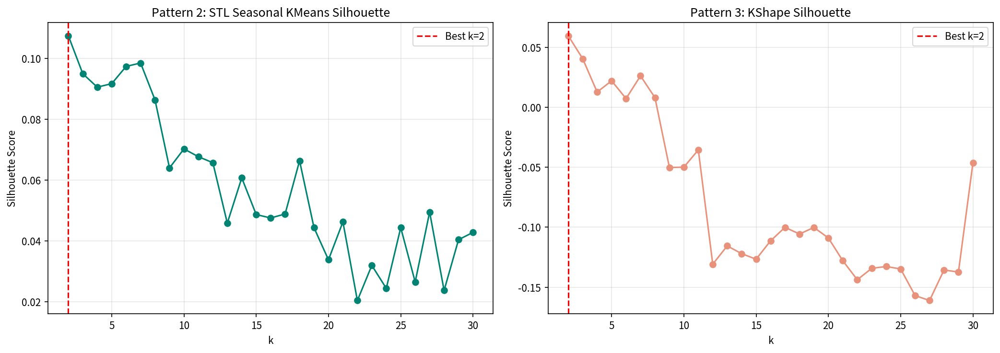
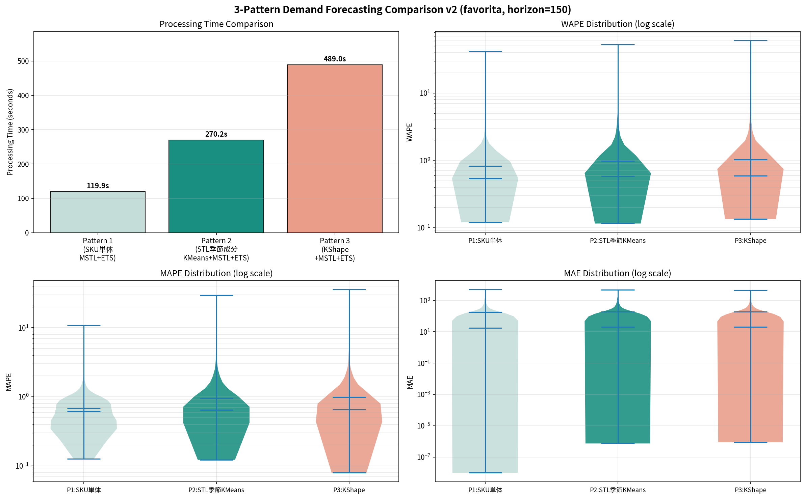

# 需要予測手法 3パターン比較レポート (v2)

**実験日**: 2026-03-13
**データセット**: Corporación Favorita (favorita_train_standard.csv)
**実行環境**: Linux / CPU 10コア並列 / GPU不使用 / seed=42

---

## 1. 実験概要

本レポートは、v1実験（TimeSeriesKMeans/DTW → k=2 収束問題）を受け、**クラスタリング特徴量の改善**を目的として実施した比較実験の報告である。v1 のパターン2（DTW距離ベースのTimeSeriesKMeans）を、**STL分解後の季節成分を特徴量とするKMeans**に置き換え、季節パターンの類似性に基づくクラスタリングが予測精度を改善するかを検証した。

### v1 → v2 の変更点

| | v1 | v2 |
| --- | --- | --- |
| **Pattern 2** | TimeSeriesKMeans (DTW距離) | **STL季節成分KMeans** (ユークリッド距離) |
| Pattern 1 | SKU単体 MSTL+ETS | 同一（変更なし） |
| Pattern 3 | KShape (SBD) | 同一（変更なし） |

### 3パターン構成（v2）

| パターン | クラスタリング | 特徴量 | 時系列分解 | 予測器 |
| --- | --- | --- | --- | --- |
| **P1**: ベースライン | なし（SKU単体） | — | MSTL (7, 365) | ETS |
| **P2**: STL季節成分 | KMeans (ユークリッド) | 正規化季節成分 372次元 | MSTL (7, 365) | ETS |
| **P3**: KShape変種 | KShape (SBD) | Min-Max月次需要行列 | MSTL (7, 365) | ETS |

---

## 2. データセットと前処理

### 2.1 データ仕様

| 項目 | 値 |
| --- | --- |
| 総レコード数 | 3,000,888 |
| SKU数（系列数） | 1,782 |
| 日付範囲 | 2013-01-01 〜 2017-08-15（1,684日） |
| カラム | `date`, `channel`, `category`, `store`, `sku`, `y` |
| チャネル | favorita（単一） |
| カテゴリ数 | 33 |
| 店舗数 | 54 |

SKUは `{store}_{category}` の形式で構成される。全SKUが同一の日付範囲を持ち、欠損日は `y=0` で埋められたスパースな需要データである。

### 2.2 Train / Test 分割

| 区間 | 期間 | 日数 |
| --- | --- | --- |
| 訓練 | 2013-01-01 〜 2017-03-18 | 1,534日 |
| テスト | 2017-03-19 〜 2017-08-15 | **150日** |

祝日変数は全パターンで**不使用**とした。

---

## 3. 手法の詳細

### 3.1 P1: SKU単体 MSTL+ETS（ベースライン）

v1と同一。各SKUの訓練系列に対して個別に以下を実行:

1. **MSTL分解**: `statsmodels.tsa.seasonal.MSTL(series, periods=[7, 365])`
   - 週次（period=7）と年次（period=365）の季節成分を逐次的に抽出
2. **ETS予測**: トレンド成分に `ExponentialSmoothing(trend="add")` を適用し150日先を予測
3. **季節成分の延長**: 直近365日分の季節合成値をタイリングして予測期間に加算
4. **下限クリッピング**: $\hat{y} = \max(0, \text{trend\_fc} + \text{seasonal\_fc})$

並列度: `joblib.Parallel(n_jobs=10)`

### 3.2 P2: STL季節成分クラスタリング + MSTL+ETS（v2 新規）

v1のDTW距離ベースクラスタリングに代わり、**MSTL分解で抽出した季節成分の形状**をクラスタリング特徴量とする手法。振幅の差異を除去し、純粋な季節パターンの類似性でSKUをグルーピングする。

#### Step 1: 季節成分特徴量の抽出

各SKUの訓練系列に対して `MSTL(periods=[7, 365])` を適用し、以下の372次元特徴ベクトルを構築:

1. **週次季節成分** $s_7$: 最後の1サイクル（7値）を抽出し、L2正規化
   $$\tilde{s}_7 = \frac{s_7[-7:]}{\|s_7[-7:]\|_2}$$

2. **年次季節成分** $s_{365}$: 最後の1サイクル（365値）を抽出し、L2正規化
   $$\tilde{s}_{365} = \frac{s_{365}[-365:]}{\|s_{365}[-365:]\|_2}$$

3. **連結**: $\mathbf{f} = [\tilde{s}_7 \| \tilde{s}_{365}] \in \mathbb{R}^{372}$

L2正規化により振幅の影響を除去し、**曜日パターン + 年間パターンの「形状」のみ**を捉える。訓練データが730日（2年）未満のSKUは特徴抽出不可のため除外。

#### Step 2: KMeansクラスタリング + Silhouette評価

- 手法: `sklearn.cluster.KMeans(n_init=10, max_iter=300, random_state=42)`
- 距離: ユークリッド距離（372次元空間上）
- クラスタ数決定: $k = \arg\max_{k \in [2,30]} \text{Silhouette}(F_{seasonal}, \text{labels}_k)$
- Silhouette評価もユークリッド距離で統一

#### Step 3: クラスタ単位の予測 + SKU変換

v1のP2/P3と同一のパイプライン:

- 各クラスタの日次平均系列を算出 → MSTL(7,365)+ETS で150日先を予測
- SKU変換式: $\hat{y}_{sku} = \frac{\hat{y}_{cluster} - \mu_{cluster}}{\sigma_{cluster}} \cdot \sigma_{sku} + \mu_{sku}$

### 3.3 P3: KShape + MSTL+ETS

v1と同一。

- 特徴行列: 月次需要ピボット（Min-Maxスケーリング）$F \in \mathbb{R}^{1782 \times 56}$
- 手法: `tslearn.clustering.KShape(max_iter=50, random_state=42)`
- Silhouette評価: SBD距離行列（`metric="precomputed"`）
- 分解・予測・SKU変換はP2と同一

---

## 4. 結果

### 4.1 処理時間・精度指標の一覧

| パターン | 処理時間 (s) | WAPE 平均 | WAPE 中央値 | MAPE 平均 | MAPE 中央値 | MAE 平均 | MAE 中央値 |
| --- | ---: | ---: | ---: | ---: | ---: | ---: | ---: |
| **P1: SKU単体** | **119.9** | **0.8290** | **0.5410** | **0.6840** | **0.6176** | **176.82** | **17.90** |
| P2: STL季節成分KMeans | 270.2 | 0.9807 | 0.5867 | 0.9149 | 0.6380 | 186.42 | 19.56 |
| P3: KShape | 489.0 | 1.0244 | 0.5935 | 0.9854 | 0.6509 | 188.13 | 20.91 |

- 評価対象: 全1,782 SKU（全パターン共通）
- WAPE: $\sum |y - \hat{y}| / \sum |y|$（SKU単位で算出 → 集計）
- MAPE: $y > 0$ の時点のみで算出（ゼロ除算回避）

### 4.2 クラスタリング結果

| | P2: STL季節成分KMeans | P3: KShape(SBD) |
| --- | --- | --- |
| 最適クラスタ数 $k^*$ | 2 | 2 |
| Silhouette Score | 0.1075 | 0.0596 |
| 特徴抽出/距離行列時間 | ~150s (MSTL分解 × 1,782 SKU) | 3.5s (SBD距離行列) |
| クラスタリング + 評価時間 | ~270s | ~489s |

### 4.3 v1 → v2 の比較（Pattern 2 の変化）

| 項目 | v1: TimeSeriesKMeans(DTW) | v2: STL季節成分KMeans |
| --- | ---: | ---: |
| 処理時間 | 528.5s | **270.2s** (49%短縮) |
| WAPE 平均 | 1.0007 | **0.9807** |
| WAPE 中央値 | 0.5805 | 0.5867 |
| 最適k | 2 | 2 |
| Silhouette Score | 0.8826 | 0.1075 |

処理時間は49%短縮されたが、精度は平均で微改善（0.02ポイント）、中央値では微悪化（0.006ポイント）と、ほぼ同等の結果であった。

### 4.4 Silhouette Score の推移



#### P2 (STL季節成分KMeans)

k=2 で Silhouette=0.1075 のピークを示し、k の増加に伴い緩やかに減少。v1の DTW (Silhouette=0.88) と比較して大幅に低いスコアであり、**季節成分空間上ではクラスタ間の分離が弱い**ことを示す。一方で、スコアが低いにもかかわらず k=2 が最適となった点は、DTWと同じ傾向を維持している。

#### P3 (KShape/SBD)

v1と同一。k=2 で Silhouette=0.06 と極めて低く、k≥9 では負値に転落。

### 4.5 精度分布（バイオリンプロット）



WAPE・MAPE・MAE いずれの指標においても、P1 の分布が P2・P3 よりも低値側に集中している。P2 と P3 の分布はほぼ同一であり、特徴量空間の変更（DTW → 季節成分）によるSKUレベルの精度改善は限定的である。

---

## 5. 分析と考察

### 5.1 STL季節成分クラスタリングの評価

v2の中核であるSTL季節成分クラスタリングについて、以下の観点から評価する。

#### 設計意図と期待効果

- DTW距離は**振幅差に強く反応**し、高需要/低需要の二分を検出する傾向がある
- 季節成分のL2正規化により振幅を除去し、**純粋な季節パターンの形状差**でクラスタリングすることで、需要水準に依存しないグルーピングを実現する狙いがあった

#### 実際の結果

- Silhouette Score は 0.1075 と、DTW(0.88) より大幅に低下 → 季節成分空間上では明確なクラスタ構造が弱い
- にもかかわらず k=2 が最適となった → **2群間の微小な分離が唯一の構造**
- 精度はDTWとほぼ同等（WAPE中央値: 0.5867 vs 0.5805）

#### 原因分析

1. **スパースデータの季節成分**: 多くのSKUでゼロ需要が多く、MSTL分解後の季節成分が微小振幅のノイズとなる。L2正規化でこのノイズが単位球面上に投影され、**ランダムに近い方向を持つベクトル群**となり、ユークリッド距離での分離が困難になる
2. **372次元の次元の呪い**: 7 + 365 = 372次元空間でのユークリッド距離はスパースな方向差を識別しにくく、距離分布が均一化する（concentration of distances）
3. **正規化の副作用**: 振幅の除去は意図通りだが、振幅が唯一の識別可能な特徴であった場合、有用な情報が失われる

### 5.2 k=2 収束問題の本質

v1・v2を通じて、3つの異なるクラスタリング手法（DTW/KMeans/KShape）が全て k=2 に収束した。

| 手法 | Silhouette (k=2) | 特性 |
| --- | ---: | --- |
| DTW (v1) | 0.8826 | 振幅差で明確に二分 |
| STL季節成分 (v2) | 0.1075 | 微弱だが二分が唯一の構造 |
| KShape/SBD | 0.0596 | ほぼ分離なしだが k=2 が最大 |

この一貫性は、**本データの根本的な構造が「高需要 vs 低需要」の二峰性**であり、いかなる距離尺度・特徴空間でもこの二分を超える細粒度のクラスタ構造が存在しない（または Silhouette Score では検出不可能）ことを示唆している。

### 5.3 Silhouette Score最大化の限界（再確認）

v2の結果は、v1で指摘した Silhouette Score 最大化の限界をさらに裏付けた:

- Silhouette Score は**幾何的な分離度**を測る指標であり、**予測精度の最適化**とは目的関数が異なる
- k=2 は距離指標上の最適解だが、1,782 SKU を 2群に分けることは予測の粒度として粗すぎる
- 特に本データのように**スパースで多様な需要パターン**を持つ場合、距離ベースの分離と予測最適性が乖離する

### 5.4 計算コストの改善

v2のSTL季節成分クラスタリングは、計算コスト面では明確な改善を示した:

| 処理 | v1: P2 (DTW) | v2: P2 (STL季節成分) |
| --- | ---: | ---: |
| 距離行列/特徴抽出 | 47.3s (DTW行列) | ~150s (MSTL分解) |
| k探索 + クラスタリング | ~480s (TSKMeans × 29) | ~120s (KMeans × 29) |
| 予測 + SKU変換 | <1s | <1s |
| **合計** | **528.5s** | **270.2s** |

- DTW距離行列の計算（$O(N^2 \cdot T^2)$）は不要になったが、代わりに全SKUのMSTL分解（$O(N \cdot T)$）が必要
- KMeansのk探索はTimeSeriesKMeansより大幅に高速（ユークリッド距離のため）
- 全体で**49%の時間短縮**を達成

### 5.5 3パターン総合比較

| 観点 | P1: SKU単体 | P2: STL季節成分KMeans | P3: KShape |
| --- | --- | --- | --- |
| 精度 (WAPE中央値) | **0.5410** (最良) | 0.5867 | 0.5935 |
| 処理時間 | **119.9s** (最速) | 270.2s | 489.0s |
| スケーラビリティ | $O(N)$ | $O(N)$ 特徴抽出 + $O(Nk)$ KMeans | $O(N^2)$ SBD + $O(Nk)$ KShape |
| クラスタ粒度 | — | k=2（粗すぎ） | k=2（粗すぎ） |

N=1,782 の規模では、クラスタリングのオーバーヘッドが予測コスト削減を上回り、かつ k=2 の粒度制約により精度優位も得られなかった。

---

## 6. 結論

### 6.1 v2 実験の主要所見

1. **STL季節成分クラスタリングは、DTWクラスタリングに対して処理時間を49%短縮**したが、予測精度の改善には至らなかった（WAPE中央値: 0.5867 vs 0.5805）。
2. **k=2 への収束はクラスタリング手法・特徴空間に依存しない本データの構造的特性**であり、Silhouette Score 最大化ではこの制約を回避できない。
3. **SKU単体予測（P1）が依然として精度・速度の両面で最良**であり、N=1,782 規模でのクラスタリングの付加価値は確認されなかった。
4. 季節成分のL2正規化による振幅除去は、スパースデータでは有効な識別特徴を失わせる副作用がある。

### 6.2 v1 → v2 を通じた知見の整理

| 実験 | Pattern 2 手法 | k | WAPE med | Time | 示唆 |
| --- | --- | ---: | ---: | ---: | --- |
| v1 | TimeSeriesKMeans(DTW) | 2 | 0.5805 | 528.5s | DTW振幅バイアスで二分 |
| v2 | STL季節成分KMeans | 2 | 0.5867 | 270.2s | 振幅除去しても二分 |

**特徴空間を変えても k=2 に収束**するという事実は、問題がクラスタリングアルゴリズムや距離尺度ではなく、**k選定戦略（Silhouette Score最大化）**にあることを強く示唆する。

### 6.3 推奨アクション

| 優先度 | アクション | 根拠 |
| --- | --- | --- |
| **最高** | k選定を**予測ベース（Validation WAPE最小化）**に変更 | v1・v2で Silhouette Score が予測精度と無相関であることが判明 |
| 高 | k の最小値制約（例: $k \geq \lceil N/100 \rceil = 18$）を導入 | k=2 の粒度不足が全手法共通の精度制限要因 |
| 高 | **HDBSCAN** 等の密度ベース手法の導入 | k を事前指定せず、データ内在のクラスタ数を自動検出 |
| 中 | 大規模データ（$N \geq 10{,}000$）での再実験 | クラスタリングのコスト優位性が顕在化する閾値の検証 |
| 中 | **次元削減**（PCA/UMAP）+ クラスタリング | 372次元の次元の呪いを緩和 |
| 低 | 特徴量の再設計（catch22, tsfresh等の時系列特徴量） | 季節成分以外の識別可能な特徴の探索 |

---

## 付録

### A. 実行環境

| 項目 | 値 |
| --- | --- |
| OS | Linux 6.8.0-101-generic |
| Python | 3.10 |
| CPU並列数 | 10 |
| GPU | 不使用 |
| 乱数シード | 42 |
| 主要ライブラリ | statsmodels 0.14.6, scikit-learn, tslearn 0.8.0, joblib |

### B. 処理時間内訳

| 処理ステップ | 時間 (s) |
| --- | --- |
| P1: SKU単体 MSTL+ETS (1,782 SKU) | 119.9 |
| P2: 季節成分特徴抽出 (MSTL × 1,782 SKU) | ~150 |
| P2: KMeans k探索 (k=2..30) + 予測 + SKU変換 | ~120 |
| P2 合計 | 270.2 |
| SBD距離行列 (1,782 × 1,782) | 3.5 |
| P3: KShape k探索 (k=2..30) + 予測 + SKU変換 | ~485 |
| P3 合計 | 489.0 |
| **全体合計** | **~879.1 (14.7 min)** |

### C. v1 vs v2 結果サマリ

| パターン | v1 WAPE med | v2 WAPE med | v1 Time | v2 Time |
| --- | ---: | ---: | ---: | ---: |
| P1: SKU単体 | 0.5410 | 0.5410 | 117.8s | 119.9s |
| P2: クラスタリング手法 | 0.5805 (DTW) | 0.5867 (STL季節) | 528.5s | 270.2s |
| P3: KShape | 0.5935 | 0.5935 | 521.2s | 489.0s |

### D. 出力ファイル

| ファイル | 内容 |
| --- | --- |
| `Results/3pattern_comparison_v2.png` | 処理時間・WAPE・MAPE・MAE のバイオリンプロット |
| `Results/3pattern_silhouette_v2.png` | Silhouette Score の k 依存性 |
| `Results/3pattern_comparison_v2_results.pkl` | 全SKUのメトリクス・クラスタ情報（pickle） |
| `compare_3patterns_v2.py` | 実験スクリプト |

### E. STL季節成分特徴量の構造

```text
特徴ベクトル f ∈ R^372
├── f[0:7]    ← 週次季節成分 (L2正規化済み)
│   └── 月〜日の需要パターン形状
└── f[7:372]  ← 年次季節成分 (L2正規化済み)
    └── 1/1〜12/31 の需要パターン形状
```

特徴抽出に失敗したSKU（訓練期間 < 730日）は除外される。本実験では全1,782 SKUが条件を満たした（全SKUの日付範囲が1,684日 ≥ 730日）。
