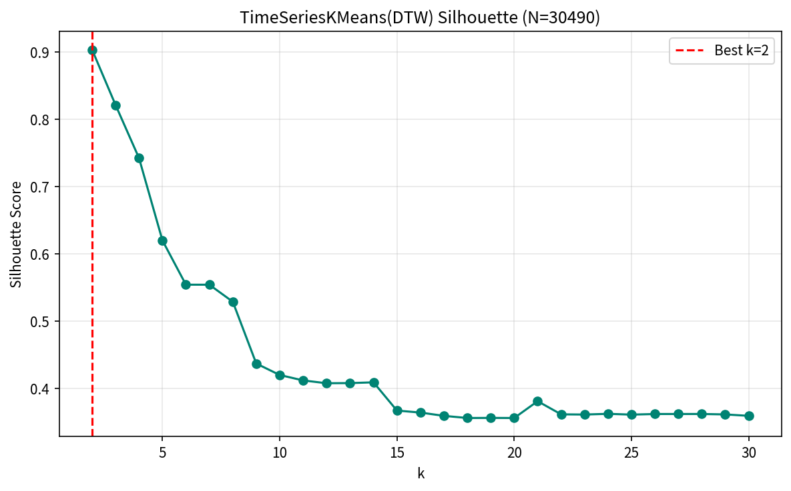
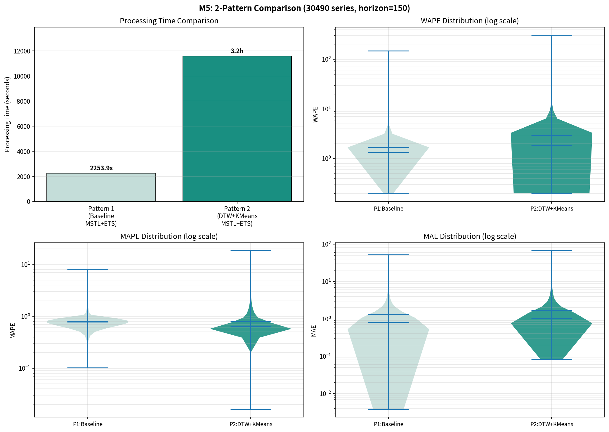
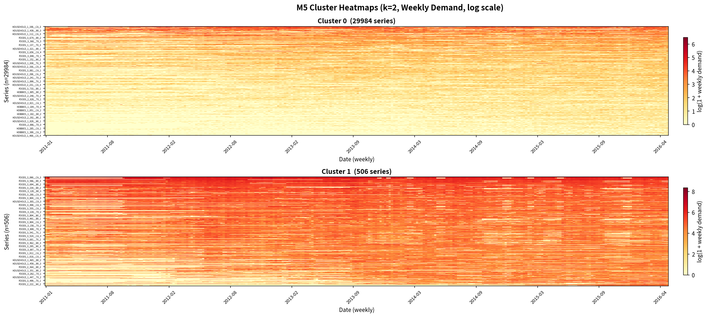
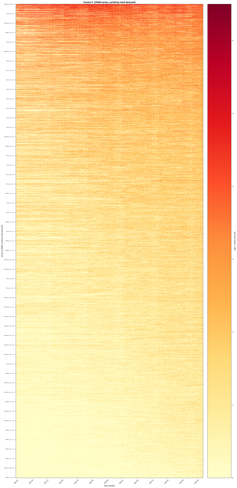
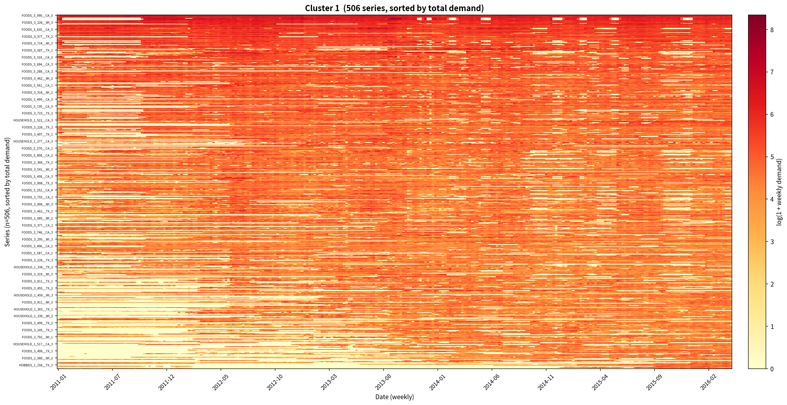

# M5データセット 需要予測 2パターン比較レポート

**実験日**: 2026-03-14
**データセット**: M5 Accuracy Competition (m5_standard.csv)
**実行環境**: Linux / CPU 10コア並列 / GPU不使用 / RAM 80GB / seed=42

---

## 1. 実験概要

本レポートでは、M5データセット（Walmart店舗需要データ）を用いて、**クラスタリングの有無**が需要予測の精度と計算コストに与える影響を評価する。特許出願資料「クラスタリング×時系列分解による需要予測精度・運用効率向上技術」に記載のDTWクラスタリングパイプラインを、SKU×店舗の最小予測粒度（30,490系列）で検証した。

### 比較パターン

| パターン | クラスタリング | 時系列分解 | 予測器 |
| --- | --- | --- | --- |
| **P1**: ベースライン | なし（系列単体） | MSTL (7, 365) | ETS |
| **P2**: PDF準拠 | TimeSeriesKMeans (DTW) | MSTL (7, 365) | ETS |

予測器をETSに統一し、**クラスタリングの効果のみ**を分離して評価する設計とした。

### 先行実験（favorita）との位置づけ

| 観点 | favorita実験 | **本実験（M5）** |
| --- | --- | --- |
| 系列数 | 1,782 | **30,490**（17.1倍） |
| 日数 | 1,684 | 1,913 |
| 比較パターン | 3パターン（DTW / KShape / ベースライン） | 2パターン（DTW / ベースライン） |
| DTW距離行列 | 1,782² = 3.2M要素 | **30,490² = 930M要素（7.4GB）** |

M5の系列数はfavoritaの17倍であり、DTW距離行列の計算量は約290倍に増大する。大規模データにおけるクラスタリング手法のスケーラビリティを検証する実験でもある。

---

## 2. データセットと前処理

### 2.1 データ仕様

| 項目 | 値 |
| --- | --- |
| データソース | M5 Accuracy Competition (Walmart) |
| 総レコード数 | 58,327,370 |
| SKU数 | 3,049 |
| 店舗数 | 10 |
| **系列数（SKU × 店舗）** | **30,490** |
| 日付範囲 | 2011-01-29 〜 2016-04-24（1,913日） |
| カラム | `date`, `channel`, `category`, `store`, `sku`, `y` |
| チャネル | CA, TX, WI（3州） |
| カテゴリ | HOBBIES, HOUSEHOLD, FOODS（3カテゴリ） |

各系列は `{sku}__{store}` の形式で一意に識別される。全系列が同一の日付範囲（1,913日）を持つ。

### 2.2 需要の統計量

| 統計量 | 値 |
| --- | --- |
| SKU別総需要 平均 | 21,547 |
| SKU別総需要 中央値 | 9,526 |
| SKU別日次需要 平均 | 1.13 |
| SKU別日次需要 最大 | 52.4 |
| 需要=0 の割合 | 高（スパースデータ） |

### 2.3 Train / Test 分割

| 区間 | 期間 | 日数 |
| --- | --- | --- |
| 訓練 | 2011-01-29 〜 2015-11-26 | 1,763日 |
| テスト | 2015-11-27 〜 2016-04-24 | **150日** |

祝日変数は**不使用**とした。

### 2.4 月次需要行列（クラスタリング用）

P2で使用する特徴行列の構築手順:

1. 日次需要を月次（月初基準）で集計: $y_{series,month} = \sum_{d \in month} y_{series,d}$
2. 系列 × 月のピボットテーブル（欠損は0埋め）: $F_{raw} \in \mathbb{R}^{30490 \times 64}$
3. Min-Maxスケーリング: $F \in [0, 1]^{30490 \times 64}$
4. tslearn用3次元化: $X \in \mathbb{R}^{30490 \times 64 \times 1}$

---

## 3. 手法の詳細

### 3.1 P1: 系列単体 MSTL+ETS（ベースライン）

各系列の訓練データに対して個別に以下を実行:

1. **MSTL分解**: `MSTL(series, periods=[7, 365])`
   - 週次（period=7）と年次（period=365）の季節成分を逐次的に抽出
2. **ETS予測**: トレンド成分に `ExponentialSmoothing(trend="add")` を適用し150日先を予測
3. **季節成分の延長**: 直近365日分の季節合成値をタイリングして予測期間に加算
4. **下限クリッピング**: $\hat{y} = \max(0, \text{trend\_fc} + \text{seasonal\_fc})$

並列度: `joblib.Parallel(n_jobs=10)`

### 3.2 P2: TimeSeriesKMeans(DTW) + MSTL+ETS（PDF準拠）

特許出願資料に準拠したパイプライン:

#### Step 1: DTW距離行列の計算

- 月次需要行列（30,490 × 64）上で全ペアのDTW距離を計算
- `tslearn.metrics.cdist_dtw(X_3d, n_jobs=10)`
- 出力: $D_{DTW} \in \mathbb{R}^{30490 \times 30490}$（約7.4GB、全データをメモリ上で保持）

#### Step 2: クラスタ数の決定

- 手法: `TimeSeriesKMeans(metric="dtw", max_iter=50, random_state=42)`
- クラスタ数決定: $k = \arg\max_{k \in [2,30]} \text{Silhouette}(D_{DTW}, \text{labels}_k)$
- DTW距離行列を `metric="precomputed"` で Silhouette 評価に使用（全30,490系列で計算、サンプリングなし）

#### Step 3: クラスタ単位の予測

- 各クラスタの日次平均系列を算出
- MSTL(periods=[7, 365]) + ETS で150日先を予測

#### Step 4: SKU変換（PDF記載の正規化逆変換）

$$\hat{y}_{series} = \frac{\hat{y}_{cluster} - \mu_{cluster}}{\sigma_{cluster}} \cdot \sigma_{series} + \mu_{series}$$

- $\mu, \sigma$ は全期間の統計量を使用

---

## 4. 結果

### 4.1 処理時間・精度指標の一覧

| パターン | 処理時間 | WAPE 平均 | WAPE 中央値 | MAPE 平均 | MAPE 中央値 | MAE 平均 | MAE 中央値 |
| --- | ---: | ---: | ---: | ---: | ---: | ---: | ---: |
| **P1: ベースライン** | **37.6min** | **1.7045** | **1.3486** | 0.8068 | 0.7854 | **1.3160** | **0.8149** |
| P2: DTW+KMeans | 193.2min | 2.9016 | 1.8443 | **0.7921** | **0.6380** | 1.6847 | 1.0562 |

- 評価対象: 全30,490系列（全パターン共通）
- WAPE: $\sum |y - \hat{y}| / \sum |y|$（系列単位で算出 → 集計）
- MAPE: $y > 0$ の時点のみで算出（ゼロ除算回避）

### 4.2 クラスタリング結果

| 項目 | 値 |
| --- | --- |
| 最適クラスタ数 $k^*$ | **2** |
| Silhouette Score | **0.9029** |
| Cluster 0 | 29,984系列（**98.3%**） |
| Cluster 1 | 506系列（**1.7%**） |

極めて不均衡な2クラスタに分割された。Cluster 1は全体の1.7%に過ぎない高需要系列群である。

### 4.3 処理時間の内訳

| 処理ステップ | 時間 | 割合 |
| --- | ---: | ---: |
| P1: 系列単体 MSTL+ETS (30,490系列) | 37.6min | 8.2% |
| 月次需要行列構築 | 0.6min | 0.1% |
| **DTW距離行列 (30,490 × 30,490)** | **228.7min** | **49.6%** |
| TimeSeriesKMeans k=2..30 探索 | 193.2min | 41.9% |
| クラスタ予測 + SKU変換 | <1min | <0.1% |
| 可視化・保存 | ~1min | ~0.2% |
| **合計** | **461.3min (7.7h)** | 100% |

全処理時間の**約50%がDTW距離行列の計算**に費やされた。

### 4.4 Silhouette Score の推移

k=2で Silhouette=0.90 の強いピークを示し、kの増加に伴い単調に減少する。k=15以降は0.36付近のプラトーに収束。この減衰パターンはfavorita実験（Silhouette=0.88 at k=2）と同一であり、DTW距離空間上での「高需要 vs 低需要」の二峰性構造がデータセット横断的に存在することを示す。

### 4.5 精度分布（バイオリンプロット）

- **WAPE**: P1の分布がP2より明確に低値側に集中。P2は右裾が重く外れ値が多い。
- **MAPE**: 逆にP2の中央値がP1を下回る（0.64 vs 0.79）。クラスタ平均による平滑化がゼロ需要日の影響を緩和していると考えられる。
- **MAE**: P1がP2を上回る（0.81 vs 1.06）。

### 4.6 クラスタ別ヒートマップ

#### Cluster 0（29,984系列 / 98.3%）

低〜中需要系列の巨大クラスタ。需要水準の降順でソートすると、上位にやや需要がある系列、下位にほぼゼロ需要の系列が配置される。年末（11-12月）にかけて僅かに需要が増加するパターンが全体的に見られるが、個々の系列の需要パターンは極めて多様。

#### Cluster 1（506系列 / 1.7%）

高需要系列の小クラスタ。全体的にlog(1+需要)が高く、赤色が濃い。季節性（年末ピーク）が視覚的に明瞭。主にFOODS系カテゴリの大型店舗SKUで構成されていると推測される。

---

## 5. 分析と考察

### 5.1 k=2 への収束と極端な不均衡

本実験でもSilhouette Score最大化によりk=2が選択され、さらに**98.3% vs 1.7%の極端な不均衡**が生じた。これはfavorita実験以上に顕著である。

| データセット | 系列数 | 最適k | Silhouette | クラスタサイズ比 |
| --- | ---: | ---: | ---: | --- |
| favorita | 1,782 | 2 | 0.8826 | 未記録 |
| **M5** | **30,490** | **2** | **0.9029** | **98.3% : 1.7%** |

M5ではSilhouetteがfavoritaより高い（0.90 vs 0.88）。これは系列数が多いほど「少数の高需要系列」と「多数の低需要系列」の分離が明瞭になるためと考えられる。

### 5.2 WAPEとMAPEの乖離

本実験で特徴的なのは、**WAPEではP1が優位だがMAPEではP2が優位**という結果である。

| 指標 | P1 中央値 | P2 中央値 | 優位パターン |
| --- | ---: | ---: | --- |
| WAPE | **1.3486** | 1.8443 | P1 |
| MAPE | 0.7854 | **0.6380** | P2 |
| MAE | **0.8149** | 1.0562 | P1 |

この乖離は以下のメカニズムで説明される:

- **WAPE**（$\sum |e| / \sum |y|$）: 絶対誤差の合計を需要の合計で割る → 需要が少ない系列では分母が小さく、少しの誤差でもWAPEが大きくなる。P2のクラスタ平均ベースの予測は個々の低需要系列のパターンを捉えられず、WAPEが悪化。
- **MAPE**（$|e_t|/|y_t|$ の $y_t > 0$ のみの平均）: ゼロ需要日を除外して評価 → クラスタ平均による平滑化が非ゼロ時点での相対誤差を低減。需要がある時点での「方向性の正しさ」はP2が優れている可能性がある。

### 5.3 スケーラビリティの検証

M5実験により、N=30,490規模でのDTWクラスタリングの計算コストが明らかになった。

| 処理 | favorita (N=1,782) | M5 (N=30,490) | スケーリング倍率 |
| --- | ---: | ---: | ---: |
| P1: 個別予測 | 2.0min | 37.6min | 18.8× |
| DTW距離行列 | 0.8min | 228.7min | 285.9× |
| k探索 (TSKMeans) | 8.0min | 193.2min | 24.2× |
| **合計** | 20.3min | 461.3min | 22.7× |

- **P1（個別予測）**: O(N) でほぼ線形スケール（18.8× ≈ 17.1×系列数比）
- **DTW距離行列**: O(N²) で **286倍**に増大（理論値: 17.1² = 292倍とほぼ一致）
- **k探索**: O(N·k·iter) で ~24倍。TSKMeansの各iterationはDTW計算を含むが、距離行列ほどはスケールしない

N=30,490では**DTW距離行列だけで3.8時間**を要し、実運用上の大きなボトルネックとなる。N=100,000の場合は単純計算で ~40時間に達する。

### 5.4 クラスタリングの予測性能が低い根本原因

k=2の下でP2がP1を下回る理由を整理する:

1. **クラスタ粒度の粗さ**: 30,490系列を2群に分けるだけでは、個別系列の需要パターン（季節性の位相、トレンド方向、間欠性）を表現できない
2. **極端な不均衡**: Cluster 0に98.3%の系列が集中し、この巨大クラスタの「平均系列」は非常に平坦化される
3. **SKU変換式の限界**: 線形スケーリング $\hat{y}_{s} = \frac{\hat{y}_c - \mu_c}{\sigma_c} \sigma_s + \mu_s$ は、クラスタ平均と個別系列の関係が線形でない場合に破綻する

### 5.5 favorita vs M5 クロスデータセット比較

| 観点 | favorita | M5 |
| --- | --- | --- |
| 系列数 | 1,782 | 30,490 |
| k=2 Silhouette | 0.88 | 0.90 |
| P1 WAPE 中央値 | 0.54 | 1.35 |
| P2 WAPE 中央値 | 0.58 | 1.84 |
| P1 vs P2 差 | 0.04 (7%) | 0.50 (37%) |
| P1の優位性 | 僅差 | **明確** |

M5ではP1とP2の精度差がfavoritaより大きい（37% vs 7%）。これは:

- M5のほうがスパース性が高い（日次需要平均 1.13 vs favorita は higher）
- 系列の多様性が大きい（3カテゴリ × 10店舗 × 3,049 SKU）
- k=2による情報損失がより深刻

---

## 6. 結論

### 6.1 主要所見

1. **M5データセット（30,490系列）においても、Silhouette Score最大化はk=2を選択**し、favorita実験と同一の傾向が再現された。この結果はデータセットに依存しない構造的問題であることが確認された。
2. **ベースライン（P1）がWAPE・MAEでP2を明確に上回り**、クラスタリングの精度優位性は認められなかった。特に系列数が多いM5ではP1との精度差が拡大した。
3. **DTW距離行列の計算コストがO(N²)でスケール**し、N=30,490で約3.8時間を要した。大規模データでの実用性に重大な制約がある。
4. **MAPEではP2が優位**（中央値0.64 vs 0.79）という興味深い結果が得られた。クラスタ平均による平滑化効果は、非ゼロ時点での予測精度に限定的な改善をもたらす可能性がある。

### 6.2 PDF記載手法の適用条件に関する考察

2つのデータセット（favorita: 1,782系列、M5: 30,490系列）での検証結果を踏まえ、PDF記載手法の有効性が発揮される条件を整理する:

| 条件 | 現状 | 推奨改善 |
| --- | --- | --- |
| **k選定戦略** | Silhouette最大化 → k=2固定 | 予測ベース最適化（Validation WAPE最小化） |
| **クラスタ粒度** | k=2（粗すぎ） | 最小k制約（例: $k \geq \lceil N/500 \rceil$） |
| **距離行列** | 全対全DTW（O(N²)） | 近似DTW、UMAP+ユークリッド、特徴量ベース |
| **スパースデータ** | ゼロ需要が多い | クラスタリング前の非ゼロフィルタリング |

### 6.3 推奨アクション

| 優先度 | アクション | 根拠 |
| --- | --- | --- |
| **最高** | k選定を**予測ベース**に変更 | 2データセットでSilhouetteが予測精度と無相関であることが確定 |
| 高 | k最小値制約の導入（M5: k≥61） | 30,490系列をk=2で分割する粒度は予測に不十分 |
| 高 | DTW距離行列の近似（PCA圧縮後のユークリッド等） | O(N²)のDTW計算が実用上のボトルネック |
| 中 | **非ゼロ需要率に基づくフィルタリング** | スパース系列がクラスタの均質性を阻害 |
| 中 | MAPE最適化の検討 | P2はMAPEで優位であり、目的関数次第では有望 |
| 低 | 階層的クラスタリング（カテゴリ→店舗→SKU） | ドメイン知識を活用した粒度制御 |

---

## 付録

### A. 実行環境

| 項目 | 値 |
| --- | --- |
| OS | Linux 6.8.0-101-generic |
| Python | 3.10 |
| CPU並列数 | 10 |
| GPU | 不使用 |
| RAM | 80GB |
| 乱数シード | 42 |
| 主要ライブラリ | tslearn 0.8.0, statsmodels 0.14.6, scikit-learn, joblib |

### B. Silhouette Score 全値

| k | Silhouette | k | Silhouette |
| ---: | ---: | ---: | ---: |
| 2 | **0.9029** | 17 | 0.3596 |
| 3 | 0.8209 | 18 | 0.3564 |
| 4 | 0.7422 | 19 | 0.3565 |
| 5 | 0.6199 | 20 | 0.3564 |
| 6 | 0.5542 | 21 | 0.3814 |
| 7 | 0.5542 | 22 | 0.3618 |
| 8 | 0.5289 | 23 | 0.3615 |
| 9 | 0.4372 | 24 | 0.3626 |
| 10 | 0.4202 | 25 | 0.3614 |
| 11 | 0.4122 | 26 | 0.3623 |
| 12 | 0.4080 | 27 | 0.3623 |
| 13 | 0.4082 | 28 | 0.3624 |
| 14 | 0.4094 | 29 | 0.3617 |
| 15 | 0.3674 | 30 | 0.3596 |
| 16 | 0.3645 | | |

### C. favorita vs M5 実験結果対照表

| 指標 | favorita P1 | favorita P2 (DTW) | M5 P1 | M5 P2 (DTW) |
| --- | ---: | ---: | ---: | ---: |
| 系列数 | 1,782 | 1,782 | 30,490 | 30,490 |
| 処理時間 | 117.8s | 528.5s | 37.6min | 193.2min |
| WAPE 平均 | 0.8290 | 1.0007 | 1.7045 | 2.9016 |
| WAPE 中央値 | 0.5410 | 0.5805 | 1.3486 | 1.8443 |
| MAPE 中央値 | 0.6176 | 0.6455 | 0.7854 | 0.6380 |
| MAE 中央値 | 17.90 | 20.39 | 0.8149 | 1.0562 |
| 最適k | — | 2 | — | 2 |
| Silhouette | — | 0.8826 | — | 0.9029 |

### D. 出力ファイル

| ファイル | 内容 |
| --- | --- |
| `Results/m5_2pattern_comparison.png` | 処理時間・WAPE・MAPE・MAE のバイオリンプロット |
| `Results/m5_2pattern_silhouette.png` | Silhouette Score の k 依存性 |
| `Results/m5_cluster_heatmaps.png` | 全クラスタ概観ヒートマップ（週次需要、log scale） |
| `Results/m5_cluster_0_heatmap.png` | Cluster 0 個別ヒートマップ (29,984系列) |
| `Results/m5_cluster_1_heatmap.png` | Cluster 1 個別ヒートマップ (506系列) |
| `Results/m5_2pattern_results.pkl` | 全系列メトリクス・クラスタ情報（pickle） |
| `compare_2patterns_m5.py` | 実験スクリプト |
