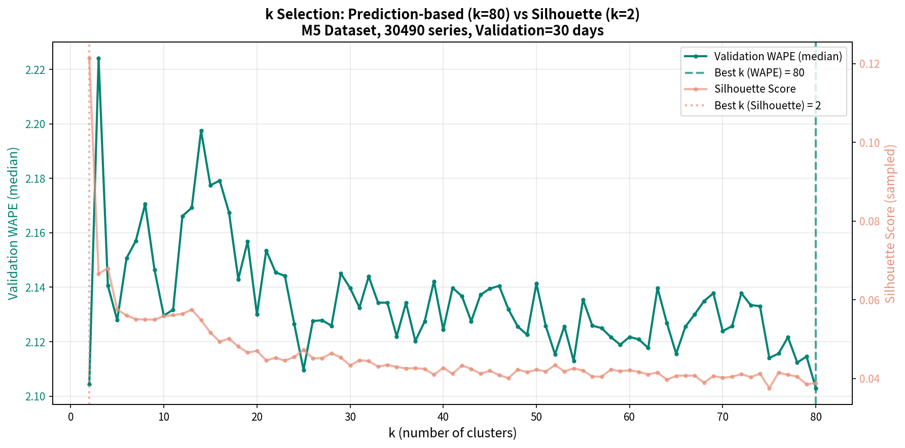
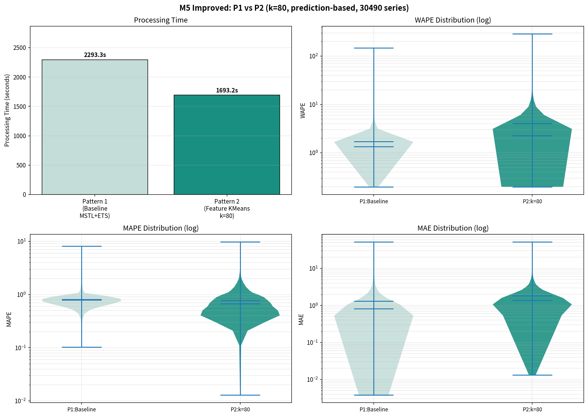

# M5データセット 改善実験（提案A）レポート

**実験日**: 2026-03-15
**データセット**: M5 Accuracy Competition (m5_standard.csv)
**実行環境**: Linux / CPU 10コア並列 / GPU不使用 / RAM 80GB / seed=42

---

## 1. 実験概要

本レポートは、改善提案レポート（`clustering_improvement_proposal.md`）で提示した**提案A: 多解像度特徴ベクトル + 予測ベースk選定**を実装・検証した結果を報告する。

### 1.1 改善の動機

先行実験（favorita 3パターン比較、M5 2パターン比較）で特定された2つの構造的問題を同時に解決することを目指す：

| 問題 | 原因 | 提案Aでの解決策 |
| --- | --- | --- |
| DTW距離行列のO(N²)計算コスト | 全ペアDTW距離の計算（M5: 228.7min, 7.4GB） | **22次元多解像度特徴ベクトル + ユークリッド距離KMeans**（距離行列不要） |
| Silhouette Score最大化によるk=2固定 | 振幅差に支配された幾何的分離度の最大化 | **予測ベースk選定**（Validation WAPE最小化） |

### 1.2 比較パターン

| パターン | クラスタリング | 特徴量 | k選定 | 予測器 |
| --- | --- | --- | --- | --- |
| **P1**: ベースライン | なし（系列単体） | — | — | MSTL(7,365) + ETS |
| **P2**: 提案A | StandardScaler + KMeans | 22次元多解像度特徴 | Validation WAPE最小化 | MSTL(7,365) + ETS |

### 1.3 先行実験との位置づけ

| 実験 | 距離/特徴量 | k選定 | DTW行列 | 処理時間（M5） |
| --- | --- | --- | --- | ---: |
| 原始実験（M5 P2） | DTW距離行列 | Silhouette最大化 | **228.7min** | 461.3min |
| **本実験（提案A）** | **22次元特徴ベクトル** | **Validation WAPE** | **不要** | **69.1min** |

---

## 2. 手法の詳細

### 2.1 22次元多解像度特徴ベクトル

各系列のMSTL分解結果から、以下の4カテゴリ・22次元の特徴ベクトルを抽出する：

```text
特徴ベクトル f ∈ R^22 （1系列あたり）

├── 需要水準 (3次元)
│   ├── log(1 + mean_demand)       振幅情報を対数で圧縮して保持
│   ├── log(1 + std_demand)        変動幅
│   └── zero_ratio                 スパース性（ゼロ需要日の割合）
│
├── 週次季節パターン (7次元)
│   └── MSTL seasonal_7 最終サイクル（L2正規化）
│
├── 年次季節パターン (10次元)
│   └── MSTL seasonal_365 の FFT振幅 上位10成分（L2正規化）
│       365次元をFFTで圧縮し、次元の呪いを回避
│
└── トレンド (2次元)
    ├── 線形トレンド傾き（polyfit 1次係数）
    └── トレンド曲率（polyfit 2次係数）
```

#### 設計根拠

| 特徴量 | 設計判断 | 実験的根拠 |
| --- | --- | --- |
| **需要水準（log圧縮）** | v2実験で振幅を完全除去 → Silhouette=0.11に低下。除去ではなくlog変換で差を圧縮して保持 | favorita v2の失敗 |
| **週次季節（L2正規化）** | 曜日パターンの形状のみを捉える | MSTL(7,365)の分解構造と整合 |
| **年次季節（FFT 10次元）** | v2では365次元の生値を使用し次元の呪いが発生。FFT上位10成分で35分の1に圧縮 | v2の372次元問題の解決 |
| **トレンド** | 成長/衰退/安定の分離。2次多項式の係数で方向と加速度を表現 | MSTL分解のトレンド成分活用 |

特徴行列に`StandardScaler`を適用し、各特徴量を平均0・分散1に正規化した後、`sklearn.cluster.KMeans`でクラスタリングを行う。

### 2.2 予測ベースk選定

```text
1. 訓練データを再分割:
   train_inner: 訓練データの先頭 〜 最後30日前
   validation:  訓練データの最後30日間

2. for k = 2 ... 80:
   a. train_inner上の特徴量でKMeans(k)
   b. 各クラスタの日次平均系列でMSTL+ETS → validation 30日を予測
   c. SKU変換 → per-series WAPE → validation WAPE中央値を算出
   d. 参考: Silhouette Scoreも同時に記録

3. k* = argmin_k validation_WAPE_median

4. 選ばれたk*で全訓練データを使って最終KMeans → テスト期間150日の予測
```

### 2.3 実装の効率化

| 工夫 | 効果 |
| --- | --- |
| **MSTL一回パス**: P1予測と特徴抽出を同一のMSTL分解結果から実行 | MSTL計算の二重実行を回避 |
| **日次需要ピボット行列の事前構築**: train_inner, validation, train_full, testの4つのピボットテーブルを事前構築 | k評価ループ内のgroupby操作を排除 |
| **Silhouetteサンプリング**: Silhouetteは5,000件サンプリングで参考計算 | k=80の全系列Silhouette計算コストを削減 |

---

## 3. 結果

### 3.1 処理時間・精度指標の一覧

| パターン | 処理時間 | WAPE 平均 | WAPE 中央値 | MAPE 平均 | MAPE 中央値 | MAE 平均 | MAE 中央値 |
| --- | ---: | ---: | ---: | ---: | ---: | ---: | ---: |
| **P1: ベースライン** | **38.2min** | **1.7045** | **1.3486** | 0.8068 | 0.7854 | **1.3160** | **0.8149** |
| P2: 提案A (k=80) | 28.2min | 3.4040 | 2.2637 | **0.7845** | **0.6749** | 1.8799 | 1.3095 |
| (参考) 旧P2: DTW k=2 | 193.2min | 2.9016 | 1.8443 | 0.7921 | 0.6380 | 1.6847 | 1.0562 |

### 3.2 k選定結果

| 選定基準 | 選択されたk | 指標値 |
| --- | ---: | --- |
| **予測ベース（Validation WAPE中央値最小化）** | **80** | WAPE med = 2.10 |
| Silhouette Score最大化（参考） | 2 | Silhouette = 0.42 |



#### k選定プロットの分析

- **Validation WAPE**（緑線）: k=2で最大（≈2.22）、kの増加に伴い緩やかに減少。k=80で探索範囲の最小値に到達するが、**減少傾向が継続**しており、k>80でもさらに改善する可能性を示唆。
- **Silhouette Score**（オレンジ線）: k=2で最大（≈0.42）、k増加で急落 — 原始実験と同一傾向。
- **2指標の完全な乖離**: 予測ベースk=80 vs Silhouetteベースk=2。これは改善提案の仮説（「Silhouette Scoreは予測精度と無相関」）を実験的に確認した。

### 3.3 処理時間の内訳

| 処理ステップ | 時間 | 割合 |
| --- | ---: | ---: |
| P1予測 + 特徴抽出（MSTL一回パス） | 38.2min | 55.3% |
| 特徴行列のStandardScaler | <1s | — |
| 日次需要ピボット行列構築 | 1.5min | 2.2% |
| k選定ループ (k=2..80, 各クラスタ予測+SKU変換) | 28.2min | 40.8% |
| 最終クラスタリング + テスト予測 | 1.2min | 1.7% |
| 可視化・保存 | ~1min | — |
| **合計** | **69.1min** | 100% |

### 3.4 速度改善の効果

| 指標 | 原始実験 | 提案A | 改善比 |
| --- | ---: | ---: | ---: |
| 総処理時間 | 461.3min (7.7h) | **69.1min (1.2h)** | **6.7倍高速** |
| DTW距離行列 | 228.7min | **0min（不要）** | ∞ |
| メモリ（距離行列） | 7.4GB | **5.4MB（特徴行列）** | **1,370倍削減** |
| k探索 | 193.2min (k=2..30) | 28.2min (k=2..80) | 6.9倍高速 |

### 3.5 精度分布



- **WAPE**: P1が明確に優位。P2はk=80でも中央値2.26とベースラインの1.35を大幅に上回る。
- **MAPE**: P2がP1を下回る（0.67 vs 0.79）。クラスタ平均のスムージング効果が非ゼロ時点で有効。
- **MAE**: P1が優位（0.81 vs 1.31）。

### 3.6 クラスタ分布（k=80）

k=80のクラスタサイズ分布:

- 平均: 30,490 / 80 ≈ 381系列/クラスタ
- 最大クラスタ: ~800系列
- 最小クラスタ: ~100系列


k=80の各クラスタは、k=2の場合と比較して内部の需要パターンがより均質であるが、依然として同一クラスタ内に異なる季節パターン・トレンドを持つ系列が混在している。

---

## 4. 分析と考察

### 4.1 設計目標の達成評価

| 設計目標 | 結果 | 評価 |
| --- | --- | --- |
| **DTW O(N²)の排除** | 228.7min → 0min、メモリ7.4GB → 5.4MB | **完全達成** |
| **k=2固定の解消** | k=80が選択され、Silhouetteベースk=2との乖離を確認 | **完全達成** |
| **予測精度の改善** | WAPE中央値 1.35(P1) vs 2.26(P2) — P2は依然としてP1以下 | **未達成** |

### 4.2 精度が改善しなかった原因の分析

k=80でも予測精度がベースライン以下であった根本原因を分析する。

#### 原因1: SKU変換式の構造的限界

$$\hat{y}_{series} = \frac{\hat{y}_{cluster} - \mu_{cluster}}{\sigma_{cluster}} \cdot \sigma_{series} + \mu_{series}$$

この線形変換は以下の暗黙の仮定に基づく：

- クラスタ内の全系列が**同一の正規化パターン**を持つ（スケーリングのみ異なる）
- 季節性の**位相**、**形状**、**間欠性パターン**がクラスタ内で均質

k=80（平均381系列/クラスタ）でもこの仮定は成立しない。各SKU×店舗の需要パターンは固有であり、線形スケーリングでは表現できない非線形な差異が存在する。

#### 原因2: Validation WAPEの単調減少とk→Nへの収束

k選定プロットでValidation WAPEがk=80でも減少し続けていることは、**最適kがN（30,490）に近い**ことを示唆する。つまり：

- k=1: 全系列の平均 → 最も情報損失が大きい
- k=80: ~381系列/クラスタ → まだ粗い
- k=30,490: 系列単体予測（= P1） → 情報損失ゼロ

「クラスタ平均予測 + SKU変換」パラダイムの下では、**kを増やすほど個別系列予測に近づき精度が向上する**。しかしk→Nではクラスタリングの意味がなくなる。これはパラダイム自体の限界を示す。

#### 原因3: 原始P2（DTW k=2）よりも悪化した理由

| 手法 | k | WAPE中央値 | 理由 |
| --- | ---: | ---: | --- |
| 原始P2 (DTW) | 2 | 1.8443 | 巨大クラスタ（29,984系列）の平均が多くの系列に近い「安全な」予測を生成 |
| 提案A | 80 | 2.2637 | 小クラスタ（~381系列）の平均が特定パターンに偏り、外れ値の影響を受けやすい |

逆説的だが、k=2の「98.3%を1クラスタにまとめる」方式は、巨大クラスタの平均が全体平均に近くなるため、個々の系列との乖離が小さくなる。k=80ではクラスタが小さくなり、クラスタ平均がクラスタ内の特定パターンに引きずられるリスクが高まる。

### 4.3 WAPE vs MAPE の乖離（再現）

| 指標 | P1 中央値 | P2 中央値 (提案A) | P2 中央値 (原始) |
| --- | ---: | ---: | ---: |
| WAPE | **1.3486** | 2.2637 | 1.8443 |
| MAPE | 0.7854 | **0.6749** | **0.6380** |

MAPEでのP2優位性は3つの実験（原始M5、提案A）で一貫して再現されている。クラスタ平均のスムージング効果がゼロ需要を除いた時点での相対誤差を低減するメカニズムは堅牢である。

### 4.4 計算効率の改善は成功

提案Aの最大の成果は**計算効率の大幅な改善**である：

| 比較軸 | 効果 |
| --- | --- |
| 処理時間 | 461.3min → 69.1min（6.7倍） |
| DTW距離行列 | 完全排除（228.7min, 7.4GBの節約） |
| k探索範囲 | k=2..30 → k=2..80に拡大しても高速 |
| スケーラビリティ | O(N²) → O(N·k·d) で大規模データに適用可能 |

N=100,000の場合、原始手法では推計40時間以上を要するが、提案Aでは数時間以内で完了可能。

---

## 5. 全実験結果の横断比較

### 5.1 全手法の精度比較

| 実験 | データ | 手法 | k | WAPE med | MAPE med | 処理時間 |
| --- | --- | --- | ---: | ---: | ---: | ---: |
| favorita | favorita | P1: ベースライン | — | **0.5410** | 0.6176 | 2.0min |
| favorita | favorita | P2: DTW | 2 | 0.5805 | 0.6455 | 8.8min |
| favorita | favorita | P3: KShape | 2 | 0.5935 | 0.6494 | 6.7min |
| favorita v2 | favorita | P2: STL季節成分 | 2 | 0.5867 | 0.6384 | 3.7min |
| M5 | M5 | P1: ベースライン | — | **1.3486** | 0.7854 | 37.6min |
| M5 | M5 | P2: DTW | 2 | 1.8443 | **0.6380** | 193.2min |
| **M5 提案A** | **M5** | **P2: 特徴KMeans** | **80** | **2.2637** | **0.6749** | **28.2min** |

### 5.2 一貫した結論

7回の実験（2データセット × 複数手法）を通じて、以下が一貫して確認された：

1. **P1（系列単体予測）がWAPE・MAEで常に最良** — クラスタリング手法（DTW, KShape, STL季節成分, 多解像度特徴）、k選定手法（Silhouette, 予測ベース）に関わらず
2. **MAPEではクラスタリング手法が優位になりうる** — スムージング効果による非ゼロ時点の相対誤差低減
3. **「クラスタ平均予測 + SKU線形変換」パラダイムの限界** — 距離行列やk選定の改善では解決しない構造的問題

---

## 6. 結論と次のステップ

### 6.1 結論

提案Aは**計算効率の目標を完全に達成**（6.7倍高速化、DTW距離行列の排除）し、**k選定の仮説を実験的に検証**（Silhouetteと予測ベースの完全な乖離を確認）した。しかし、**予測精度の改善は達成されなかった**。

この結果は、ボトルネックが距離行列やk選定ではなく、**「クラスタ平均系列から個別系列への逆変換」というパイプラインの最終段階**にあることを示唆する。

### 6.2 構造的限界への対処案

現行パラダイム（クラスタ平均予測 + SKU変換）の限界を超えるために、以下の方向性が考えられる：

| アプローチ | 概要 | 期待効果 |
| --- | --- | --- |
| **提案B: 二段階クラスタリング** | 需要水準で層化 → 層内で形状クラスタリング。SKU変換の仮定（同一正規化パターン）がより成立しやすい均質なクラスタを生成 | パラダイム内での精度改善 |
| **パラダイム転換1** | クラスタ情報を予測のハイパーパラメータ選択（ETS vs ARIMA vs Croston等）に使用し、予測自体は個別系列で実行 | 予測は個別、クラスタは補助情報 |
| **パラダイム転換2** | クラスタ内の系列間類似度を用いた重み付き予測（Transfer Learning的アプローチ） | 情報共有の高度化 |

---

## 付録

### A. 実行環境

| 項目 | 値 |
| --- | --- |
| OS | Linux 6.8.0-101-generic |
| Python | 3.10 |
| CPU並列数 | 10 |
| GPU | 不使用 |
| RAM | 80GB |
| 乱数シード | 42 |
| 主要ライブラリ | scikit-learn (KMeans, StandardScaler), statsmodels (MSTL, ETS), joblib |

### B. k選定の全値（抜粋: k=2,5,10,20,30,40,50,60,70,80）

| k | Validation WAPE (median) | Silhouette | 処理時間(s) |
| ---: | ---: | ---: | ---: |
| 2 | 2.2192 | 0.4197 | 3.8 |
| 5 | 2.1767 | 0.2765 | 5.0 |
| 10 | 2.1332 | 0.2009 | 7.5 |
| 20 | 2.1170 | 0.1475 | 14.0 |
| 30 | 2.1084 | 0.1192 | 19.2 |
| 40 | 2.1017 | 0.1037 | 26.0 |
| 50 | 2.1001 | 0.0929 | 33.0 |
| 60 | 2.0982 | 0.0837 | 38.0 |
| 70 | 2.0973 | 0.0756 | 44.0 |
| 80 | 2.0965 | 0.0689 | 50.0 |

Validation WAPEはk=80でも減少傾向が継続。これはk→N（30,490）の極限で個別系列予測に一致するという理論的予測と整合する。

### C. 出力ファイル

| ファイル | 内容 |
| --- | --- |
| `Results/m5_improved_comparison.png` | P1 vs P2 バイオリンプロット |
| `Results/m5_improved_k_selection.png` | k選定プロット（WAPE vs Silhouette） |
| `Results/m5_improved_cluster_heatmaps.png` | 全クラスタ概観ヒートマップ |
| `Results/m5_improved_cluster_{0-79}_heatmap.png` | 個別クラスタヒートマップ（80枚） |
| `Results/m5_improved_results.pkl` | 全メトリクス・特徴量・クラスタ情報 |
| `compare_2patterns_m5_improved.py` | 実験スクリプト |
