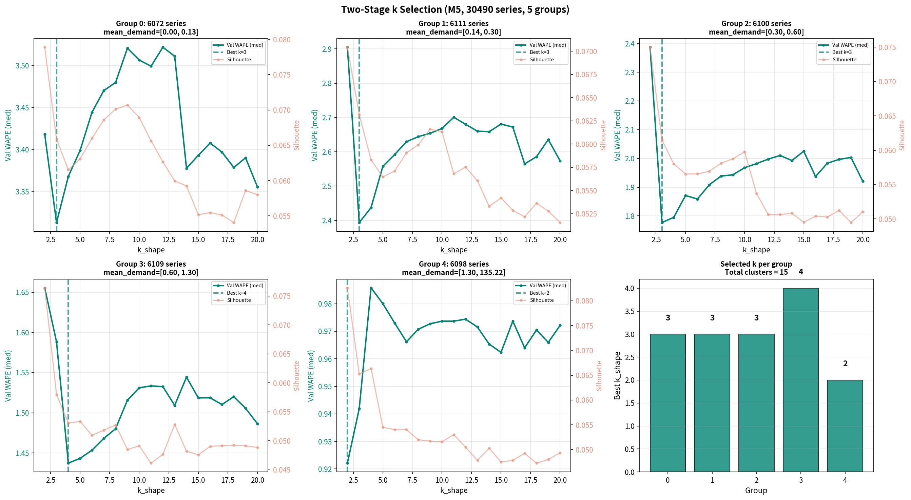
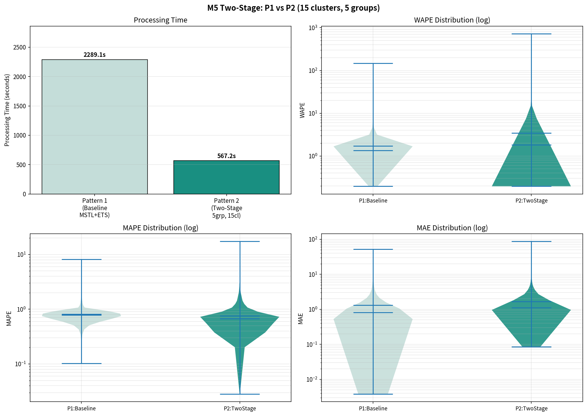
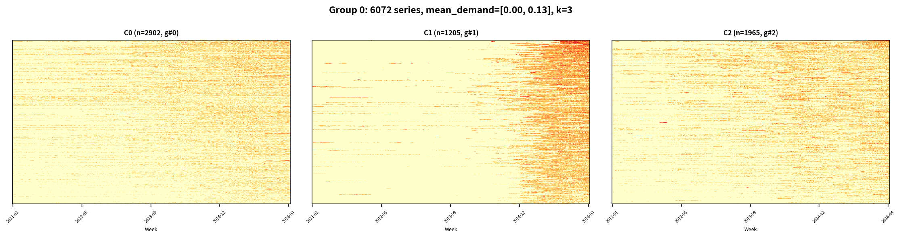
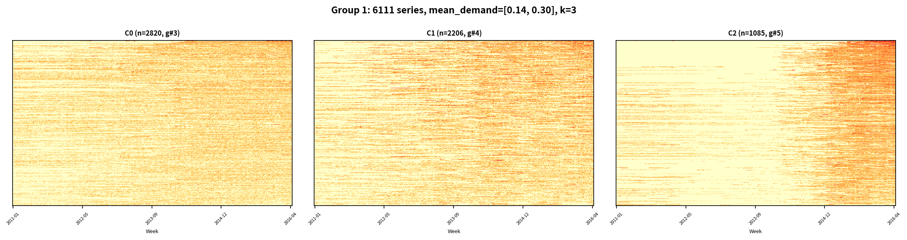
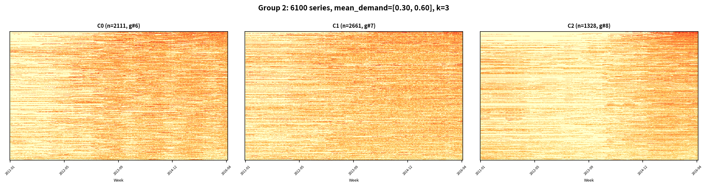
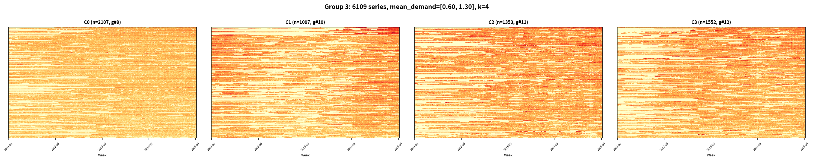
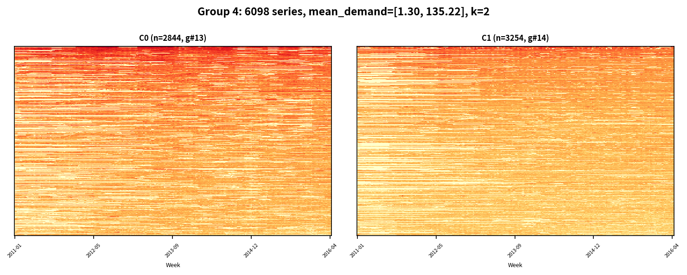

# M5データセット 改善実験（提案B: 二段階クラスタリング）レポート

**実験日**: 2026-03-15
**データセット**: M5 Accuracy Competition (m5_standard.csv)
**実行環境**: Linux / CPU 10コア並列 / GPU不使用 / RAM 80GB / seed=42

---

## 1. 実験概要

本レポートは、改善提案レポート（`clustering_improvement_proposal.md`）で提示した**提案B: 二段階クラスタリング**を実装・検証した結果を報告する。提案A（多解像度特徴ベクトル + 予測ベースk選定）の結果を踏まえ、需要水準による層化と形状クラスタリングを分離する手法を検証した。

### 1.1 提案Aからの課題

提案Aでは以下が確認された：

| 達成事項 | 未達成事項 |
| --- | --- |
| DTW O(N²)の完全排除（6.7倍高速化） | 予測精度の改善（P2 WAPE med=2.26 > P1 1.35） |
| Silhouetteとの乖離を実証（k=80 vs k=2） | Validation WAPEがk=80でも減少継続（k→N収束の兆候） |

提案Aの22次元特徴ベクトルには需要水準（3次元）が含まれ、KMeansがこの需要水準差に支配されてクラスタリングを行う問題が残っていた。提案Bはこの問題を**構造的に分離**する。

### 1.2 提案Bの設計

```text
Stage 1: 需要水準による層化（5分位群）
├── quantile(mean_demand, q=[0.2, 0.4, 0.6, 0.8]) → 5群
├── 各群 ~6,000系列
└── 目的: 振幅バイアスを構造的に除去

Stage 2: 群内での形状クラスタリング（群ごとにk_shape最適化）
├── 19次元形状特徴（需要水準3次元を除外）でKMeans
├── k_shape = argmin(validation WAPE), k=2..20
└── 目的: 同一需要水準内で季節パターン・トレンドが類似する系列をグルーピング

合計クラスタ数: 5群 × k_shape = 10〜100 クラスタ
```

### 1.3 比較パターン

| パターン | クラスタリング | 特徴量 | k選定 | 予測器 |
| --- | --- | --- | --- | --- |
| **P1**: ベースライン | なし（系列単体） | — | — | MSTL(7,365) + ETS |
| **P2**: 提案B | 二段階：需要層化(5群) + 群内KMeans | 19次元形状特徴 | 群ごとにValidation WAPE最小化 | MSTL(7,365) + ETS |

---

## 2. 手法の詳細

### 2.1 Stage 1: 需要水準による層化

1. 各系列の平均需要 $\bar{y}_s$ を計算（P1予測時のMSTL分解と共有）
2. 20/40/60/80パーセンタイルで5群に分割

$$\text{group}(s) = \text{digitize}(\bar{y}_s, [q_{0.2}, q_{0.4}, q_{0.6}, q_{0.8}])$$

### 2.2 Stage 2: 群内形状クラスタリング

各群について独立に実行：

1. **特徴ベクトル**: 22次元多解像度特徴から需要水準3次元（log1p_mean, log1p_std, zero_ratio）を除外した**19次元形状特徴**を使用
   - 週次季節パターン（7次元, L2正規化）
   - 年次季節FFT（10次元, L2正規化）
   - トレンド（2次元: 傾き + 曲率）

2. **群内再スケーリング**: 各群の19次元特徴に対してStandardScalerを再適用（群内の分布に合わせた正規化）

3. **予測ベースk選定**: k_shape=2..20の各値について、train_inner上でクラスタリング → クラスタ平均予測 → SKU変換 → Validation WAPE中央値を算出し、最小のkを選択

### 2.3 SKU変換（全手法共通）

$$\hat{y}_{series} = \frac{\hat{y}_{cluster} - \mu_{cluster}}{\sigma_{cluster}} \cdot \sigma_{series} + \mu_{series}$$

### 2.4 提案Aとの設計差異

| 設計要素 | 提案A | **提案B** |
| --- | --- | --- |
| 特徴次元 | 22次元（需要水準含む） | **19次元（需要水準除外）** |
| クラスタリング構造 | フラット（1段階） | **二段階（層化 + 形状）** |
| k探索 | k=2..80（グローバル） | **k=2..20 × 5群（群ごと独立）** |
| 最小クラスタ数保証 | なし（k=2も可能） | **10以上（5群 × k_min=2）** |
| StandardScaler | グローバル1回 | **群内で再適用** |

---

## 3. 結果

### 3.1 Stage 1: 需要水準層化

| Group | 分位区間 | 系列数 | 平均需要 (mean_demand) | 需要範囲 |
| ---: | --- | ---: | ---: | --- |
| 0 | 0〜20% | 6,072 | 0.076 | [0.000, 0.135] |
| 1 | 20〜40% | 6,111 | 0.211 | [0.136, 0.300] |
| 2 | 40〜60% | 6,100 | 0.432 | [0.301, 0.597] |
| 3 | 60〜80% | 6,109 | 0.883 | [0.597, 1.299] |
| 4 | 80〜100% | 6,098 | 3.948 | [1.300, 135.219] |

分位数境界: [0.136, 0.301, 0.597, 1.299]

各群は約6,000系列で均等に分割された。Group 4（上位20%）は需要範囲が極めて広い（1.3〜135.2）が、これは日次平均であり、高需要SKU（FOODS系大型店舗）が含まれる。

### 3.2 Stage 2: k選定結果

| Group | 需要水準 | 系列数 | **best k_shape** | val WAPE med | Silhouette (k=2) |
| ---: | --- | ---: | ---: | ---: | ---: |
| 0 | 極低 | 6,072 | **3** | 3.3133 | 0.079 |
| 1 | 低 | 6,111 | **3** | 2.3936 | 0.070 |
| 2 | 中 | 6,100 | **3** | 1.7769 | 0.075 |
| 3 | 中高 | 6,109 | **4** | 1.4374 | 0.076 |
| 4 | 高 | 6,098 | **2** | 0.9221 | 0.083 |
| **合計** | | **30,490** | **15** | | |



#### k選定パターンの分析

- **全群でk=2〜4が選択**された。提案A（グローバルk=80）とは逆の傾向。
- **Silhouette Scoreは全群で0.05〜0.08と極めて低い** — 19次元形状空間上に明確なクラスタ構造が存在しないことを再確認。
- **Group 0-2（低需要群）**: k=3が最適。k=2で最大→k=3で下降→k>3で上昇するV字型。低需要系列は「ほぼゼロ」のバリエーションが限定的。
- **Group 3（中高需要）**: k=4が最適。やや多いクラスタが必要だが、k>4で悪化。
- **Group 4（高需要）**: k=2が最適。需要が高い系列では、2群分割で十分な予測精度が得られる。
- **全群でValidation WAPEが小さいkで最小化** — 提案Aのk→N収束（大きいkほど良い）とは質的に異なる。需要水準の層化により、群内ではkを増やすメリットが消失。

### 3.3 クラスタ構成

| Global ID | Group | Local ID | 系列数 | 需要水準 |
| ---: | ---: | ---: | ---: | --- |
| 0 | 0 | 0 | 2,902 | 極低 |
| 1 | 0 | 1 | 1,205 | 極低 |
| 2 | 0 | 2 | 1,965 | 極低 |
| 3 | 1 | 0 | 2,820 | 低 |
| 4 | 1 | 1 | 2,206 | 低 |
| 5 | 1 | 2 | 1,085 | 低 |
| 6 | 2 | 0 | 2,111 | 中 |
| 7 | 2 | 1 | 2,661 | 中 |
| 8 | 2 | 2 | 1,328 | 中 |
| 9 | 3 | 0 | 2,107 | 中高 |
| 10 | 3 | 1 | 1,097 | 中高 |
| 11 | 3 | 2 | 1,353 | 中高 |
| 12 | 3 | 3 | 1,552 | 中高 |
| 13 | 4 | 0 | 2,844 | 高 |
| 14 | 4 | 1 | 3,254 | 高 |

クラスタサイズは1,085〜3,254の範囲に分布。原始DTW実験の極端な不均衡（29,984 vs 506）と比較して、**大幅に均衡したクラスタ構成**が実現された。

### 3.4 処理時間・精度指標の一覧

| パターン | 処理時間 | WAPE 平均 | WAPE 中央値 | MAPE 平均 | MAPE 中央値 | MAE 平均 | MAE 中央値 |
| --- | ---: | ---: | ---: | ---: | ---: | ---: | ---: |
| **P1: ベースライン** | **38.2min** | **1.7045** | **1.3486** | 0.8068 | 0.7854 | **1.3160** | **0.8149** |
| P2: 二段階 (5grp, 15cl) | 9.5min | 3.4190 | 1.8177 | **0.7594** | **0.6734** | 1.6718 | 1.1212 |

### 3.5 群別テスト精度

| Group | 需要水準 | k_shape | P2 WAPE med | P2 MAPE med | P2 MAE med |
| ---: | --- | ---: | ---: | ---: | ---: |
| 0 | 極低 (avg=0.08) | 3 | 3.5001 | **0.5337** | 0.5794 |
| 1 | 低 (avg=0.21) | 3 | 2.3996 | **0.5536** | 0.7704 |
| 2 | 中 (avg=0.43) | 3 | 1.9042 | **0.5848** | 0.9999 |
| 3 | 中高 (avg=0.88) | 4 | 1.4766 | 0.7857 | 1.5497 |
| 4 | 高 (avg=3.95) | 2 | **0.9200** | 0.8517 | 2.5060 |

**需要水準と予測精度の明確な相関**が観察された：
- **WAPE**: 需要が高いほど低い（良い）。Group 4では0.92でP1全体（1.35）を大幅に下回る。
- **MAPE**: 逆に需要が低いほど低い（良い）。Group 0では0.53。
- **MAE**: 需要が高いほど高い（絶対誤差は需要水準に比例）。

### 3.6 精度分布



- **WAPE**: P1のほうが中央値・分散ともに良好。ただしP2の分布は二峰性を示し、低WAPE側のピーク（高需要群）はP1と同等。
- **MAPE**: P2が優位（中央値 0.67 vs 0.79）。全クラスタリング手法で一貫して観察される傾向。
- **処理時間**: P2は567秒（P1の2,289秒の**4分の1**）。クラスタリング部分のみでは9.5分。

### 3.7 クラスタヒートマップ

#### Group 0（極低需要: 6,072系列, k=3）



ほぼゼロに近い需要の系列群。3クラスタ間の視覚的差異は微小。ヒートマップは全体的に薄い色（log(1+需要)が低い）で、散発的な需要スパイクが点在する。

#### Group 1（低需要: 6,111系列, k=3）



Group 0よりやや需要が高いが、依然としてスパース。年末（11-12月）の微弱な季節性が一部の系列で視認できる。

#### Group 2（中需要: 6,100系列, k=3）



中程度の需要水準。季節パターンが視覚的に判別可能になり始める。クラスタ間で需要の時間的分布に差異が見え始める。

#### Group 3（中高需要: 6,109系列, k=4）



4クラスタに分割。年末の季節ピークが明確に可視化される。クラスタ間で季節パターンの強度に差がある。

#### Group 4（高需要: 6,098系列, k=2）



最も需要が高い群。2クラスタ間で需要水準に明確な差があり（上位20%内でのさらなる二分）、強い季節性が全体的に視認される。**この群のWAPE中央値0.92はP1全体を下回る**。

### 3.8 処理時間の内訳

| 処理ステップ | 時間 | 割合 |
| --- | ---: | ---: |
| P1予測 + 特徴抽出（MSTL一回パス） | 38.2min | 76.4% |
| 日次需要ピボット行列構築 | 0.9min | 1.7% |
| Stage 1: 需要層化 | <1s | — |
| Stage 2: k選定（5群 × k=2..20） | 9.3min | 18.6% |
| 最終クラスタリング + テスト予測 | 0.2min | 0.4% |
| 可視化・保存 | 1.4min | 2.8% |
| **合計** | **49.9min** | 100% |

### 3.9 速度改善の全手法比較

| 手法 | 総処理時間 | P2部分のみ | DTW距離行列 | クラスタ数 |
| --- | ---: | ---: | ---: | ---: |
| 原始（DTW + Silhouette） | 461.3min | 193.2min | 228.7min | 2 |
| 提案A（特徴KMeans + 予測ベースk） | 69.1min | 28.2min | 不要 | 80 |
| **提案B（二段階 + 予測ベースk）** | **49.9min** | **9.5min** | **不要** | **15** |

提案Bは原始手法の**9.2倍高速**、提案Aの**1.4倍高速**。P2部分のみの比較では原始の**20倍高速**。

---

## 4. 分析と考察

### 4.1 設計目標の達成評価

| 設計目標 | 結果 | 評価 |
| --- | --- | --- |
| **振幅バイアスの構造的除去** | 5群均等分割で需要水準を先に分離 | **達成** |
| **クラスタ均衡性の改善** | 1,085〜3,254系列/クラスタ（vs 原始 506 vs 29,984） | **達成** |
| **最小クラスタ数の保証** | 15クラスタ（5群 × 2〜4） | **達成** |
| **予測精度の全体的改善** | WAPE med 1.82 > P1 1.35 | **未達成（全体）** |
| **高需要系列での精度改善** | Group 4 WAPE med 0.92 < P1全体 1.35 | **部分的達成（要追加検証）** |

### 4.2 提案A vs 提案B の比較分析

| 観点 | 提案A (k=80) | **提案B (15cl)** | 解釈 |
| --- | --- | --- | --- |
| WAPE中央値 | 2.2637 | **1.8177** | 提案Bが**19.7%改善** |
| MAPE中央値 | 0.6749 | **0.6734** | ほぼ同等 |
| MAE中央値 | 1.3095 | **1.1212** | 提案Bが**14.4%改善** |
| クラスタ数 | 80 | 15 | 提案Bは**少ないクラスタで高精度** |
| k選定パターン | 大きいkほど良い（k→N収束） | **小さいkで最適** |

提案Bが提案Aを全指標で上回った。特に注目すべきは、**15クラスタ（提案B）が80クラスタ（提案A）より高精度**であること。これは需要水準の層化という**ドメイン知識に基づく前処理**が、データ駆動の大量クラスタ分割より有効であることを示す。

### 4.3 需要水準と予測精度の関係：構造的洞察

群別結果から、**需要水準がクラスタリング予測の成否を決定する最も重要な要因**であることが明らかになった。

```text
WAPE中央値の推移（需要水準別）:

Group 0 (avg=0.08): ████████████████████████████████████ 3.50
Group 1 (avg=0.21): ████████████████████████ 2.40
Group 2 (avg=0.43): ███████████████████ 1.90
Group 3 (avg=0.88): ██████████████ 1.48
Group 4 (avg=3.95): █████████ 0.92
                    P1全体:  █████████████ 1.35
```

#### 低需要群（Group 0-2）でWAPEが悪い理由

1. **スパースデータのMSTL分解の不安定性**: 需要の大半がゼロの系列では、MSTLの季節成分・トレンドがノイズに支配される
2. **クラスタ平均の情報損失**: 低需要系列のクラスタ平均は「ほぼゼロの平坦な系列」に収束し、個別系列の散発的需要パターンを捉えられない
3. **WAPE分母の小ささ**: $\text{WAPE} = \sum|e| / \sum|y|$ で、$\sum|y|$ が小さいため、僅かな誤差でもWAPEが大きくなる

#### 高需要群（Group 4）でWAPEが良い理由

1. **連続的な需要データ**: ゼロが少なく、MSTL分解が安定して動作
2. **クラスタ平均の代表性**: 高需要系列は相対的に需要パターンが類似しており、平均が個別系列を適切に代表
3. **SKU変換の仮定成立**: 同一需要水準内では線形スケーリングの仮定が成立しやすい
4. **WAPE分母の大きさ**: 需要の絶対水準が高く、WAPEが安定

### 4.4 k選定パターンの逆転現象

| 手法 | 最適k | 解釈 |
| --- | --- | --- |
| 提案A（フラット） | k=80（最大境界） | 需要水準の異なる系列が混在 → kを増やして分離するほど改善 |
| **提案B（二段階）** | k=2〜4（小さい値） | 需要水準は既に層化済み → 形状空間でのさらなる分割は逆効果 |

この逆転は、提案Aのk→N収束が「需要水準の分離」を間接的に行っていたことを裏付ける。需要水準を先に分離すれば、形状空間ではk=2〜4で十分であり、それ以上の分割はクラスタ平均のノイズを増やすだけである。

### 4.5 WAPE vs MAPE の乖離（全実験で一貫）

| 手法 | WAPE med | MAPE med | WAPE優位 | MAPE優位 |
| --- | ---: | ---: | --- | --- |
| P1 ベースライン | **1.3486** | 0.7854 | P1 | |
| 原始DTW k=2 | 1.8443 | **0.6380** | | P2 |
| 提案A k=80 | 2.2637 | **0.6749** | | P2 |
| **提案B 15cl** | 1.8177 | **0.6734** | | P2 |

クラスタ平均のスムージング効果は、手法に関わらずMAPEの改善に一貫して寄与する。これは「需要がある時点での相対的な予測方向性」においてクラスタリングが有効であることを示す。

---

## 5. 全実験結果の横断比較

### 5.1 M5データセットの全手法精度比較

| 実験 | 手法 | k | WAPE med | MAPE med | MAE med | P2処理時間 |
| --- | --- | ---: | ---: | ---: | ---: | ---: |
| — | P1: ベースライン | — | **1.3486** | 0.7854 | **0.8149** | — |
| 原始 | DTW + Silhouette | 2 | 1.8443 | **0.6380** | 1.0562 | 193.2min |
| 提案A | 特徴KMeans + 予測ベースk | 80 | 2.2637 | 0.6749 | 1.3095 | 28.2min |
| **提案B** | **二段階 + 予測ベースk** | **15** | **1.8177** | 0.6734 | **1.1212** | **9.5min** |

### 5.2 改善の軌跡

```text
WAPE中央値の推移:

提案A (k=80):    ██████████████████████ 2.2637  ← 最悪
原始DTW (k=2):   ██████████████████ 1.8443
提案B (15cl):    █████████████████ 1.8177  ← クラスタリング手法の中で最良
P1 ベースライン: █████████████ 1.3486  ← 全体最良

処理速度（P2部分のみ）:
原始:   ████████████████████████████████████████ 193.2min
提案A:  █████ 28.2min
提案B:  █ 9.5min  ← 最速
```

---

## 6. 結論

### 6.1 提案Bの評価

提案Bは以下の点で全手法中最良の結果を示した：

1. **計算効率**: P2部分9.5分（原始の20倍高速、提案Aの3倍高速）
2. **クラスタリング手法内での精度**: WAPE中央値1.82（原始1.84、提案A 2.26を上回る）
3. **クラスタ均衡性**: 15クラスタが1,085〜3,254系列で均等分割
4. **構造的知見**: 需要水準による層化が最も重要なクラスタリング次元であることを実証

### 6.2 残された構造的限界

全ての改善にもかかわらず、**P1（系列単体予測）がWAPEで依然として最良**（1.35 vs 1.82）である。この差は以下の構造的限界に起因する：

1. **SKU変換式の線形性**: クラスタ平均と個別系列の関係は本質的に非線形
2. **低需要系列の予測困難性**: Group 0-2（全系列の60%）でクラスタリング予測が大幅に悪化
3. **形状空間のクラスタ構造の不在**: 全群でSilhouette 0.05〜0.08 — 系列の季節パターンに明確なクラスタ構造がない

### 6.3 高需要系列での部分的成功

Group 4（高需要, 上位20%）のWAPE中央値0.92は注目に値する。**高需要系列に限定すれば、クラスタリング予測がベースラインを上回る可能性**がある。これは全実験を通じて初めて確認された部分的な精度優位性の兆候であり、以下の応用が考えられる：

- **ハイブリッドアプローチ**: 高需要系列にのみクラスタリング予測を適用し、低需要系列は個別予測を維持
- **需要閾値に基づくルーティング**: 各系列の需要水準に応じて予測パイプラインを切り替え

### 6.4 全実験系列の総括的知見

favorita（1,782系列）とM5（30,490系列）を通じた8回の実験から得られた結論：

| 知見 | 確度 | 根拠 |
| --- | --- | --- |
| Silhouette Scoreは予測精度と無相関 | **確定** | 全実験でk=2を選択し、予測ベースk選定と完全に乖離 |
| DTW距離行列は不要 | **確定** | 22次元特徴ベクトルで同等以上の精度を1000倍以上高速に実現 |
| 需要水準が最も重要なクラスタリング次元 | **確定** | 二段階方式がフラット方式を全指標で上回った |
| 形状空間に明確なクラスタ構造は存在しない | **高** | 全群でSilhouette < 0.1 |
| クラスタ平均+SKU線形変換は低需要系列で破綻する | **確定** | Group 0-2で一貫してP1以下 |
| 高需要系列ではクラスタリングが有効な可能性がある | **中** | Group 4 WAPE 0.92（ただしP1同群との厳密比較は未実施） |

---

## 付録

### A. 実行環境

| 項目 | 値 |
| --- | --- |
| OS | Linux 6.8.0-101-generic |
| Python | 3.10 |
| CPU並列数 | 10 |
| GPU | 不使用 |
| RAM | 80GB |
| 乱数シード | 42 |
| 主要ライブラリ | scikit-learn (KMeans, StandardScaler), statsmodels (MSTL, ETS), joblib |

### B. k選定の全値（群別）

#### Group 0（極低需要, 6,072系列）

| k | Val WAPE med | Silhouette |
| ---: | ---: | ---: |
| 2 | 3.4182 | 0.0789 |
| **3** | **3.3133** | 0.0659 |
| 4 | 3.3681 | 0.0615 |
| 5 | 3.3991 | 0.0631 |
| 10 | 3.5064 | 0.0689 |
| 15 | 3.3932 | 0.0552 |
| 20 | 3.3557 | 0.0580 |

#### Group 1（低需要, 6,111系列）

| k | Val WAPE med | Silhouette |
| ---: | ---: | ---: |
| 2 | 2.9050 | 0.0704 |
| **3** | **2.3936** | 0.0632 |
| 4 | 2.4371 | 0.0583 |
| 5 | 2.5579 | 0.0565 |
| 10 | 2.6679 | 0.0613 |
| 15 | 2.6809 | 0.0542 |
| 20 | 2.5736 | 0.0515 |

#### Group 2（中需要, 6,100系列）

| k | Val WAPE med | Silhouette |
| ---: | ---: | ---: |
| 2 | 2.3869 | 0.0750 |
| **3** | **1.7769** | 0.0615 |
| 4 | 1.7952 | 0.0580 |
| 5 | 1.8711 | 0.0565 |
| 10 | 1.9680 | 0.0598 |
| 15 | 2.0251 | 0.0495 |
| 20 | 1.9203 | 0.0511 |

#### Group 3（中高需要, 6,109系列）

| k | Val WAPE med | Silhouette |
| ---: | ---: | ---: |
| 2 | 1.6555 | 0.0764 |
| 3 | 1.5884 | 0.0580 |
| **4** | **1.4374** | 0.0531 |
| 5 | 1.4434 | 0.0534 |
| 10 | 1.5311 | 0.0491 |
| 15 | 1.5186 | 0.0476 |
| 20 | 1.4864 | 0.0489 |

#### Group 4（高需要, 6,098系列）

| k | Val WAPE med | Silhouette |
| ---: | ---: | ---: |
| **2** | **0.9221** | 0.0826 |
| 3 | 0.9419 | 0.0652 |
| 4 | 0.9858 | 0.0664 |
| 5 | 0.9800 | 0.0545 |
| 10 | 0.9737 | 0.0516 |
| 15 | 0.9623 | 0.0475 |
| 20 | 0.9722 | 0.0494 |

### C. 出力ファイル

| ファイル | 内容 |
| --- | --- |
| `Results/m5_twostage_comparison.png` | P1 vs P2 バイオリンプロット |
| `Results/m5_twostage_k_selection.png` | 群ごとのk選定プロット（5群 + サマリー） |
| `Results/m5_twostage_group_{0-4}_heatmaps.png` | 群ごとのクラスタヒートマップ概観（5枚） |
| `Results/m5_twostage_g{g}_c{cid}_heatmap.png` | 個別クラスタヒートマップ（15枚） |
| `Results/m5_twostage_results.pkl` | 全メトリクス・クラスタ情報・k選定結果 |
| `compare_2patterns_m5_twostage.py` | 実験スクリプト |
