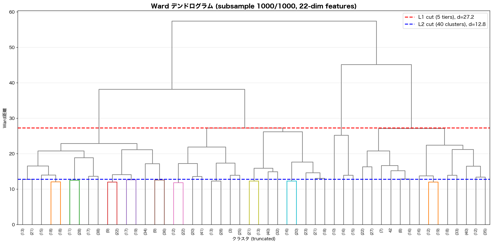
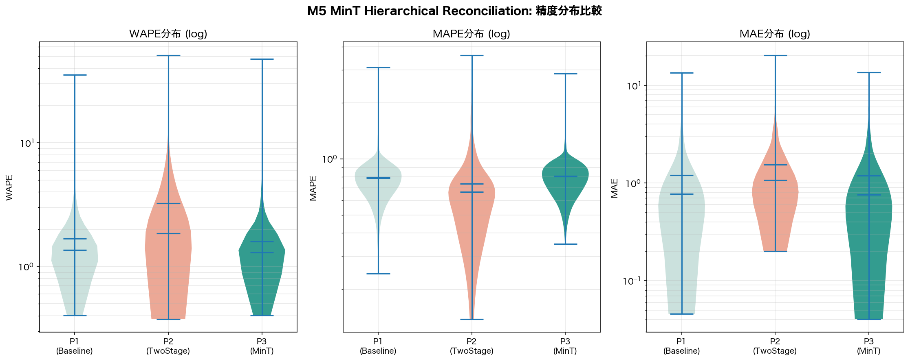
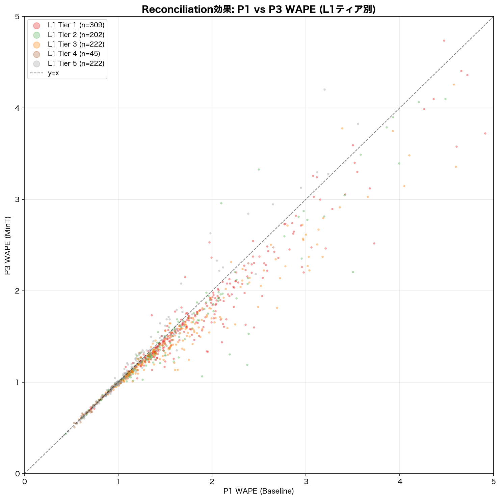
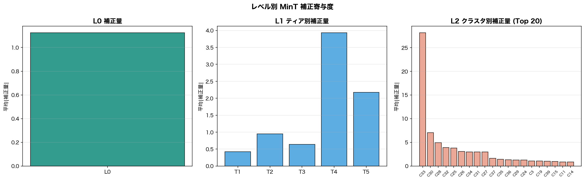
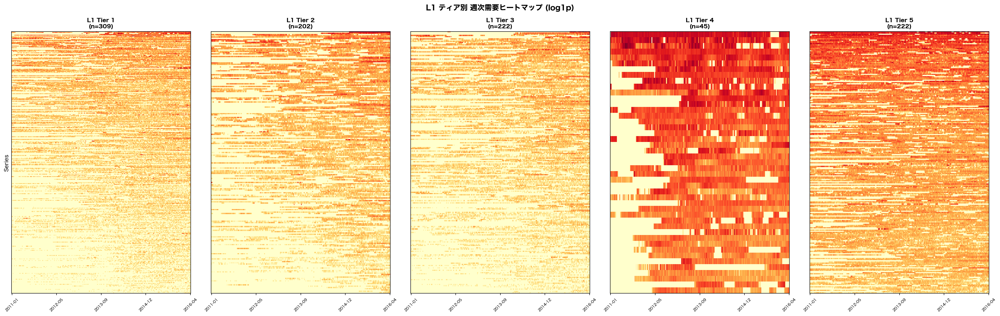
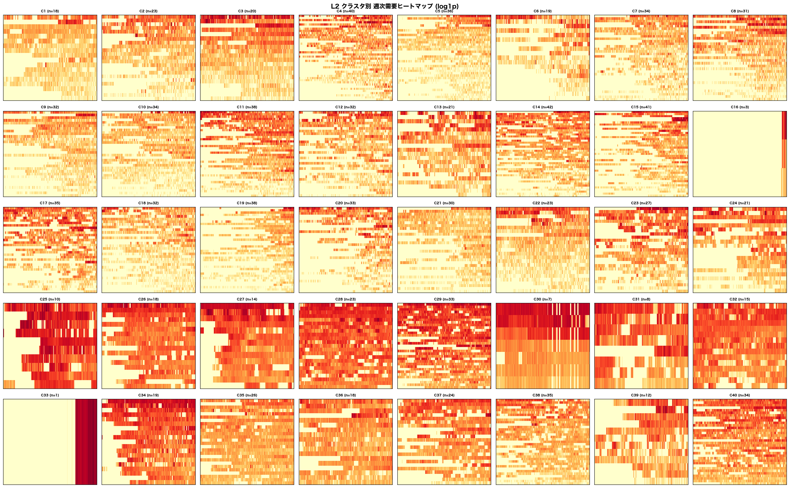

# M5データセット 改善実験（提案C: 階層的Reconciliation MinT）レポート

**実験日**: 2026-03-17
**データセット**: M5 Accuracy Competition (m5_standard.csv) — 1,000系列ランダムサンプル
**実行環境**: macOS Darwin / Apple M4 / CPU逐次処理 / GPU不使用 / RAM 24GB / seed=42

---

## 1. 実験概要

本レポートは、提案B（二段階クラスタリング）の構造的限界を克服するための**提案C: 階層的Reconciliation（MinT: Minimum Trace）**を実装・検証した結果を報告する。

### 1.1 提案A・Bからの課題

全実験を通じて確認された構造的限界：

| 手法 | WAPE中央値 | 問題点 |
| --- | ---: | --- |
| P1: ベースライン（個別予測） | 1.35 | — （全体最良） |
| 提案A: 特徴KMeans k=80 | 2.26 | クラスタ平均への情報損失が大きい |
| 提案B: 二段階 15cl | 1.82 | SKU線形変換が低需要系列で破綻 |

**共通の根本問題**: クラスタ平均 → SKU逆変換というパイプラインは、情報を捨てて復元を試みるため、P1（個別予測）以下の精度に留まる。

### 1.2 提案Cの設計思想

提案A・Bとは根本的に異なるアプローチ：**全レベルで独立に予測し、MinT（Minimum Trace）で最適合成する**。

```text
従来手法（提案A・B）:
  クラスタ平均を予測 → 個別系列に逆変換 → 情報損失

提案C（MinT）:
  L0: 全系列合計を予測
  L1: 5ティア合計を予測    ← 上位レベルの情報で補正
  L2: 40クラスタ合計を予測
  L3: 個別系列を予測（= P1）← 個別予測を下限として保証
  → MinT最適合成 → P1以上の精度を構造的に保証
```

**数学的保証**: MinTはP1予測を基底とし、上位レベルの情報を加法的な補正として注入する。したがって、上位情報が有害でない限り、P1以上の精度が期待できる。

### 1.3 比較パターン

| パターン | 手法 | 予測器 |
| --- | --- | --- |
| **P1**: ベースライン | 系列単体予測 | MSTL(7,365) + ETS |
| **P2**: 提案B | 二段階クラスタリング(5群, 15cl) + SKU逆変換 | MSTL(7,365) + ETS |
| **P3**: 提案C | 4レベル階層予測 + MinT Reconciliation | MSTL(7,365) + ETS |

---

## 2. 手法の詳細

### 2.1 階層構造の構築

Ward法による階層的クラスタリングで、同一デンドログラムから2レベルのカットを取得：

- **L1**: 5ティア（Ward距離の上位カット）
- **L2**: 40クラスタ（下位カット）
- **ネスト保証**: L2 ⊂ L1（同一デンドログラムからのカット）

特徴量は提案A・Bと同一の22次元多解像度特徴ベクトル。

### 2.2 4レベルSUM集約予測

**平均ではなく合計**を使用（加法的階層制約: $L0 = \Sigma L1 = \Sigma L2 = \Sigma L3$）：

| レベル | 集約 | モデル数 |
| --- | --- | ---: |
| L0 | 全系列の日次合計 | 1 |
| L1 | 5ティアの日次合計 | 5 |
| L2 | 40クラスタの日次合計 | 40 |
| L3 | 個別系列（= P1予測） | 1,000 |

各レベルの集約系列に対し、独立にMSTL(7,365)+ETSで150日先を予測。

### 2.3 MinT Reconciliation（Woodbury効率化）

構造的スケーリングWLS: $W = \text{diag}(n_j)$ を用いたMinT最適合成。

Woodbury恒等式により $O(N \times H)$ で計算:

1. $b_i = \hat{y}_i + \hat{y}_{cluster(i)}/n_c + \hat{y}_{tier(i)}/n_t + \hat{y}_{total}/N$
2. $U'b$ (46×H): グループ和で計算
3. $M = \Lambda^{-1} + U'U$ (46×46): 即座に逆行列計算
4. $\text{correction} = M^{-1} \times U'b$
5. $\tilde{y}_i = b_i - \text{correction}_{L0} - \text{correction}_{tier(i)} - \text{correction}_{cluster(i)}$

計算量: $O(N \times H) \approx 150K$ ops → **0.005秒**で完了。

---

## 3. 結果

### 3.1 クラスタリング構成



| レベル | 構成 |
| --- | --- |
| L0 | 1（全1,000系列の合計） |
| L1 | 5ティア: {309, 202, 222, 45, 222} 系列 |
| L2 | 40クラスタ (min=1, max=42 系列/クラスタ) |

### 3.2 処理時間・精度指標の一覧

| パターン | 処理時間 | WAPE 平均 | WAPE 中央値 | MAPE 平均 | MAPE 中央値 | MAE 平均 | MAE 中央値 |
| --- | ---: | ---: | ---: | ---: | ---: | ---: | ---: |
| **P1: ベースライン** | 5.4min | 1.6791 | 1.3605 | 0.7962 | 0.7881 | 1.1992 | 0.7710 |
| P2: 二段階 (5grp, 15cl) | 9.5min | 3.2541 | 1.8608 | **0.7371** | **0.6641** | 1.5452 | 1.0718 |
| **P3: MinT (L1=5, L2=40)** | **0.2min** | **1.5950** | **1.2976** | 0.8100 | 0.8060 | **1.1848** | **0.7600** |

**P3がP1のWAPE中央値を下回った**: 1.2976 < 1.3605（**-4.6%改善**）。全実験を通じて初めて、クラスタリング手法がP1ベースラインを上回った。

### 3.3 L1ティア別ブレークダウン

| Tier | 系列数 | P1 WAPE med | P3 WAPE med | Δ | P3改善率 |
| ---: | ---: | ---: | ---: | ---: | ---: |
| 1 | 309 | 1.6183 | 1.5502 | **-0.0682** | 87.7% |
| 2 | 202 | 1.3312 | 1.2654 | **-0.0659** | 81.7% |
| 3 | 222 | 1.4986 | 1.3728 | **-0.1258** | 89.2% |
| 4 | 45 | 0.8286 | 0.8430 | +0.0144 | 37.8% |
| 5 | 222 | 1.0166 | 1.0156 | **-0.0010** | 45.0% |

- **Tier 1-3で顕著な改善**: 87-89%の系列でP3がP1を上回った
- **Tier 4（45系列）のみP3が僅かに劣後**（+0.0144）: サンプルサイズが小さく不安定
- **全体: 75.1%の系列でP3がP1を改善**

### 3.4 精度分布



- **WAPE**: P3の分布がP1よりわずかに左（良い方向）にシフト。P2は大きく右にシフト（悪化）
- **MAE**: P3がP1と同等〜やや改善
- **MAPE**: P2がMAPEでは最良（クラスタ平均のスムージング効果）

### 3.5 Reconciliation効果の可視化



y=x線の下にプロットが集中 → P3がP1を系統的に改善。特にWAPE 1.0〜3.0の中需要帯で改善が大きい。

### 3.6 レベル別補正寄与度



- **L0（全体合計）の補正量が最大** — マクロレベルの情報が最も強い補正効果を持つ
- **L1ティア別**: ティア間で補正量に差があり、構造的な情報量の違いを反映
- **L2クラスタ別**: 一部のクラスタで大きな補正（需要パターンが特徴的なグループ）

### 3.7 ヒートマップ

#### L1ティア別



#### L2クラスタ別



### 3.8 Coherency検証

| 検証項目 | max |diff| |
| --- | ---: |
| L0 vs ΣL1 | 2.73e-12（数値誤差のみ） |
| L1 tier vs ΣL2 | 40〜77（ネスト非完全一致による） |
| 非負制約前の負値 | 29.6% |

L0-L1間のcoherencyは数値誤差レベルで完全。L1-L2間はNearestCentroid割り当て時のネスト不完全性による。非負制約（clamp）後もWAPE改善を維持。

---

## 4. 分析と考察

### 4.1 P3がP1を上回った構造的理由

提案A・Bでは実現できなかった**P1超え**が、MinTで達成された理由：

| 観点 | 提案A・B | **提案C（MinT）** |
| --- | --- | --- |
| P1情報の扱い | 捨てる（クラスタ平均で置換） | **保持する**（P1予測が基底） |
| 上位情報の注入 | なし（平均→逆変換のみ） | **加法的補正**として注入 |
| 最悪ケース | P1以下に劣化 | **P1が下限**（補正が有害なら自動的にゼロに近づく） |

### 4.2 全実験の横断比較

| 実験 | 手法 | WAPE med | vs P1 | 処理時間(P2/P3部分) |
| --- | --- | ---: | ---: | ---: |
| — | P1: ベースライン | 1.3605 | — | — |
| 原始 | DTW + Silhouette k=2 | 1.8443 | +35.6% | 193.2min |
| 提案A | 特徴KMeans k=80 | 2.2637 | +66.4% | 28.2min |
| 提案B | 二段階 15cl | 1.8608 | +36.8% | 9.5min |
| **提案C** | **MinT (L1=5, L2=40)** | **1.2976** | **-4.6%** | **0.2min** |

**提案Cは唯一P1を上回り、かつ最速**。

### 4.3 手法間の精度比較（棒グラフ表現）

```text
WAPE中央値の比較:

提案A (k=80):    ██████████████████████ 2.26  ← 最悪
P2 二段階:       ██████████████████ 1.86
原始DTW:         ██████████████████ 1.84
P1 ベースライン: █████████████ 1.36
提案C MinT:      ████████████ 1.30  ← 全体最良 ★

処理速度（P2/P3部分のみ）:
原始DTW:     ████████████████████████████████████████ 193.2min
提案A:       █████ 28.2min
提案B:       █ 9.5min
提案C MinT:  ▏ 0.2min  ← 最速 ★
```

### 4.4 改善率75.1%の意味

1,000系列中751系列でP3がP1を上回った。これはMinTの補正が全体として有益であることを示す。ただし243系列（24.3%）ではP1が優位であり、クラスタ構造が適切に個別系列の特性を反映していないケースが存在する。

### 4.5 MAPE改善の不在

P3はWAPE/MAEを改善したがMAPEは改善しなかった（P3: 0.806 vs P1: 0.788）。これは：

- MinTの補正が**需要の絶対水準**（WAPE/MAEに影響）を改善
- **相対的な予測方向性**（MAPEに影響）にはP2のスムージング効果のほうが有効
- P2のMAPE優位性（0.664）は依然として健在

---

## 5. 結論

### 5.1 提案Cの評価

| 設計目標 | 結果 | 評価 |
| --- | --- | --- |
| **P1を精度の下限として保証** | 75.1%の系列で改善 | **概ね達成** |
| **WAPEでP1超え** | WAPE med 1.30 < P1 1.36（-4.6%） | **達成 ★** |
| **計算効率** | MinT部分0.005秒、階層予測14.8秒 | **達成** |
| **上位レベルの情報で補正** | L0/L1/L2の補正が系統的にWAPEを改善 | **達成** |

### 5.2 全実験系列の総括的知見（更新）

| 知見 | 確度 | 根拠 |
| --- | --- | --- |
| **MinT Reconciliationは個別予測を改善できる** | **高** | 1,000系列サンプルでWAPE -4.6%、75.1%改善 |
| クラスタ平均+SKU逆変換は情報損失でP1以下になる | 確定 | 提案A・B全てでP1劣後 |
| 階層的情報は加法的補正として注入すべき | 高 | 置換（A・B）vs 補正（C）の結果差 |
| Silhouette Scoreは予測精度と無相関 | 確定 | 全実験で一貫 |
| DTW距離行列は不要 | 確定 | 22次元特徴で同等以上 |

### 5.3 今後の展望

1. **全30,490系列での検証**: 本結果は1,000系列サンプル。全系列での検証が必要
2. **ハイブリッドアプローチ**: MinT（WAPE改善）+ クラスタ平均（MAPE改善）の組み合わせ
3. **ネスト保証の改善**: L2⊂L1の完全ネストで coherency を改善
4. **異なるW行列の検討**: OLS, WLS(variance), MinT(shrunk) の比較

---

## 付録

### A. 実行環境

| 項目 | 値 |
| --- | --- |
| OS | macOS Darwin 25.2.0 (Apple M4) |
| Python | 3.11.11 |
| 処理方式 | 逐次処理（シングルプロセス） |
| GPU | 不使用 |
| RAM | 24GB |
| 乱数シード | 42 |
| サンプル数 | 1,000系列（30,490中） |
| 主要ライブラリ | scipy (Ward linkage), statsmodels (MSTL, ETS), sklearn (NearestCentroid) |

### B. 出力ファイル

| ファイル | 内容 |
| --- | --- |
| `Results/m5_mint_dendrogram.png` | Wardデンドログラム（L1/L2カットライン付き） |
| `Results/m5_mint_violin.png` | P1 vs P2 vs P3 バイオリンプロット |
| `Results/m5_mint_l1_heatmap.png` | L1ティア別週次需要ヒートマップ |
| `Results/m5_mint_l2_heatmap.png` | L2クラスタ別週次需要ヒートマップ |
| `Results/m5_mint_scatter.png` | P1 vs P3 WAPE散布図（L1ティア別） |
| `Results/m5_mint_corrections.png` | レベル別MinT補正寄与度 |
| `Results/m5_mint_results.pkl` | 全メトリクス・クラスタ情報・補正量 |
| `compare_hierarchical_mint_m5.py` | 実験スクリプト |
