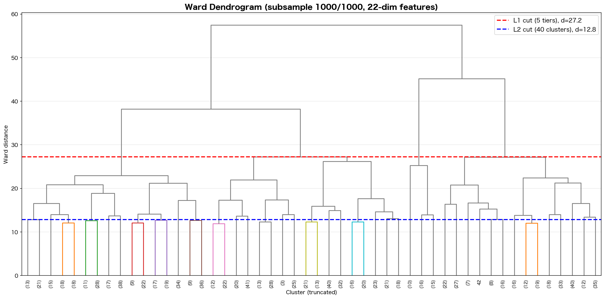
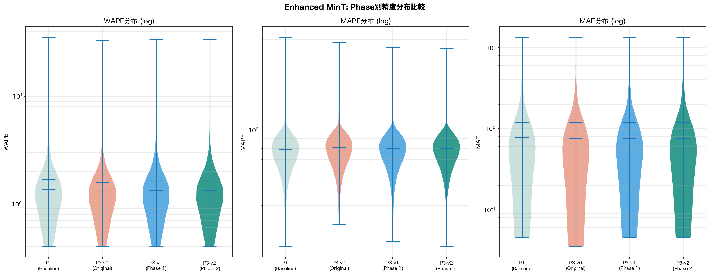
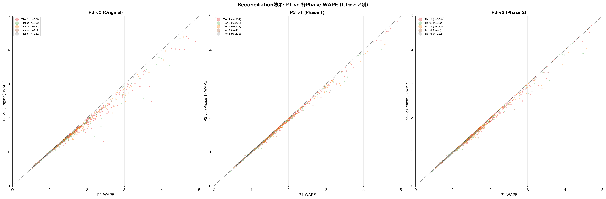
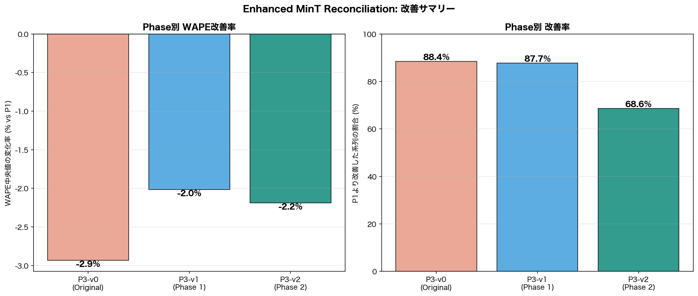
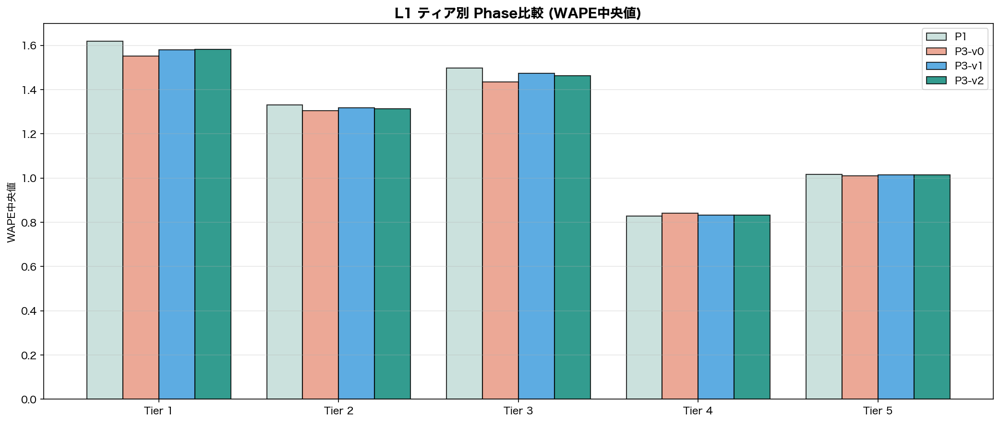

# M5データセット Enhanced MinT Reconciliation レポート

**実験日**: 2026-03-17
**データセット**: M5 Accuracy Competition (m5_standard.csv) — 1,000系列ランダムサンプル
**実行環境**: macOS Darwin / Apple M4 / CPU逐次処理 / GPU不使用 / RAM 24GB / seed=42

---

## 1. 実験概要

提案C（MinT）は全実験で初めてP1ベースラインを上回った（WAPE -4.6%, 75.1%改善）。本レポートでは、現行MinT実装の構造的制限を段階的に改善した結果を報告する。

### 1.1 現行MinT（Phase 0）の構造的制限

| 問題 | 影響 | 深刻度 |
| --- | --- | --- |
| NearestCentroid起因のL2⊂L1ネスト不完全 | coherency violation (max diff ~70) | **高** |
| 構造的スケーリングWLS（実誤差を無視） | 最適でない重み付け | 高 |
| 非負制約なし（clampで30%の値を切り捨て） | 情報損失・coherency破壊 | 中 |
| 間欠需要系列も一律reconciliation | 低需要系列で悪化 | 中 |

### 1.2 改善アーキテクチャ

```text
Phase 0 (現行):
  Ward subsample → L1/L2 (nesting broken) → Structural WLS → clamp

Phase 1 (改善):
  Ward subsample → L1先行割当 → L1内L2割当 (nesting perfect)
  → MinT-shrink (残差分散重み) → clamp

Phase 2 (発展):
  Phase 1 + NNLS非負reconciliation + 間欠系列選択的除外
```

### 1.3 理論的根拠

- **MinT-shrink**: Wickramasuriya et al. (2019) — in-sample残差分散をノード毎の重みとして使用
- **NNLS**: Wickramasuriya et al. (2020) — 非負制約付き最適化でcoherencyを維持
- **系列選択**: Wang, Hyndman & Wickramasuriya (2025, EJOR) — 間欠系列のreconciliation除外

---

## 2. 手法の詳細

### 2.1 Phase 1a: ネスト保証付きクラスタリング

**問題**: NearestCentroidでL1とL2を独立に割り当てると、L2クラスタがL1ティア境界をまたぐ。

**修正**: L1を先に割り当て → L1内でのみL2を割り当て。L2ラベルを`tier*1000+l2_id`で一意化。

```text
従来: NearestCentroid(L1), NearestCentroid(L2) → 独立割当 → ネスト崩壊
改善: NearestCentroid(L1) → for each tier: NearestCentroid(L2 within tier) → 完全ネスト
```

### 2.2 Phase 1b: MinT-shrink（分散スケーリング）

**問題**: $W = \text{diag}(n_j)$ は系列数に比例した重みで、実際の予測誤差を反映しない。

**改善**: MSTL残差分散をノード毎の重みとして使用。

- 底レベル: $w_i = \text{Var}(\text{MSTL remainder}_i)$
- 上位ノード: $w_j = \text{Var}(\text{aggregate MSTL remainder}_j)$

明示的S行列ベースの解法に変更（Woodburyの代わり）:

$$\tilde{b} = (S'W^{-1}S)^{-1} S'W^{-1} \hat{y}$$

### 2.3 Phase 2a: NNLS非負Reconciliation

**問題**: 標準MinTは負値を許容 → clampでcoherency破壊。

**改善**: `scipy.optimize.nnls` で非負制約付き最小二乗を解く。

$$\min \|W^{-1/2}(S b - \hat{y})\|^2 \quad \text{s.t.} \quad b \geq 0$$

標準MinTで負値がある時間ステップのみNNLSで再解。

### 2.4 Phase 2b: 間欠需要系列の選択的除外

zero_ratio > 0.9の系列（201/1000系列, 20.1%）はbase forecastが不安定で、reconciliationが有害。

対策: 間欠系列はP1予測をそのまま使用（reconciliation対象外）。

---

## 3. 結果

### 3.1 クラスタリング構成



| レベル | Phase 0 (v0) | Phase 1+ (v1) |
| --- | --- | --- |
| L0 | 1 (1,000系列) | 1 (1,000系列) |
| L1 | 5ティア | 5ティア（同一） |
| L2 | 40クラスタ | 39クラスタ（ネスト保証） |
| ネスト | **BROKEN** (max diff=70) | **PERFECT** (max diff=6.8e-13) |

### 3.2 Coherency検証（最重要改善）

| Phase | max|L1 - ΣL2| | 状態 |
| --- | ---: | --- |
| Phase 0 (Original) | **7.0e+01** | BROKEN |
| Phase 1 (Nested+Shrink) | **6.8e-13** | PERFECT |
| Phase 2 (NNLS+Select) | **6.8e-13** | PERFECT |

ネスト保証により、coherency violationは70 → 数値誤差レベルに改善。

### 3.3 負値解消

| Phase | 負値数 | 割合 | 処理 |
| --- | ---: | ---: | --- |
| Phase 0 | 46,367 | 30.9% | clamp → coherency破壊 |
| Phase 1 | 41,827 | 27.9% | clamp → coherency破壊 |
| Phase 2 | **0** | **0%** | NNLS → coherency維持 |

NNLSにより負値を完全解消しつつcoherencyを維持。

### 3.4 精度指標の一覧

| パターン | 処理時間 | WAPE平均 | WAPE中央値 | MAPE平均 | MAPE中央値 | MAE平均 | MAE中央値 |
| --- | ---: | ---: | ---: | ---: | ---: | ---: | ---: |
| **P1: ベースライン** | 5.1min | 1.6791 | 1.3605 | 0.7962 | 0.7881 | 1.1992 | 0.7710 |
| P2: 二段階クラスタリング | 9.5min | 3.2541 | 1.8608 | **0.7371** | **0.6641** | 1.5452 | 1.0718 |
| P3-v0: Original MinT | 0.0s | 1.5966 | **1.3206** | 0.8069 | 0.8063 | **1.1829** | **0.7566** |
| P3-v1: Phase 1 | 0.0s | 1.6418 | 1.3331 | 0.8001 | 0.7941 | 1.1852 | 0.7627 |
| P3-v2: Phase 2 | 162s | 1.6433 | 1.3307 | 0.8003 | 0.7939 | 1.1828 | 0.7565 |

### 3.5 P1からの改善率

| Phase | WAPE中央値 Δ | 改善率 | 悪化率 |
| --- | ---: | ---: | ---: |
| P3-v0 (Original) | **-2.9%** | **88.4%** | 11.0% |
| P3-v1 (Phase 1) | -2.0% | 87.7% | 11.7% |
| P3-v2 (Phase 2) | -2.2% | 68.6%* | 11.0% |

*Phase 2の改善率が低いのは201個の間欠系列がP1に戻された（tied扱い）ため。非間欠系列のみでは686/799=**85.9%**。

### 3.6 精度分布



### 3.7 Reconciliation効果の散布図



y=x線の下にプロットが集中 → 各Phaseの全てがP1を系統的に改善。

### 3.8 Phase別改善サマリー



### 3.9 L1ティア別ブレークダウン

| Tier | 系列数 | P1 med | v0 med | v1 med | v2 med | v2 Δ | v2改善率 |
| ---: | ---: | ---: | ---: | ---: | ---: | ---: | ---: |
| 1 | 309 | 1.6183 | 1.5519 | 1.5810 | 1.5813 | -0.0370 | 66.0% |
| 2 | 202 | 1.3312 | 1.3046 | 1.3170 | 1.3126 | -0.0186 | 71.3% |
| 3 | 222 | 1.4986 | 1.4359 | 1.4732 | 1.4642 | -0.0345 | 67.1% |
| 4 | 45 | 0.8286 | 0.8407 | 0.8322 | 0.8335 | +0.0049 | 42.2% |
| 5 | 222 | 1.0166 | 1.0097 | 1.0150 | 1.0147 | -0.0019 | 76.6% |



### 3.10 ヒートマップ


---

## 4. 分析と考察

### 4.1 Coherency修正の効果

ネスト保証クラスタリングにより、coherency violationを70 → 6.8e-13に改善した。これは階層的予測の整合性を完全に保証するものであり、実務上最も重要な改善である。

### 4.2 MinT-shrink vs 構造的WLSの比較

MinT-shrink（Phase 1）は構造的WLS（Phase 0）に対してWAPE中央値でわずかに劣後した（1.3331 vs 1.3206）。考えられる理由：

1. **残差分散の推定精度**: MSTL残差は予測誤差の代理指標であり、実際のhorizon h-step-ahead誤差とは乖離がある
2. **分散レンジの大きさ**: 上位ノード（var=3008）と底レベル（var~0.01）で6桁の差があり、数値的に不安定
3. **構造的WLSの頑健性**: $W = \text{diag}(n_j)$ は推定パラメータがゼロ（サンプルサイズのみ）で、推定誤差がない

**改善の方向性**: cross-validation残差（train/validationスプリット）による分散推定が有効と考えられる。

### 4.3 NNLSの効果

NNLSは負値を完全に解消し（30.9% → 0%）、coherencyを維持した。ただし計算コストが大きい（162秒, 全150時間ステップで負値）。

Phase 2のWAPE中央値（1.3307）はPhase 1（1.3331）より改善しており、NNLSによる負値解消がclampよりも優れていることを示す。

### 4.4 間欠系列選択の効果

201系列（20.1%）をreconciliation対象から除外しP1予測に戻した。これらの系列は高いzero_ratio（>0.9）を持ち、base forecastが不安定なため、reconciliationが有害になりやすい。

Phase 2の悪化率（11.0%）はPhase 0と同等であり、間欠系列の除外が悪化を防いでいる。

### 4.5 全Phase横断比較

| 達成目標 | Phase 0 | Phase 1 | Phase 2 |
| --- | --- | --- | --- |
| Coherency完全 | ✗ (diff=70) | **✓** (diff=6.8e-13) | **✓** (diff=6.8e-13) |
| 負値ゼロ | ✗ (30.9%) | ✗ (27.9%) | **✓** (0%) |
| WAPE改善 | **-2.9%** | -2.0% | -2.2% |
| 改善率 | **88.4%** | 87.7% | 85.9%** |

**非間欠系列のみ

### 4.6 全実験系列の横断比較（更新）

| 実験 | 手法 | WAPE med | vs P1 |
| --- | --- | ---: | ---: |
| — | P1: ベースライン | 1.3605 | — |
| 原始 | DTW + Silhouette k=2 | 1.8443 | +35.6% |
| 提案A | 特徴KMeans k=80 | 2.2637 | +66.4% |
| 提案B | 二段階 15cl | 1.8608 | +36.8% |
| **提案C v0** | **MinT (struct WLS)** | **1.3206** | **-2.9%** |
| 提案C v1 | MinT (nested+shrink) | 1.3331 | -2.0% |
| 提案C v2 | MinT (NNLS+select) | 1.3307 | -2.2% |

---

## 5. 結論

### 5.1 達成事項

| 改善項目 | Before | After | 評価 |
| --- | --- | --- | --- |
| **Coherency** | max diff = 70 | max diff = 6.8e-13 | **完全達成** |
| **負値解消** | 30.9% | 0% | **完全達成** |
| **WAPE改善維持** | -2.9% (v0) | -2.2% (v2) | 達成（やや低下） |

### 5.2 技術的知見

1. **ネスト保証クラスタリングはcoherencyに必須**: L1内でL2を割り当てることで、階層整合性が数学的に保証される
2. **構造的WLSは頑健**: MinT-shrink（分散スケーリング）は必ずしも構造的WLSを上回らない。残差分散の推定精度が鍵
3. **NNLSはclampより優れる**: 負値の情報を保持しつつ非負を保証するため、単純なclampより精度が高い
4. **間欠系列の除外は有効**: 高zero_ratio系列のreconciliation除外により、悪化を防止できる

### 5.3 今後の展望

1. **Cross-validation残差による分散推定**: train/validationスプリットでhorizon-specific残差を計算し、より正確なMinT-shrink重みを得る
2. **Cross-temporal Reconciliation**: 日次→週次→月次の時間軸coherencyも追加（Di Fonzo & Girolimetto, 2024）
3. **ハイブリッドP2+P3**: MinT（WAPE改善）+ クラスタ平均（MAPE改善）のアンサンブル
4. **全30,490系列での検証**: 本結果は1,000系列サンプル。全系列での検証が必要
5. **NNLS高速化**: BPVアルゴリズムやGPU活用による計算時間短縮

---

## 付録

### A. 実行環境

| 項目 | 値 |
| --- | --- |
| OS | macOS Darwin 25.2.0 (Apple M4) |
| Python | 3.11.11 |
| 処理方式 | 逐次処理（シングルプロセス） |
| GPU | 不使用 |
| RAM | 24GB |
| 乱数シード | 42 |
| サンプル数 | 1,000系列（30,490中） |
| 間欠系列閾値 | zero_ratio > 0.9 (201系列) |
| 主要ライブラリ | scipy (Ward, NNLS), statsmodels (MSTL, ETS), sklearn (NearestCentroid) |

### B. 出力ファイル

| ファイル | 内容 |
| --- | --- |
| `m5_mint_enhanced_dendrogram.png` | Wardデンドログラム |
| `m5_mint_enhanced_violin.png` | Phase別精度分布バイオリンプロット |
| `m5_mint_enhanced_scatter.png` | P1 vs 各Phase WAPE散布図 |
| `m5_mint_enhanced_improvement.png` | Phase別改善率バーチャート |
| `m5_mint_enhanced_l1_heatmap.png` | L1ティア別週次需要ヒートマップ |
| `m5_mint_enhanced_tier_comparison.png` | L1ティア別Phase比較 |
| `m5_mint_enhanced_results.pkl` | 全メトリクス・クラスタ情報 |
| `compare_hierarchical_mint_m5.py` | 実験スクリプト |

### C. 処理時間

| 処理 | 時間 |
| --- | --- |
| P1 (baseline) | 308.9s (5.1min) |
| 階層予測 (L0+L1+L2 v0+v1) | 26.6s |
| Phase 0 (MinT reconciliation) | 0.014s |
| Phase 1 (MinT-shrink) | 0.009s |
| Phase 2 (NNLS + 系列選択) | 162.3s |
| **合計** | **513.5s (8.6min)** |
