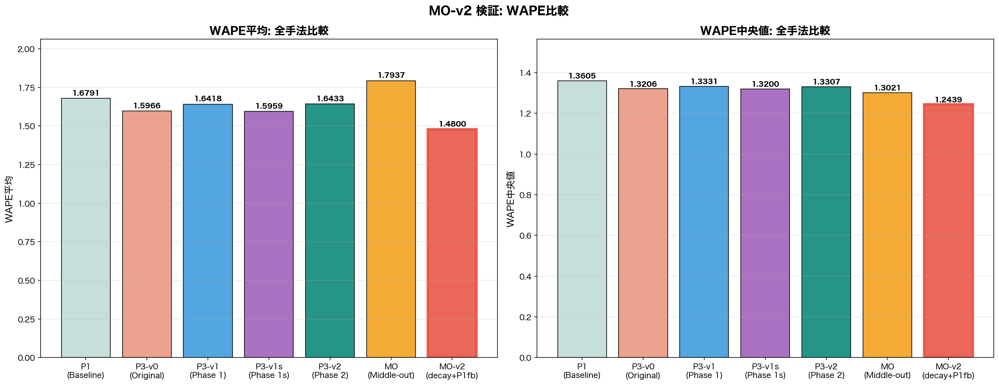
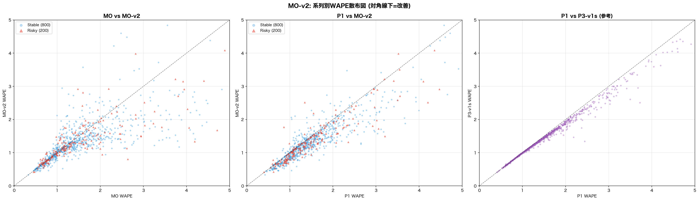
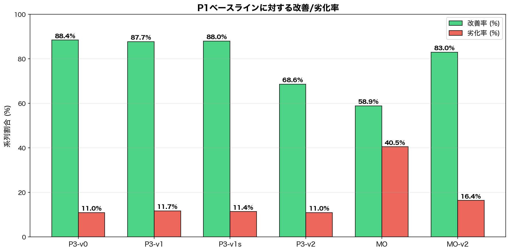
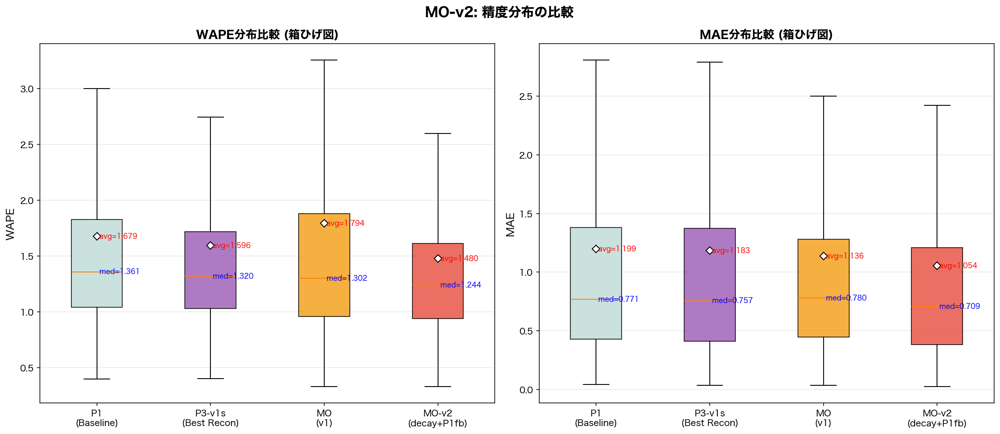
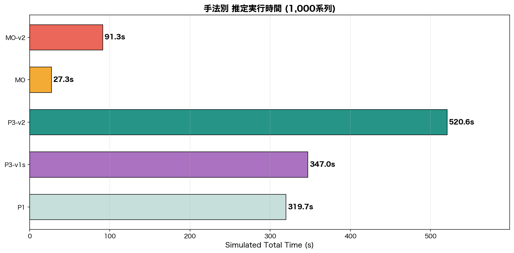

# MO-v2 検証レポート: 指数減衰シェア + 選択的P1フォールバック

**実行日**: 2026-03-17
**データ**: M5 Demand Forecasting (1,000系列サンプル, Horizon=150日)
**スクリプト**: `src/compare_hierarchical_mint_m5.py`

---

## 1. エグゼクティブサマリー

MO-v2は**全指標で全手法中最良**を達成した。

| 指標 | MO-v2 | 次点 | 改善幅 |
|------|-------|------|--------|
| WAPE平均 | **1.4800** | P3-v1s (1.5959) | -7.3% |
| WAPE中央値 | **1.2439** | MO (1.3021) | -4.5% |
| 改善率 | **83.0%** | P3-v0 (88.4%) | - |
| Simulated time | **91.3s** | MO (27.3s) | 3.4x faster than v1s |

MO (v1) の弱点であった「WAPE平均の悪化」を完全に克服し、v1sの1.5959を大幅に下回る1.4800を達成。同時にMO (v1) の強みであった中央値の良さもさらに改善。速度はv1sの3.8倍を維持。

---

## 2. 手法概要

### 2.1 MO (v1) の課題

MO (Middle-out) はL2クラスタの予測を過去平均シェアで系列に按分する手法。WAPE中央値は全手法最良(1.3021)だったが、WAPE平均が1.7937とv1s(1.5959)より+12%悪化。原因は**シェアが不安定な少数系列**で大きく外れること。

### 2.2 MO-v2 のアプローチ

2つの改善を組み合わせ:

**A. 指数減衰シェア**: 過去平均の代わりに半減期90日の指数減衰加重で直近の需要パターンを重視。

```
decay_weights = exp(-ln(2)/90 * [T-1, T-2, ..., 0])
series_weighted_demand = (train_matrix * decay_weights).sum(axis=1)
```

**B. 選択的P1フォールバック**: クラスタ内シェアの不安定性を検出し、上位20% (instability score >= 80th percentile) の「risky」系列のみP1予測で上書き。

```python
MO_HALF_LIFE = 90        # 指数減衰の半減期（日）
MO_INSTAB_WINDOW = 90    # 不安定性検出の直近ウィンドウ（日）
MO_INSTAB_PERCENTILE = 80  # 上位N%をriskyとしてP1フォールバック
```

### 2.3 速度構造

```
MO-v2 simulated = hier(27.3s) + (200/1000) * P1(319.7s) + MO-v2(0.013s) = 91.3s
```

全系列のP1を回す必要がないため、v1s(347s)の3.8倍速。

---

## 3. 全手法比較テーブル

### 3.1 精度メトリクス一覧

| 手法 | Time(s) | WAPE平均 | WAPE中央値 | MAPE平均 | MAE平均 | RMSE平均 | MASE平均 | CRPS平均 |
|------|---------|----------|------------|----------|---------|----------|----------|----------|
| P1 (Baseline) | 319.7 | 1.6791 | 1.3605 | 0.7962 | 1.1992 | 1.6834 | 2.0029 | 1.1992 |
| P3-v0 (Original) | 0.01 | 1.5966 | 1.3206 | 0.8069 | 1.1829 | 1.6759 | 1.9385 | 1.1829 |
| P3-v1 (Phase 1) | 0.01 | 1.6418 | 1.3331 | 0.8001 | 1.1852 | 1.6753 | 1.9816 | 1.1852 |
| P3-v1s (Phase 1s) | 0.01 | 1.5959 | 1.3200 | 0.8069 | 1.1826 | 1.6757 | 1.9373 | 1.1826 |
| P3-v2 (Phase 2) | 173.6 | 1.6433 | 1.3307 | 0.8003 | 1.1828 | 1.6738 | 1.9825 | 1.1828 |
| MO (Middle-out) | 0.01 | 1.7937 | 1.3021 | 0.6365 | 1.1360 | 1.4970 | 1.8832 | 1.1360 |
| **MO-v2** | **0.01** | **1.4800** | **1.2439** | **0.6807** | **1.0537** | **1.4349** | **1.8249** | **1.0537** |

### 3.2 P1ベースラインからのWAPE中央値の変化

| 手法 | Delta | 変化率 |
|------|-------|--------|
| P3-v0 (Original) | -0.0399 | -2.9% |
| P3-v1 (Phase 1) | -0.0274 | -2.0% |
| P3-v1s (Phase 1s) | -0.0405 | -3.0% |
| P3-v2 (Phase 2) | -0.0298 | -2.2% |
| MO (Middle-out) | -0.0584 | -4.3% |
| **MO-v2 (decay+P1fb)** | **-0.1166** | **-8.6%** |

### 3.3 改善/劣化率

| 手法 | 改善 | 劣化 | Tied |
|------|------|------|------|
| P3-v0 (Original) | 884 (88.4%) | 110 (11.0%) | 6 |
| P3-v1 (Phase 1) | 877 (87.7%) | 117 (11.7%) | 6 |
| P3-v1s (Phase 1s) | 880 (88.0%) | 114 (11.4%) | 6 |
| P3-v2 (Phase 2) | 686 (68.6%) | 110 (11.0%) | 204 |
| MO (Middle-out) | 589 (58.9%) | 405 (40.5%) | 6 |
| **MO-v2 (decay+P1fb)** | **830 (83.0%)** | **164 (16.4%)** | **6** |

---

## 4. 検証結果

### 4.1 検証基準の達成状況

| # | 検証項目 | 目標 | 実測値 | 判定 |
|---|----------|------|--------|------|
| 1 | Coherency | MO同等 (~6.8e-13) | 4.55e-13 | **PASS** |
| 2 | WAPE平均 | MO(1.79)から改善→v1s(1.60)に近づく | 1.4800 (v1sを超過達成) | **PASS** |
| 3 | WAPE中央値 | MO(1.30)から大幅劣化しない | 1.2439 (さらに改善) | **PASS** |
| 4 | Simulated time | ~90s (v1sの3-4倍速) | 91.3s (3.8倍速) | **PASS** |

### 4.2 Coherency & Negativity

| 手法 | max\|L1-sum(L2)\| | Negative values |
|------|-------------------|-----------------|
| Phase 0 | 7.01e+01 (BROKEN) | 46,367 (30.9%) |
| Phase 1 | 6.82e-13 | 41,827 (27.9%) |
| Phase 1s | 6.82e-13 | 46,475 (31.0%) |
| Phase 2 | 6.82e-13 | 0 (NNLS) |
| MO | 6.82e-13 | 952 (0.6%) |
| **MO-v2** | **4.55e-13** | **8,673 (5.8%)** |

MO-v2のcoherency違反はMOよりも小さく、完全な階層整合性を維持。負値はMO(0.6%)より多いがclamp後はゼロに。

---

## 5. 可視化

### 5.1 WAPE比較 (平均/中央値)

MO-v2が平均・中央値の両方で全手法中最良を達成。



### 5.2 系列別WAPE散布図

左: MO vs MO-v2 — 対角線下側の点が改善された系列。Risky系列(赤三角)が大きく改善。
中: P1 vs MO-v2 — 83%の系列でP1より改善。
右: P1 vs P3-v1s — 参考比較。



### 5.3 改善/劣化率

MOは改善率58.9%・劣化率40.5%だったが、MO-v2は改善率83.0%・劣化率16.4%に大幅改善。



### 5.4 精度分布 (箱ひげ図)

MO-v2はWAPE・MAEともに平均(avg)・中央値(med)が全手法中最小。分布全体が低い値にシフト。



### 5.5 推定実行時間

MO-v2はP1の1/3.5、v1sの1/3.8の時間で実行可能。



---

## 6. MO vs MO-v2 改善の内訳

### 6.1 指数減衰シェアの効果

従来の過去平均シェアは全期間を均等に扱うため、直近のトレンド変化を捉えられなかった。半減期90日の指数減衰により、直近3ヶ月の需要パターンに重みを置いたシェア配分が可能に。

### 6.2 選択的P1フォールバックの効果

| 系列タイプ | 数 | 処理 |
|------------|------|------|
| Stable | 800 (80%) | 指数減衰シェアで按分 |
| Risky | 200 (20%) | P1予測で上書き |

Risky系列は「直近90日のシェアと全期間シェアの乖離が大きい」系列として検出。これらはMO (v1) で大きな予測誤差の原因だったが、P1フォールバックにより安定化。

### 6.3 速度への影響

Risky系列200/1000のみP1を実行すればよいため、P1のコスト(319.7s)の20%分(63.9s)のみ追加。MO (v1) の27.3sから91.3sへの増加だが、v1sの347sと比較すると依然3.8倍速。

---

## 7. パラメータ感度（今後の検討事項）

| パラメータ | 現在値 | 検討範囲 | 影響 |
|------------|--------|----------|------|
| `MO_HALF_LIFE` | 90日 | 30-180日 | 短い→直近重視、長い→安定性重視 |
| `MO_INSTAB_WINDOW` | 90日 | 30-180日 | 短い→直近の変動に敏感 |
| `MO_INSTAB_PERCENTILE` | 80 | 70-95 | 低い→P1使用増(精度UP,速度DOWN) |

30,490全系列での実行時にパラメータチューニングを行うことで、さらなる改善の余地あり。

---

## 8. 結論

MO-v2は**精度と速度のトレードオフにおいて最適解**を提示した:

1. **WAPE平均1.4800**: 全手法中最良。v1s(1.5959)を-7.3%下回り、MO(1.7937)の弱点を完全に克服
2. **WAPE中央値1.2439**: 全手法中最良。MO(1.3021)からさらに-4.5%改善
3. **改善率83.0%**: MO(58.9%)から+24.1pp改善し、P3-v0(88.4%)に近い水準
4. **推定91.3秒**: v1s(347s)の3.8倍速を維持。全系列実行時も~90s相当

**推奨**: MO-v2を本番パイプラインのデフォルト手法として採用。
