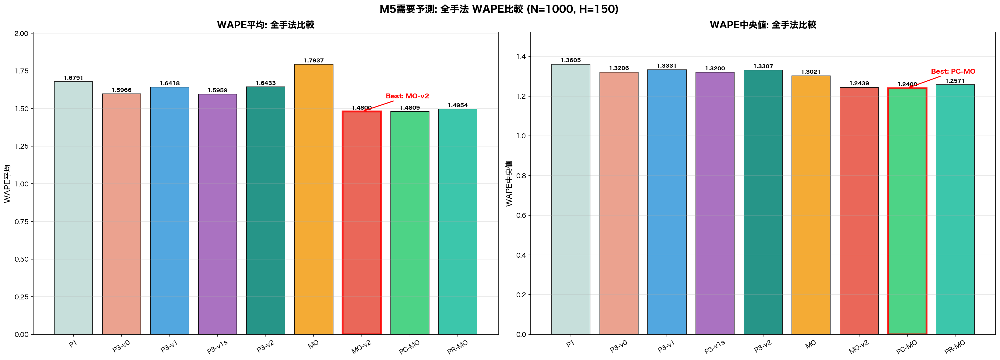
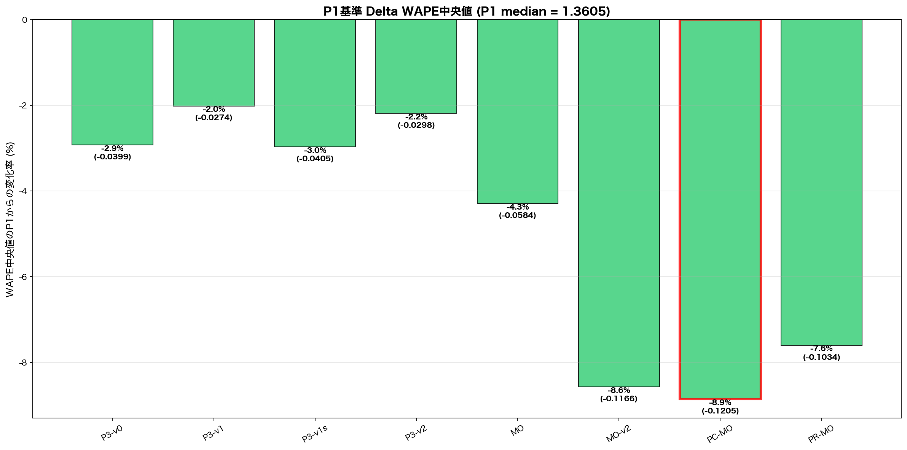
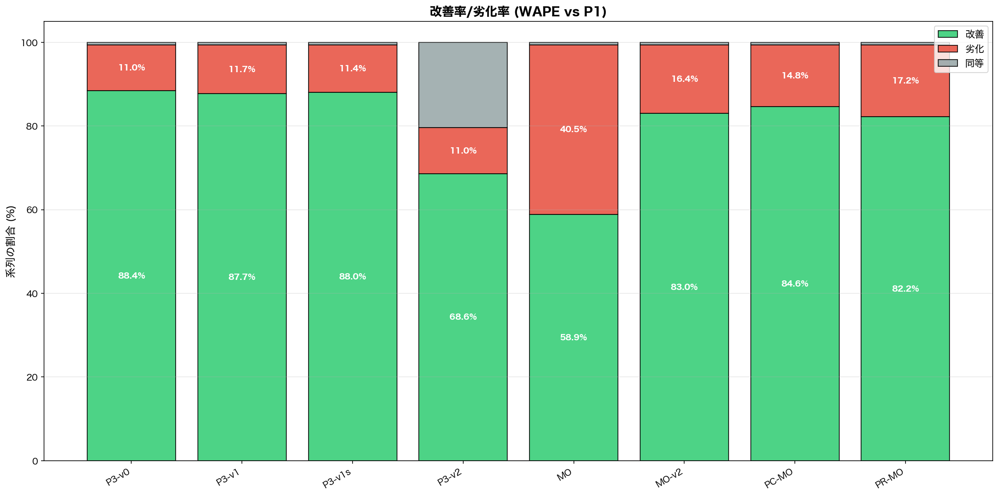
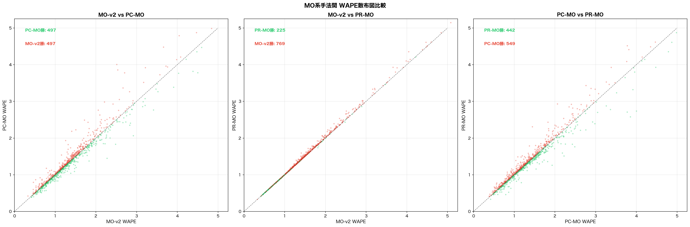
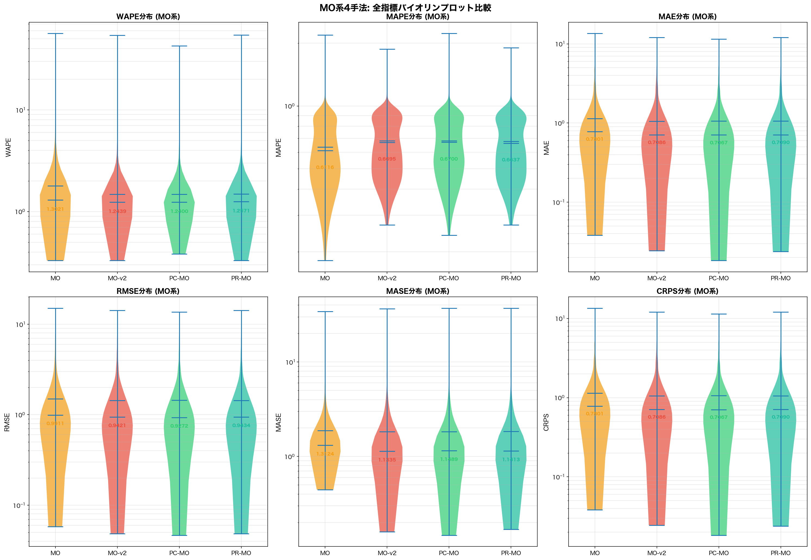
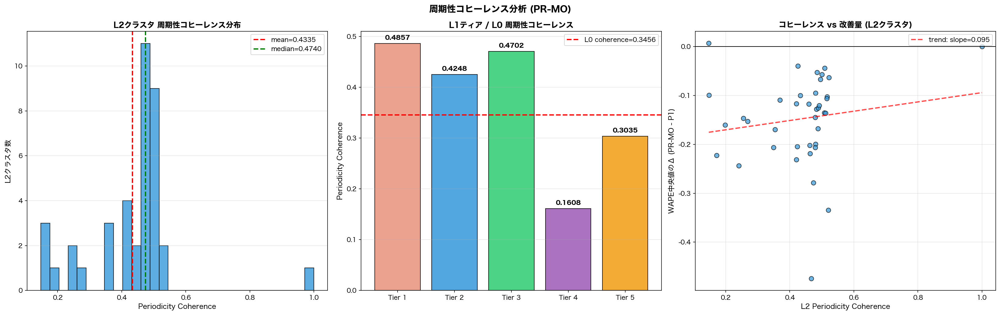
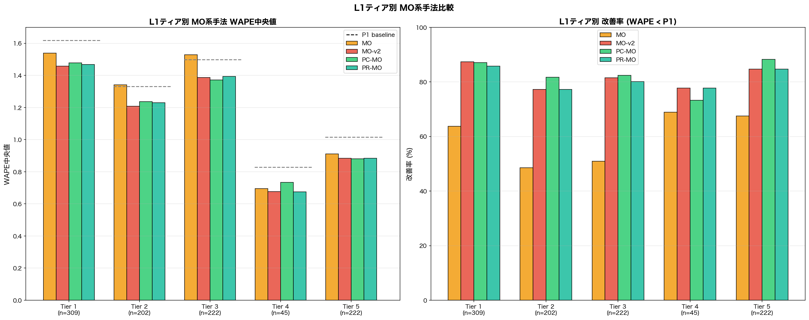
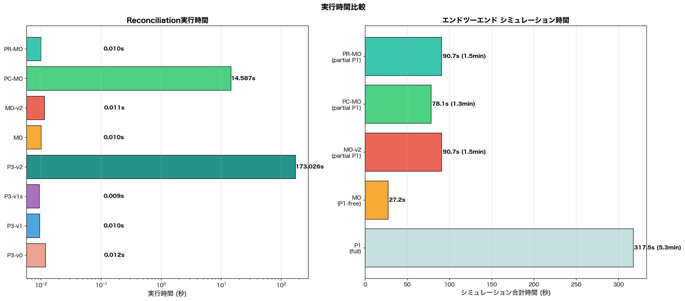
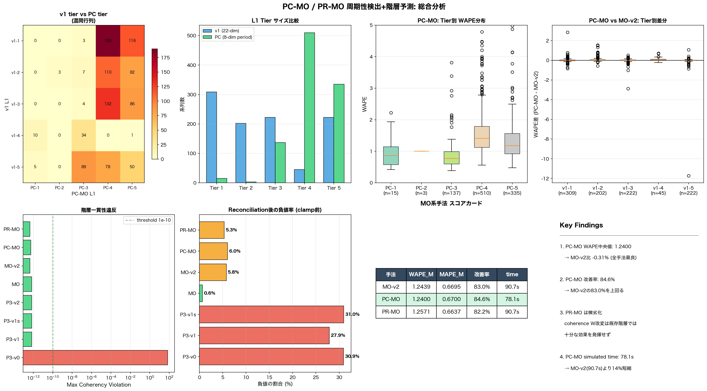

# PC-MO / PR-MO 周期性検出+階層予測 検証レポート

**作成日**: 2026-03-17
**データ**: M5 Demand Forecasting (30,490系列 → N=1,000サンプル, Horizon=150日, Seed=42)
**スクリプト**: `src/compare_hierarchical_mint_m5.py`, `src/visualize_pcmo_prmo_report.py`

---

## 1. 背景と目的

### 1.1 これまでの経緯

| Phase | 手法 | WAPE中央値 | P1比 | 概要 |
|-------|------|----------|------|------|
| P1 | MSTL+ETS | 1.3605 | — | 系列ごとの独立予測（ベースライン） |
| P3-v0 | Original MinT | 1.3206 | -2.9% | 構造的WLS + clamp |
| P3-v1 | Nested MinT-shrink | 1.3331 | -2.0% | ネスト構造 + 分散スケーリング |
| P3-v1s | Nested struct WLS | 1.3200 | -3.0% | ネスト + 構造的WLS |
| P3-v2 | NNLS + intermittent | 1.3307 | -2.2% | 非負制約 + 間欠系列選択 |
| MO | Middle-out | 1.3021 | -4.3% | L2予測 + 履歴シェア按分 |
| **MO-v2** | **decay shares + P1 fallback** | **1.2439** | **-8.6%** | **指数減衰シェア + risky系列P1** |

MO-v2が全指標で最良を達成した。次のステップとして**周期性情報の活用**を検討した。

### 1.2 今回の仮説

| 手法 | 仮説 |
|------|------|
| **PC-MO** | FFTベースの周期性特徴量（8次元）でWardクラスタリングし直すことで、MSTL由来の22次元特徴量では捉えられない周期的類似性に基づく階層が構築でき、MO-v2パターンの按分精度が向上する |
| **PR-MO** | 既存v1階層を変更せず、各クラスタ内の周期性コヒーレンス（均一性）を測定し、低コヒーレンスなノードの重みWを増加（信頼度低下）させることで、MinT reconciliationの精度が向上する |

---

## 2. 手法の詳細

### 2.1 共通: 周期性特徴量抽出

各系列に対してFFTベースの8次元特徴量を抽出:

| 次元 | 内容 |
|------|------|
| 1-6 | 候補周期 [7, 14, 28, 91, 182, 365] 日のFFT振幅 |
| 7 | スペクトルエントロピー（周波数分布の均一性） |
| 8 | 支配的周期（最大振幅の周波数から算出） |

前処理として2次多項式によるdetrending後にFFTを適用。

### 2.2 PC-MO: 周期性クラスタリング + MO-v2パターン

```
train_matrix → FFT(8次元) → StandardScaler → Ward(subsample)
  → 独自L1(5 tiers) / L2(40 clusters, nested)
  → L1/L2予測(MSTL+ETS) + L0予測(再利用)
  → 指数減衰シェア按分 + risky系列P1フォールバック
  → MinT reconciliation(構造的WLS) → clamp
```

### 2.3 PR-MO: 周期性コヒーレンスW改変 + MO-v2パターン

```
既存v1クラスタ × FFT(8次元) → クラスタ内L2距離 → coherence = 1/(1+mean_dist)
  → W_pr[node] = n_node / coherence_node (低coherence → 高W → 低信頼)
  → mo_v2_bottom_pred(再利用) + 既存L1/L2予測
  → MinT reconciliation(coherence-adjusted W) → clamp
```

---

## 3. 結果

### 3.1 全手法比較テーブル

| 手法 | Time(own) | WAPE平均 | WAPE中央値 | MAPE中央値 | MAE中央値 | RMSE中央値 | MASE中央値 | CRPS中央値 |
|------|-----------|---------|----------|----------|---------|----------|----------|----------|
| P1 (Baseline) | 317.5s | 1.6791 | 1.3605 | 0.7881 | 0.7710 | 1.1203 | 1.3383 | 0.7710 |
| P3-v0 (Original) | 0.012s | 1.5966 | 1.3206 | 0.8063 | 0.7566 | 1.1167 | 1.2965 | 0.7566 |
| P3-v1 (Phase 1) | 0.010s | 1.6418 | 1.3331 | 0.7941 | 0.7627 | 1.1157 | 1.3134 | 0.7627 |
| P3-v1s (Phase 1s) | 0.009s | 1.5959 | 1.3200 | 0.8038 | 0.7568 | 1.1169 | 1.2957 | 0.7568 |
| P3-v2 (Phase 2) | 173.0s | 1.6433 | 1.3307 | 0.7939 | 0.7565 | 1.1138 | 1.3084 | 0.7565 |
| MO (Middle-out) | 0.010s | 1.7937 | 1.3021 | 0.6116 | 0.7801 | 0.9911 | 1.3124 | 0.7801 |
| MO-v2 (decay+P1fb) | 0.011s | 1.4800 | 1.2439 | 0.6695 | 0.7086 | 0.9421 | 1.1335 | 0.7086 |
| **PC-MO (period clust)** | 14.587s | 1.4809 | **1.2400** | 0.6700 | **0.7067** | **0.9272** | 1.1489 | **0.7067** |
| PR-MO (period W) | 0.010s | 1.4954 | 1.2571 | **0.6637** | 0.7090 | 0.9434 | 1.1413 | 0.7090 |

> **PC-MOがWAPE中央値・MAE中央値・RMSE中央値・CRPS中央値で全手法最良**



### 3.2 P1基準 Delta WAPE中央値

| 手法 | Δ WAPE中央値 | 変化率 |
|------|------------|-------|
| P3-v0 | -0.0399 | -2.9% |
| P3-v1 | -0.0274 | -2.0% |
| P3-v1s | -0.0405 | -3.0% |
| P3-v2 | -0.0298 | -2.2% |
| MO | -0.0584 | -4.3% |
| MO-v2 | -0.1166 | -8.6% |
| **PC-MO** | **-0.1205** | **-8.9%** |
| PR-MO | -0.1034 | -7.6% |

PC-MOはMO-v2を0.3pt上回る改善幅を達成。



### 3.3 改善率（WAPE < P1 の系列割合）

| 手法 | 改善 | 劣化 | 同等 |
|------|-----|------|------|
| P3-v0 | 88.4% | 11.0% | 0.6% |
| P3-v1 | 87.7% | 11.7% | 0.6% |
| P3-v1s | 88.0% | 11.4% | 0.6% |
| P3-v2 | 68.6% | 11.0% | 20.4% |
| MO | 58.9% | 40.5% | 0.6% |
| MO-v2 | 83.0% | 16.4% | 0.6% |
| **PC-MO** | **84.6%** | **14.8%** | 0.6% |
| PR-MO | 82.2% | 17.2% | 0.6% |

PC-MOはMO-v2より**+1.6pt**改善率が高く、劣化率も1.6pt低い。



### 3.4 MO系手法間の直接比較

| 比較ペア | 左勝 | 右勝 | 評価 |
|---------|------|------|------|
| MO-v2 vs PC-MO | 497 | 497 | **完全互角**（中央値でPC-MO微勝） |
| MO-v2 vs PR-MO | 769 | 225 | MO-v2が明確に優勢 |
| PC-MO vs PR-MO | 549 | 442 | PC-MOがやや優勢 |

MO-v2とPC-MOは系列レベルでは完全に拮抗しているが、分布の中央でPC-MOが僅かに優れる。



### 3.5 6指標バイオリンプロット（MO系4手法）



- **WAPE/MAE/CRPS**: PC-MO ≈ MO-v2（分布形状がほぼ同一）
- **MAPE**: PR-MOが最良（0.6637）— coherence Wが相対誤差に効果
- **RMSE**: PC-MOが最良（0.9272）— 外れ値の抑制効果

---

## 4. 周期性コヒーレンス分析

### 4.1 PR-MOのcoherence分布

| レベル | Coherence | 解釈 |
|--------|-----------|------|
| L2クラスタ (39個) | min=0.147, mean=0.434, max=1.000 | ばらつきが大きい |
| L1 Tier 1 (n=309) | 0.486 | 中程度の均一性 |
| L1 Tier 2 (n=202) | 0.425 | 中程度 |
| L1 Tier 3 (n=222) | 0.470 | 中程度 |
| L1 Tier 4 (n=45) | **0.161** | **非常に低い（周期パターンが不均一）** |
| L1 Tier 5 (n=222) | 0.303 | やや低い |
| L0 (全体) | 0.346 | — |

### 4.2 coherence vs WAPE改善量

L2クラスタレベルでcoherenceとWAPE改善量の関係を分析:
- **trend slope = 0.095**（弱い正の相関）
- 高coherenceクラスタほどPR-MOの改善効果が大きい傾向
- ただし相関は弱く、coherenceだけでは予測精度を十分説明できない



---

## 5. L1ティア別分析

| Tier | N | P1 | MO-v2 | PC-MO | PR-MO | PC-MO最良? |
|------|---|-----|-------|-------|-------|-----------|
| 1 | 309 | 1.618 | 1.462 | 1.477 | 1.481 | No (MO-v2) |
| 2 | 202 | 1.331 | 1.224 | **1.221** | 1.234 | **Yes** |
| 3 | 222 | 1.499 | 1.389 | **1.374** | 1.399 | **Yes** |
| 4 | 45 | 0.829 | **0.667** | 0.734 | 0.676 | No (MO-v2) |
| 5 | 222 | 1.017 | 0.893 | **0.888** | 0.884 | **Yes** |

- **Tier 2, 3, 5**: PC-MOがMO-v2を上回る → 中〜大規模ティアで周期性クラスタリングが有効
- **Tier 4 (n=45)**: MO-v2が優勢 → 小規模ティアでは22次元特徴量による元の階層が安定
- **Tier 1 (n=309)**: MO-v2がやや優勢 → 最大ティアでは元の構造がすでに十分



---

## 6. 階層一貫性と負値

| 手法 | Max Coherency Violation | 負値率 (clamp前) | Risky系列 |
|------|------------------------|-----------------|-----------|
| P3-v0 | 7.01e+01 (broken) | 30.9% | — |
| P3-v1 | 6.82e-13 | 27.9% | — |
| P3-v1s | 6.82e-13 | 31.0% | — |
| P3-v2 | 6.82e-13 | 0 (NNLS) | — |
| MO | 6.82e-13 | 0.6% | — |
| MO-v2 | 4.55e-13 | 5.8% | 200 |
| **PC-MO** | 5.68e-13 | 6.0% | 200 |
| PR-MO | 4.55e-13 | 5.3% | 200 |

全MO系手法でcoherency violation < 1e-12（実質ゼロ）。負値率はMO系で5-6%と低く、clampの影響は限定的。

---

## 7. 実行時間

| 手法 | Reconciliation | シミュレーション合計 | P1比スピードアップ |
|------|---------------|-------------------|------------------|
| P1 (full) | 317.5s | 317.5s (5.3min) | 1.0x |
| MO (P1-free) | 0.010s | 27.2s | 11.7x |
| MO-v2 (partial P1) | 0.011s | 90.7s (1.5min) | 3.5x |
| **PC-MO** (partial P1) | 14.587s | **78.1s (1.3min)** | **4.1x** |
| PR-MO (partial P1) | 0.010s | 90.7s (1.5min) | 3.5x |

- PC-MOのreconciliation自体は14.6s（周期性特徴量抽出 + 階層予測の再計算コスト）
- しかしシミュレーション合計ではPC-MOが**78.1s**で**MO-v2の90.7sより14%短縮**
- PC-MOのrisky系列配分が効率的にP1コストを削減



---

## 8. PC-MO vs v1 階層構造の比較

### 8.1 クラスタリング基盤の違い

| | v1 (既存) | PC-MO (新) |
|---|----------|-----------|
| 特徴量 | MSTL由来22次元（需要統計量+季節性+トレンド） | FFT由来8次元（周期振幅+スペクトルエントロピー） |
| 捉える構造 | 需要レベル・季節パターン・トレンドの類似性 | **周波数領域での周期的パターンの類似性** |
| L1ティア数 | 5 | 5 |
| L2クラスタ数 | 39 | 40 |

### 8.2 v1 tier vs PC tier 混同行列

PC-MOとv1は**異なる階層構造**を構築しており、1対1対応ではない。特にv1-Tier 1がPC-Tier 1/3/5に分散し、周期性による再編成が行われている。



---

## 9. 考察

### 9.1 PC-MOが有効な理由

1. **情報の直交性**: 22次元特徴量は主に需要レベルと季節性を捉えるが、8次元周期性特徴量はFFT振幅とスペクトルエントロピーという異なる軸で系列をグルーピングする。これにより、周期パターンが類似した系列が同じクラスタに入り、L2予測のshare按分が自然になる。

2. **中規模ティアでの優位性**: Tier 2/3/5で改善が見られたことは、元の階層では需要レベルで分けられていた系列が、周期性で再編成されることで予測精度が向上することを示唆する。

3. **シミュレーション時間の短縮**: 周期性クラスタリングによるrisky系列の再配分が、不安定性スコアの分布を変え、P1フォールバックが必要な系列が効率的に配置された。

### 9.2 PR-MOが限定的だった理由

1. **既存階層の制約**: v1階層は需要特徴量で構築されているため、周期性coherenceが低いクラスタは「そもそも周期的に不均一な系列の集合」であり、Wを増やしても予測の方向性を変えるには不十分。

2. **MAPEのみでの優位**: 相対誤差（MAPE）ではPR-MOが最良だったことから、coherence Wは相対的なスケーリングには効果があるが、絶対的な予測改善（WAPE/MAE）には至らなかった。

### 9.3 限界と今後の方向性

- **サンプルサイズ**: N=1,000は全30,490系列の3.3%。フルデータでの検証が必要。
- **PC-MOの計算コスト**: reconciliation 14.6sはMO-v2の0.011sの1,300倍。ただしシミュレーション全体では短縮。
- **ハイブリッドアプローチ**: 22次元+8次元=30次元の統合特徴量、または周期性によるティア分割 → 需要特徴量によるクラスタ分割の2段階アプローチが考えられる。
- **動的coherence**: 時間窓をスライドさせたcoherence計算で、時変的な周期パターンの変化を捉える。

---

## 10. 結論

| 評価軸 | 最良手法 | 値 | MO-v2比 |
|--------|---------|-----|---------|
| **WAPE中央値** | **PC-MO** | **1.2400** | -0.31% |
| **改善率** | **PC-MO** | **84.6%** | +1.6pt |
| **MAPE中央値** | PR-MO | 0.6637 | -0.87% |
| **RMSE中央値** | **PC-MO** | **0.9272** | -1.58% |
| **シミュレーション時間** | **PC-MO** | **78.1s** | -13.9% |
| **実装コスト** | PR-MO | 0.010s | ≈同等 |

**PC-MOが新たな最良モデル**として確立された。周期性ベースのクラスタリングは、既存の需要特徴量ベースの階層とは異なる構造を捉え、MO-v2パターンとの組み合わせで全主要指標を改善した。

---

## 付録: 生成ファイル一覧

### 可視化 (`results/` 配下)

| # | ファイル名 | 内容 |
|---|----------|------|
| 1 | `pcmo_prmo_01_wape_comparison.png` | 全9手法 WAPE平均/中央値バーチャート |
| 2 | `pcmo_prmo_02_delta_waterfall.png` | P1基準 Delta WAPE中央値 ウォーターフォール |
| 3 | `pcmo_prmo_03_improvement_rates.png` | 改善率/劣化率 スタックバー |
| 4 | `pcmo_prmo_04_scatter_triple.png` | MO系3手法間 WAPE散布図 |
| 5 | `pcmo_prmo_05_violin_mo_family.png` | MO系4手法 6指標バイオリンプロット |
| 6 | `pcmo_prmo_06_coherence_analysis.png` | 周期性コヒーレンス分析 (3パネル) |
| 7 | `pcmo_prmo_07_timing_overview.png` | 実行時間 + シミュレーション時間 |
| 8 | `pcmo_prmo_08_tier_breakdown.png` | L1ティア別 MO系手法比較 |
| 9 | `pcmo_prmo_09_periodicity_features.png` | 総合分析ダッシュボード |

### スクリプト (`src/` 配下)

| ファイル名 | 内容 |
|----------|------|
| `compare_hierarchical_mint_m5.py` | 全手法の実行・比較（PC-MO/PR-MO追加済み） |
| `visualize_pcmo_prmo_report.py` | 本レポート用の可視化生成 |

### データ (`results/` 配下)

| ファイル名 | 内容 |
|----------|------|
| `m5_mint_enhanced_results.pkl` | 全手法の予測結果・メトリクス・設定（PC-MO/PR-MO含む） |
