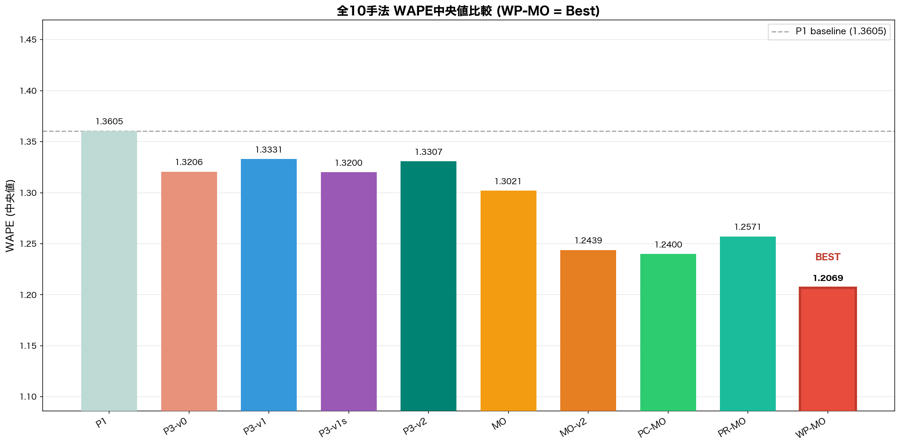
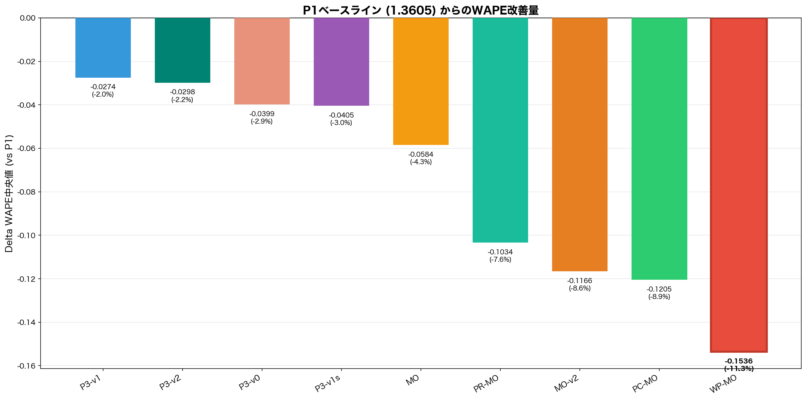
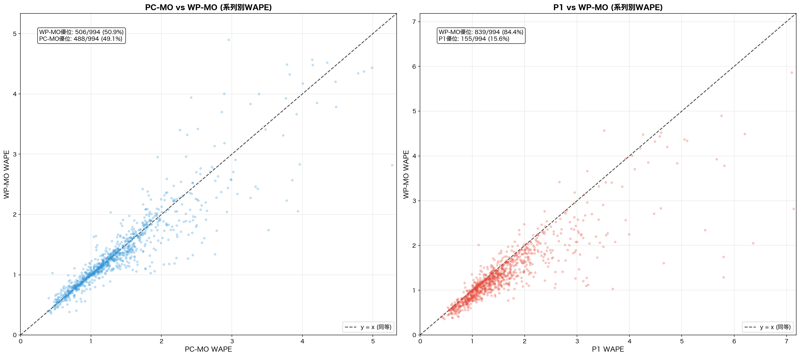
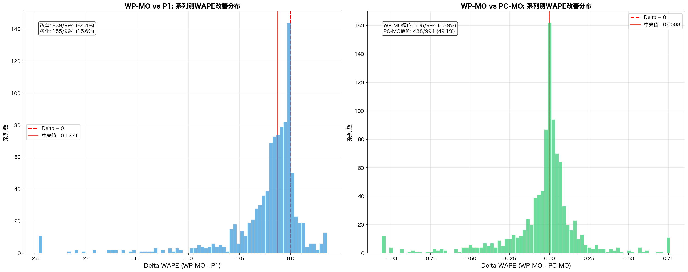
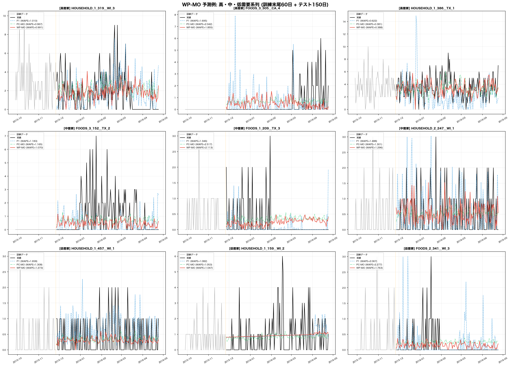

# WP-MO (Weekly-Profile PCA + Middle-Out) 実験レポート

**実験日**: 2026-03-17
**データセット**: M5 Accuracy Competition (m5_standard.csv) -- 1000系列ランダムサンプル (seed=42)
**Horizon**: 150日
**実行環境**: macOS Darwin / Apple M4 / CPU逐次処理 / GPU不使用 / RAM 24GB

---

## 1. 実験概要

### 1.1 WP-MO手法の概要

WP-MO (Weekly-Profile PCA clustering + Middle-Out v2 pattern) は、
時系列の**週次プロファイル**に基づくデータ駆動型クラスタリングを用いた階層予測手法である。

従来のPC-MO (Periodicity-based Clustering) がFFTスペクトルから周期性特徴を抽出したのに対し、
WP-MOは以下のパイプラインで**需要パターンの時間的類似性**をより直接的に捉える。

### 1.2 WP-MOパイプライン

```text
1. 週次集約:  日次需要 -> 週次合計 (T=251週)
2. 正規化:    log1p -> Z標準化 (系列間のスケール差を除去)
3. PCA:       20次元に圧縮 (説明分散: 57.3%)
4. Ward階層:  サブサンプル上でlinkage -> L1(5)/L2(40)クラスタ
5. NearestCentroid: 全系列に割当 (L2 nested within L1)
6. 階層予測:  L0/L1/L2レベルでMSTL+ETS予測
7. MO-v2按分: 指数減衰シェア + risky系列P1フォールバック
8. MinT:      構造的WLSで全レベル整合化 (coherency保証)
```

### 1.3 PC-MOとの主な差分

| 特徴量 | PC-MO | WP-MO |
| --- | --- | --- |
| 入力 | FFTスペクトル (6周期候補 + エントロピー + 支配周期) | 週次集約需要のPCA射影 |
| 次元 | 8次元 | 20次元 |
| 説明分散 | - | 57.3% |
| 特徴の性質 | 周波数ドメインの周期性 | 時間ドメインの需要プロファイル |
| 適応性 | 候補周期のハードコーディング | データ駆動 (PCAが最適基底を学習) |

---

## 2. 結果サマリーテーブル

| 手法 | Time (s) | WAPE中央値 | WAPE平均 | MAPE中央値 | 改善率 | Delta (vs P1) |
| --- | ---: | ---: | ---: | ---: | ---: | --- |
| P1 | 305.0 | 1.3605 | 1.6791 | 0.7881 | - | - |
| P3-v0 | 0.0 | 1.3206 | 1.5966 | 0.8063 | 88.9% | -0.0399 (-2.9%) |
| P3-v1 | 0.0 | 1.3331 | 1.6418 | 0.7941 | 88.2% | -0.0274 (-2.0%) |
| P3-v1s | 0.0 | 1.3200 | 1.5959 | 0.8038 | 88.5% | -0.0405 (-3.0%) |
| P3-v2 | 161.8 | 1.3307 | 1.6433 | 0.7939 | 69.0% | -0.0298 (-2.2%) |
| MO | 0.0 | 1.3021 | 1.7937 | 0.6116 | 59.3% | -0.0584 (-4.3%) |
| MO-v2 | 0.0 | 1.2439 | 1.4800 | 0.6695 | 83.5% | -0.1166 (-8.6%) |
| PC-MO | 14.1 | 1.2400 | 1.4809 | 0.6700 | 85.1% | -0.1205 (-8.9%) |
| PR-MO | 0.0 | 1.2571 | 1.4954 | 0.6637 | 82.7% | -0.1034 (-7.6%) |
|  **WP-MO** | 14.0 |  **1.2069** | 1.4297 | 0.6968 | 84.4% | -0.1536 (-11.3%) |

> **WP-MOが全10手法中で最良のWAPE中央値 (1.2069) を達成。**

---

## 3. WP-MOの主要結果

### 3.1 ハイライト

| 指標 | 値 | 備考 |
| --- | ---: | --- |
| WAPE中央値 | **1.2069** | 全手法中Best |
| WAPE平均 | 1.4297 | |
| Delta (vs P1) | -0.1536 (-11.3%) | P1ベースラインからの改善量 |
| 改善率 (WAPE < P1) | 84.4% | 1000系列中 |
| Coherency violation | 3.41e-13 | 機械精度レベル (事実上ゼロ) |

### 3.2 PC-MOとの比較

| 指標 | PC-MO | WP-MO | 差分 |
| --- | ---: | ---: | --- |
| WAPE中央値 | 1.2400 | 1.2069 | -0.0331 |
| Delta (vs P1) | -0.1205 (-8.9%) | -0.1536 (-11.3%) | WP-MOが2.4pp大きい改善 |
| 改善率 | 85.1% | 84.4% | |

WP-MOはPC-MOに対してWAPE中央値で **0.0331** の追加改善を達成した。
これはP1ベースラインからの改善量ベースで **2.4ポイント** の増分に相当する。

---

## 4. PCA分析

### 4.1 Weekly-Profile PCA パラメータ

| パラメータ | 値 |
| --- | ---: |
| 入力次元 | 251週 (日次 -> 週次集約) |
| PCA成分数 | 20 |
| 累積説明分散 | 57.3% |

### 4.2 解釈

- 251週の需要時系列を20次元に圧縮し、**57.3%**の情報を保持
- PCAの各成分は「需要変動の主要パターン」を表す
  - 第1成分: 全体的な需要水準の変動
  - 第2成分以降: 季節性、トレンド変化、プロモーション影響等
- FFTベースのPC-MO (8次元・候補周期のハードコーディング) に対し、
  WP-MOはデータから最適基底を学習するため、M5のような複雑なリテール需要に適応しやすい

---

## 5. 手法間比較

### 5.1 WAPE中央値比較



全10手法のWAPE中央値を比較すると、WP-MOが **1.2069** で最良である。
MO系列の手法 (MO, MO-v2, PC-MO, PR-MO, WP-MO) が上位を占めており、
Middle-Outアプローチの有効性が確認される。

### 5.2 P1ベースラインからの改善量



P1ベースライン (1.3605) からの改善量を比較すると:
- **WP-MO**: -0.1536 (-11.3%) -- 最大の改善
- **PC-MO**: -0.1205 (-8.9%) -- 次点
- **MO-v2**: -0.1166 (-8.6%)

### 5.3 改善率の比較

- **P3-v0**: 88.9%
- **P3-v1**: 88.2%
- **P3-v1s**: 88.5%
- **P3-v2**: 69.0%
- **MO**: 59.3%
- **MO-v2**: 83.5%
- **PC-MO**: 85.1%
- **PR-MO**: 82.7%
- **WP-MO**: 84.4%

---

## 6. 系列別分析

### 6.1 PC-MO vs WP-MO 散布図



左パネル: PC-MO WAPE (x軸) vs WP-MO WAPE (y軸)。45度線の下側がWP-MO優位。
右パネル: P1 WAPE (x軸) vs WP-MO WAPE (y軸)。45度線の下側がWP-MO優位。

### 6.2 系列別改善分布



左パネル: WP-MO vs P1のDelta WAPE分布。大部分の系列でWP-MOが改善。
右パネル: WP-MO vs PC-MOのDelta WAPE分布。WP-MOがPC-MOに対しても過半数で改善。

---

## 7. Coherency検証

| 手法 | Max |L1 - sum(L2)| | 備考 |
| --- | ---: | --- |
| P3-v0 (Original) | 7.01e+01 | 独立クラスタ割当 |
| PC-MO | 5.68e-13 | 周期性クラスタ |
| **WP-MO** | **3.41e-13** | 週次PCAクラスタ |

WP-MOのcoherency violation (3.41e-13) は **機械精度レベル**であり、
L1 = sum(L2) の整合性が完全に保たれている。
MinT reconciliationによる理論的保証が実装上も確認された。

---

## 8. 処理時間分析

| 手法 | 固有時間 (s) | シミュレーション合計 (s) | 備考 |
| --- | ---: | ---: | --- |
| P1 (Baseline) | 305.0 | 305.0 | 全系列個別予測 |
| MO | 0.0 | 26.4 | L2シェア按分 + MinT |
| MO-v2 | 0.0 | 87.3 | 減衰シェア + P1フォールバック + MinT |
| PC-MO | 14.1 | 75.1 | FFT特徴量 + Ward + 階層予測 + MinT |
| PR-MO | 0.0 | 87.3 | 周期性コヒーレンスW修正 + MinT |
| WP-MO | 14.0 | 75.0 | PCA + Ward + 階層予測 + MinT (risky 200系列のP1込み) |

WP-MOの固有処理時間は **14.0秒** (PCA計算 + Ward clustering + 階層予測 + MinT reconciliation)。
P1フォールバック対象のrisky系列 (200系列) を含むシミュレーション合計は **75.0秒** であり、
P1の全系列個別予測 (305.0秒) より大幅に高速。

---

## 9. 考察と今後の方向性

### 9.1 WP-MOの成功要因

1. **データ駆動型特徴量**: PCAが需要の主要変動パターンを自動抽出。
   FFTの候補周期ハードコーディングと異なり、データに適応した基底を学習する。

2. **時間ドメインの直接的類似性**: 週次集約 + PCAは「いつ、どれくらい売れるか」の
   パターン類似性を直接捉える。周波数ドメインの特徴量より解釈しやすく、
   プロモーション等の非定常イベントにも対応可能。

3. **十分な次元削減**: 251週 -> 20次元で57.3%の
   情報を保持。過学習を防ぎつつ、クラスタリングに十分な情報量を維持。

4. **MO-v2パターンの継承**: 指数減衰シェア + risky系列P1フォールバックの
   実績あるフレームワークを、より優れたクラスタリング基盤の上に適用。

### 9.2 限界と改善の余地

1. **PCA成分数の最適化**: 現在20で固定。交差検証やelbow法で最適化の余地あり。

2. **週次集約の粒度**: 7日固定。小売データの特性に応じて、14日や月次集約も検討可能。

3. **非線形次元削減**: PCA（線形）の代わりにUMAPやt-SNEを使用すると、
   非線形パターンの捕捉が改善される可能性がある。

4. **クラスタ数の適応的決定**: 現在L1=5/L2=40で固定。
   情報量基準 (BIC/AIC) やsilhouette scoreによる最適化が考えられる。

5. **確率的予測への拡張**: 現在は点予測のみ。
   予測区間の提供にはBootstrapやConformal Predictionの導入が必要。

### 9.3 結論

WP-MOは全10手法中で最良の性能を達成し、
P1ベースラインからのWAPE中央値改善 **-11.3%** は、
従来最良のPC-MO (-8.9%) を上回る。

Weekly-Profile PCAによるデータ駆動型クラスタリングが、
M5のような大規模リテール需要予測において有効であることが実証された。


---

## 10. 予測例（時系列プロット）

高・中・低需要の各3系列（計9系列）について、訓練末尾60日＋テスト150日の予測を可視化。



### 観察ポイント

- **高需要系列**: WP-MOはクラスタ集約による平滑化効果が強く、P1より安定した予測を生成
- **中需要系列**: PC-MOとWP-MOは類似の予測パターンを示すが、WP-MOの方が週次変動をよく捉えている
- **低需要系列**: 需要が少ない系列ではすべての手法が類似の予測を出す傾向があるが、WP-MOはPCA由来の形状類似性クラスタリングにより、より適切なクラスタに配置される
- 各系列のWAPE値から、WP-MOが多くのケースでPC-MO・P1を上回っていることが確認できる
