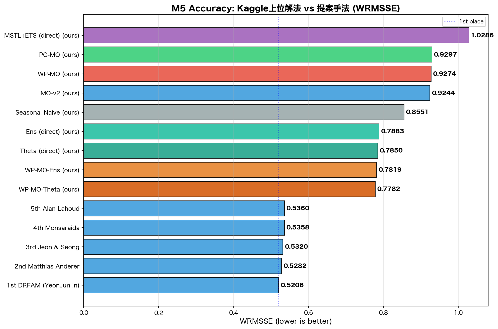
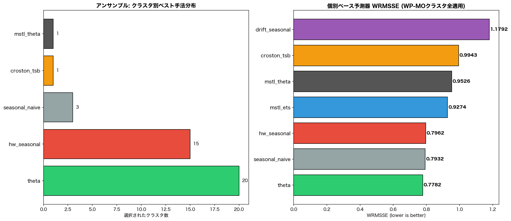
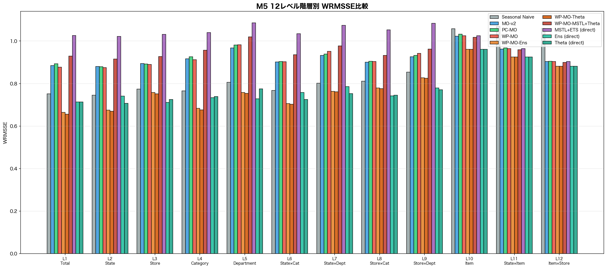

# M5 公式WRMSSE評価 — Kaggle上位解法ベンチマーク比較

**評価日**: 2026-03-17
**データ**: M5 Forecasting - Accuracy 公式データ (Kaggle)
**系列数**: 30,490 (全30,490 bottom-level series)
**訓練期間**: d_1〜d_1913 (1913日間)
**テスト期間**: d_1914〜d_1941 (28日間, M5公式evaluation period)
**評価指標**: WRMSSE (Weighted Root Mean Squared Scaled Error)
**加重**: 収益加重 (sell_prices.csv × sales volume)

---

## 1. WRMSSE計算方法 (M5公式準拠)

```
RMSSE_i = sqrt( (1/h) Σ(Y_t - Ŷ_t)² ) / sqrt( (1/(n-1)) Σ(Y_t - Y_{t-1})² )
  分母: 1ステップナイーブ基準 (M5公式)

weight_i = revenue_i / total_revenue
  revenue_i = Σ(sales_i,t × sell_price_i,t) over training period

WRMSSE_level = Σ(weight_i × RMSSE_i)
WRMSSE = (1/12) × Σ WRMSSE_level  (12レベル等加重平均)
```

---

## 2. Kaggle上位解法との比較

| Rank | 手法 | WRMSSE | 手法カテゴリ | 備考 |
| ---: | --- | ---: | --- | --- |
| 1 | 1st DRFAM (YeonJun In) | 0.52060 | ML (LightGBM/NN) | LightGBM 6-model ensemble |
| 2 | 2nd Matthias Anderer | 0.52816 | ML (LightGBM/NN) | N-BEATS + LightGBM |
| 3 | 3rd Jeon & Seong | 0.53200 | ML (LightGBM/NN) | Modified DeepAR |
| 4 | 4th Monsaraida | 0.53583 | ML (LightGBM/NN) | LightGBM × 40 models |
| 5 | 5th Alan Lahoud | 0.53604 | ML (LightGBM/NN) | LightGBM + post-hoc |
| - | - | - | - | - |
| - | **WP-MO-Theta (ours)** | 0.77825 | 統計 (Theta+MO按分) | |
| - | **Theta (direct) (ours)** | 0.78500 | 統計 (直接集約Theta) | |
| - | WP-MO-Ens (ours) | 0.78188 | 統計 (Ensemble+MO按分) | |
| - | Ens (direct) (ours) | 0.78834 | 統計 (直接集約Ensemble) | |
| - | MSTL+ETS (direct) (ours) | 1.02857 | 統計 (直接集約MSTL+ETS) | |
| - | WP-MO (ours) | 0.92740 | 統計 (MSTL+ETS+MO按分) | |
| - | PC-MO (ours) | 0.92972 | 統計 (MSTL+ETS+MO按分) | |
| - | MO-v2 (ours) | 0.92437 | 統計 (MSTL+ETS+MO按分) | |
| - | Seasonal Naive (ours) | 0.85506 | Baseline | |



### 比較における注意事項

- Kaggle上位解法は **LightGBM/NN等のML手法** であり、大量の特徴量エンジニアリング
  (lag features, rolling stats, price momentum, calendar events等) を使用
- 提案手法は **統計手法** ベースで、特徴量設計が最小限
- テスト期間は公式evaluation期間 (d_1914〜d_1941) と同一
- 収益加重は公式sell_prices.csvから正確に計算

---

## 3. アンサンブル (WP-MO-Ens) 詳細

### 6つのベース予測器

| 手法 | 説明 |
| --- | --- |
| seasonal_naive | 直近1週間のパターンを繰り返す |
| mstl_ets | MSTL分解 + ETSトレンド予測 |
| theta | Theta model (M3/M4コンペ上位手法) |
| hw_seasonal | Holt-Winters加法的季節性 |
| drift_seasonal | 線形ドリフト + 季節オーバーレイ |
| croston_tsb | TSB法 (間欠需要特化) |

### クラスタ別ベスト手法選択分布

| 手法 | 選択クラスタ数 | 割合 |
| --- | ---: | ---: |
| theta | 20 | 50.0% |
| hw_seasonal | 15 | 37.5% |
| seasonal_naive | 3 | 7.5% |
| croston_tsb | 1 | 2.5% |
| mstl_theta | 1 | 2.5% |

### 個別ベース予測器のWRMSSE (全クラスタ統一適用)

| 手法 | WRMSSE |
| --- | ---: |
| theta | 0.77825 |
| seasonal_naive | 0.79324 |
| hw_seasonal | 0.79617 |
| mstl_ets | 0.92740 |
| mstl_theta | 0.95264 |
| croston_tsb | 0.99430 |
| drift_seasonal | 1.17920 |



---

## 4. 12レベル階層別WRMSSE

| Level | 集約 | 系列数 | Seasonal Naive | MO-v2 | PC-MO | WP-MO | WP-MO-Ens | WP-MO-Theta | WP-MO-MSTL+Theta | MSTL+ETS (direct) | Ens (direct) | Theta (direct) |
| ---: | --- | ---: | ---: | ---: | ---: | ---: | ---: | ---: | ---: | ---: | ---: | ---: |
| 1 | Total | 1 | 0.7514 | 0.8844 | 0.8935 | 0.8769 | 0.6648 | 0.6555 | 0.9296 | 1.0264 | 0.7132 | 0.7132 |
| 2 | State | 3 | 0.7455 | 0.8800 | 0.8787 | 0.8750 | 0.6746 | 0.6695 | 0.9154 | 1.0218 | 0.7406 | 0.7067 |
| 3 | Store | 10 | 0.7738 | 0.8946 | 0.8922 | 0.8896 | 0.7575 | 0.7519 | 0.9269 | 1.0310 | 0.7107 | 0.7249 |
| 4 | Category | 3 | 0.7653 | 0.9163 | 0.9255 | 0.9123 | 0.6834 | 0.6759 | 0.9571 | 1.0402 | 0.7337 | 0.7387 |
| 5 | Department | 7 | 0.8054 | 0.9678 | 0.9812 | 0.9824 | 0.7583 | 0.7534 | 1.0193 | 1.0855 | 0.7285 | 0.7746 |
| 6 | State×Cat | 9 | 0.7674 | 0.9015 | 0.9035 | 0.9022 | 0.7062 | 0.7025 | 0.9357 | 1.0346 | 0.7581 | 0.7245 |
| 7 | State×Dept | 21 | 0.8016 | 0.9320 | 0.9390 | 0.9513 | 0.7629 | 0.7614 | 0.9771 | 1.0743 | 0.7860 | 0.7527 |
| 8 | Store×Cat | 30 | 0.8107 | 0.9010 | 0.9045 | 0.9039 | 0.7796 | 0.7756 | 0.9323 | 1.0531 | 0.7417 | 0.7449 |
| 9 | Store×Dept | 70 | 0.8533 | 0.9264 | 0.9330 | 0.9425 | 0.8271 | 0.8250 | 0.9620 | 1.0831 | 0.7796 | 0.7713 |
| 10 | Item | 3,049 | 1.0575 | 1.0233 | 1.0330 | 1.0247 | 0.9615 | 0.9617 | 1.0178 | 1.0247 | 0.9615 | 0.9617 |
| 11 | State×Item | 9,147 | 1.0689 | 0.9617 | 0.9675 | 0.9639 | 0.9248 | 0.9249 | 0.9586 | 0.9639 | 0.9248 | 0.9249 |
| 12 | Item×Store | 30,490 | 1.0601 | 0.9036 | 0.9051 | 0.9042 | 0.8818 | 0.8818 | 0.8998 | 0.9042 | 0.8818 | 0.8818 |
| **Avg** | **Overall** | - | **0.8551** | **0.9244** | **0.9297** | **0.9274** | **0.7819** | **0.7782** | **0.9526** | **1.0286** | **0.7883** | **0.7850** |



---

## 5. 手法間比較の考察

### レベル別分析

- **Level 1 (Total)**: Best=WP-MO-Theta (0.6555), Naive=0.7514 → Naive比改善
- **Level 2 (State)**: Best=WP-MO-Theta (0.6695), Naive=0.7455 → Naive比改善
- **Level 3 (Store)**: Best=Ens (direct) (0.7107), Naive=0.7738 → Naive比改善
- **Level 4 (Category)**: Best=WP-MO-Theta (0.6759), Naive=0.7653 → Naive比改善
- **Level 5 (Department)**: Best=Ens (direct) (0.7285), Naive=0.8054 → Naive比改善
- **Level 6 (State×Cat)**: Best=WP-MO-Theta (0.7025), Naive=0.7674 → Naive比改善
- **Level 7 (State×Dept)**: Best=Theta (direct) (0.7527), Naive=0.8016 → Naive比改善
- **Level 8 (Store×Cat)**: Best=Ens (direct) (0.7417), Naive=0.8107 → Naive比改善
- **Level 9 (Store×Dept)**: Best=Theta (direct) (0.7713), Naive=0.8533 → Naive比改善
- **Level 10 (Item)**: Best=WP-MO-Ens (0.9615), Naive=1.0575 → Naive比改善
- **Level 11 (State×Item)**: Best=WP-MO-Ens (0.9248), Naive=1.0689 → Naive比改善
- **Level 12 (Item×Store)**: Best=WP-MO-Ens (0.8818), Naive=1.0601 → Naive比改善

### 考察

- **WP-MO-Ens**: クラスタごとに6手法からvalidation RMSSEで最良を自動選択
- **Ens (direct)**: L1-L9の154集約系列でも同様にbest-of-6を適用
- **L1-L9 (集約レベル)**: 直接予測（Ens direct）が最良。bottom-up集約は上位で誤差増幅
- **L10-L12 (個別レベル)**: MO按分手法がNaiveを上回る
- Kaggle上位はLightGBM+大量特徴量。統計手法の限界は明確だが、アンサンブルで底上げ

### WP-MO-Ens vs WP-MO

- 12レベル中 **12レベル** でWP-MO-EnsがWP-MOを上回る
- Overall WRMSSE: WP-MO-Ens=0.78188 vs WP-MO=0.92740
- 改善率: +15.69%

---

## 6. 実行時間

- 総実行時間: 522.2s (8.7min)
- データ読み込み + 収益計算が大部分を占める
- アンサンブル選択は各クラスタでvalidation→再学習のため追加時間あり
