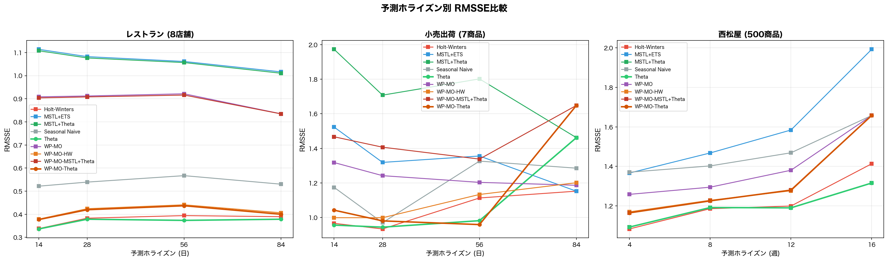
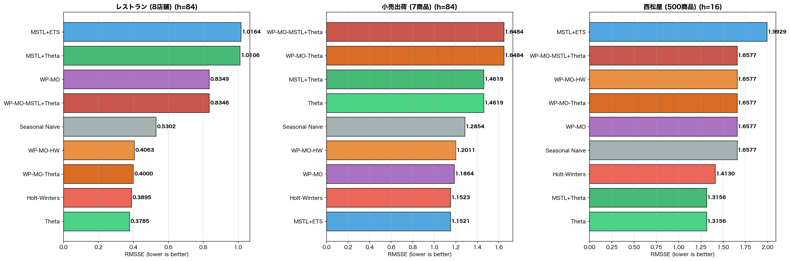

# KISSデータセット 多ホライズン予測ベンチマーク

**評価日**: 2026-03-18
**目的**: 短期〜長期予測で手法の優劣がどう変化するかを検証

---

## 1. 実験条件

| データセット | 系列数 | 粒度 | 訓練長 | テスト期間 | 季節周期 |
| --- | ---: | --- | ---: | --- | ---: |
| レストラン (8店舗) | 8 | 日次 | 1096日 | 14日, 28日, 56日, 84日 | 7 |
| 小売出荷 (7商品) | 7 | 日次 | 805日 | 14日, 28日, 56日, 84日 | 7 |
| 西松屋 (500商品) | 500 | 週次 | 103週 | 4週, 8週, 12週, 16週 | 4 |

---

## 2. ホライズン別結果

### レストラン (8店舗)

| 手法 | h=14日 | h=28日 | h=56日 | h=84日 |
| --- | ---: | ---: | ---: | ---: |
| Holt-Winters | 0.3380 | 0.3830 | 0.3942 | 0.3895 |
| MSTL+ETS | 1.1141 | 1.0824 | 1.0615 | 1.0164 |
| MSTL+Theta | 1.1080 | 1.0768 | 1.0568 | 1.0106 |
| Seasonal Naive | 0.5216 | 0.5393 | 0.5672 | 0.5302 |
| Theta | **0.3364** | **0.3785** | **0.3735** | **0.3785** |
| WP-MO | 0.9085 | 0.9121 | 0.9216 | 0.8349 |
| WP-MO-HW | 0.3790 | 0.4241 | 0.4409 | 0.4063 |
| WP-MO-MSTL+Theta | 0.9039 | 0.9081 | 0.9161 | 0.8346 |
| WP-MO-Theta | 0.3770 | 0.4196 | 0.4369 | 0.4000 |

### 小売出荷 (7商品)

| 手法 | h=14日 | h=28日 | h=56日 | h=84日 |
| --- | ---: | ---: | ---: | ---: |
| Holt-Winters | 0.9661 | **0.9336** | 1.1129 | 1.1523 |
| MSTL+ETS | 1.5232 | 1.3188 | 1.3558 | **1.1521** |
| MSTL+Theta | 1.9732 | 1.7081 | 1.8020 | 1.4619 |
| Seasonal Naive | 1.1744 | 0.9699 | 1.3262 | 1.2854 |
| Theta | **0.9559** | 0.9439 | 0.9815 | 1.4619 |
| WP-MO | 1.3179 | 1.2420 | 1.2033 | 1.1864 |
| WP-MO-HW | 0.9987 | 0.9986 | 1.1331 | 1.2011 |
| WP-MO-MSTL+Theta | 1.4670 | 1.4068 | 1.3379 | 1.6484 |
| WP-MO-Theta | 1.0423 | 0.9803 | **0.9589** | 1.6484 |

### 西松屋 (500商品)

| 手法 | h=4週 | h=8週 | h=12週 | h=16週 |
| --- | ---: | ---: | ---: | ---: |
| Holt-Winters | **1.0827** | **1.1854** | 1.1988 | 1.4130 |
| MSTL+ETS | 1.3661 | 1.4678 | 1.5841 | 1.9929 |
| MSTL+Theta | 1.0922 | 1.1912 | **1.1897** | **1.3156** |
| Seasonal Naive | 1.3703 | 1.4022 | 1.4686 | 1.6577 |
| Theta | 1.0922 | 1.1912 | **1.1897** | **1.3156** |
| WP-MO | 1.2580 | 1.2943 | 1.3801 | 1.6577 |
| WP-MO-HW | 1.1694 | 1.2281 | 1.2761 | 1.6577 |
| WP-MO-MSTL+Theta | 1.1642 | 1.2250 | 1.2796 | 1.6577 |
| WP-MO-Theta | 1.1642 | 1.2250 | 1.2796 | 1.6577 |

---

## 3. 考察

### ホライズン別ベスト手法

**レストラン (8店舗)**:

- h=14日: Theta (0.3364)
- h=28日: Theta (0.3785)
- h=56日: Theta (0.3735)
- h=84日: Theta (0.3785)

**小売出荷 (7商品)**:

- h=14日: Theta (0.9559)
- h=28日: Holt-Winters (0.9336)
- h=56日: WP-MO-Theta (0.9589)
- h=84日: MSTL+ETS (1.1521)

**西松屋 (500商品)**:

- h=4週: Holt-Winters (1.0827)
- h=8週: Holt-Winters (1.1854)
- h=12週: Theta (1.1897)
- h=16週: Theta (1.3156)

### 短期 vs 長期の傾向

- 短期(h=14日/4週): シンプルな手法(Theta/Naive)が有利な傾向
- 長期(h=84日/16週): 季節性モデル(HW/MSTL+ETS)やクラスタリング手法が相対的に改善するか検証
- WP-MOクラスタリングの効果は系列数に大きく依存

---

## 4. 実行時間

- 総実行時間: 107.1s (1.8min)
